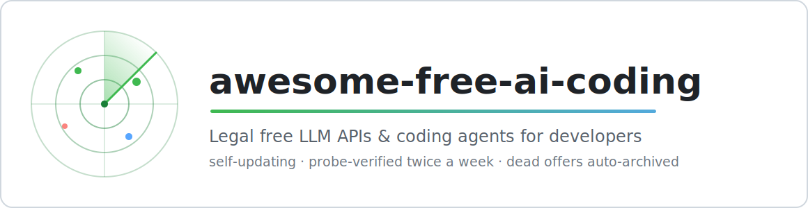
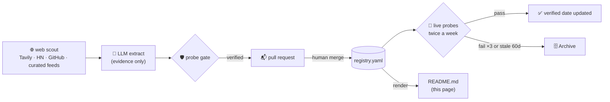

<div align="center">

<picture>
  <source media="(prefers-color-scheme: dark)" srcset="assets/banner-dark.svg">
  
</picture>

[](https://github.com/mvalentsev/awesome-free-ai-coding/actions/workflows/update.yml)


[](LICENSE)
[](CONTRIBUTING.md)

**[🤖 Agents](#-coding-agents--clis) · [🔌 APIs](#-llm-apis-with-free-tier) · [🎁 Trials](#-trials-no-card-when-possible) · [🧭 Aggregators](#-aggregators-one-key-many-providers) · [🔧 Plug it in](#-plug-it-into-your-agent) · [⚙️ How it works](#how-this-list-stays-fresh)**

</div>

> **Every row below is machine-verified.** Legal free tiers, trials and free-model APIs for AI coding — probed twice a week against live model APIs and pricing pages; dead offers drop to the [Archive](#archive) automatically.

### 🤖 Coding agents & CLIs
| Tool | What you get | Free models | Limits | Card required | Verified |
|---|---|---|---|---|---|
| [opencode](https://opencode.ai) | Open-source TUI/desktop coding agent with free models included via the opencode Zen gateway (Big Pickle, DeepSeek V4 Flash, MiMo-V2.5, Nemotron 3 Ultra); any provider via BYOK too | big-pickle, deepseek-v4-flash, mimo-v2.5, nemotron-3-ultra | Bundled Zen models priced Free (some marked limited-time); frontier models pay-as-you-go | ✅ No | 2026-07-20 |
| [Kilo Code](https://kilocode.ai) | VS Code agent extension; free starter credits usable on 500+ routed models (Claude Sonnet 5, GPT-5.5, Gemini 3.1 Pro, ...) | — | Free credits on signup | ✅ No | 2026-07-20 |
| [OpenAI Codex CLI](https://developers.openai.com/codex/) | Open-source coding CLI, free by signing in with a $0 ChatGPT Free account; local coding tasks included on all plans | gpt-5.6 | Free ChatGPT plan carries the smallest allowance; shared 5-hour rolling + weekly rate limits; local tasks only | ✅ No | 2026-07-20 |
### 🔌 LLM APIs with free tier
| Tool | What you get | Free models | Limits | Card required | Verified |
|---|---|---|---|---|---|
| [NVIDIA NIM (build.nvidia.com)](https://build.nvidia.com) | Free hosted NIM endpoints for 100+ models via the free NVIDIA Developer Program (OpenAI-compatible at integrate.api.nvidia.com/v1) | llama-4 | Free tier ~40 req/min, no credit card; production use needs NVIDIA AI Enterprise | ✅ No | 2026-07-20 |
| [Groq](https://groq.com) | Fast inference free tier | llama-4, qwen3 | Free tier daily limits per model | ✅ No | 2026-07-20 |
| [Cerebras Inference](https://www.cerebras.ai) | Very fast inference, free tier | qwen3 | Free tier with daily limits | ✅ No | 2026-07-20 |
| [OVHcloud AI Endpoints](https://endpoints.ai.cloud.ovh.net) | EU-hosted serverless open-model API; anonymous tier needs no signup or API key (OpenAI-compatible) | qwen3, gpt-oss | No-key anonymous access, rate-limited; free API key raises limits | ✅ No | 2026-07-20 |
| [Cloudflare Workers AI](https://workers.cloudflare.com) | 10k neurons/day free | llama-4 | 10,000 neurons/day free allocation | ✅ No | 2026-07-20 |
| [Ollama Cloud](https://ollama.com/cloud) | Cloud-hosted open models with free usage tier | minimax-3, gpt-oss | Free tier with hourly/daily limits; open models only — flagship models (DeepSeek V4, GLM-5, Kimi K2.x, Qwen3.5) need a subscription | ✅ No | 2026-07-20 |
| [GitHub Models](https://github.com/marketplace/models) | Free playground+API for catalog models with GitHub account | gpt-4.1 | Per-model rate limits, free tier | ✅ No | 2026-07-20 |
| [Mistral La Plateforme](https://mistral.ai) | Free experiment tier on La Plateforme | mistral-medium | Experiment tier rate limits | ✅ No | 2026-07-20 |
| [Pollinations.AI](https://pollinations.ai) | Open GenAI text API, no signup, OpenAI-compatible (POST text.pollinations.ai/openai) | gpt-oss | Anonymous 1 req/15s (no signup); free registration 1 req/5s; anon text model is GPT-OSS-20B | ✅ No | 2026-07-20 |
| [Alibaba Cloud Model Studio (DashScope, international)](https://www.alibabacloud.com/en/product/modelstudio) | Free quota for Qwen models on DashScope, international (Singapore) region; OpenAI-compatible | qwen3-max, qwen3-coder | 1,000,000 free tokens per model, valid 90 days after activation; Singapore/international scope only | ✅ No | 2026-07-20 |
| [Novita AI](https://novita.ai/) | Inference cloud for 200+ open models; selected models priced Free plus a small signup trial credit | — | Selected models free on the pricing page (e.g. Hunyuan 3); ~$0.5 trial credit valid 1 year | ✅ No | 2026-07-20 |
| [Scaleway Generative APIs](https://www.scaleway.com/en/generative-apis/) | EU-made serverless LLM API (OpenAI-compatible); 1M free tokens for every new customer | glm-5.2, qwen3 | 1,000,000 free tokens then pay-per-token; a valid payment method is required | 💳 Yes | 2026-07-20 |
| [Google AI Studio (Gemini API)](https://aistudio.google.com) | Free tier for Gemini 2.5 Flash/Pro API | gemini-2.5 | Low per-model daily caps on the free tier (see rate-limits page) — among the stingiest here | ✅ No | 2026-07-20 |
### 🎁 Trials (no card when possible)
| Tool | What you get | Free models | Limits | Card required | Verified |
|---|---|---|---|---|---|
| [GitHub Copilot Free](https://github.com/features/copilot) | Free Copilot plan for individual developers in VS Code, JetBrains, Visual Studio and CLI; completions, limited chat and agent usage | — | 2,000 code completions/month; limited chat & agent requests; auto model selection only | ✅ No | 2026-07-20 |
| [Kiro](https://kiro.dev/) | Perpetual free tier of AWS's spec-driven agentic IDE (successor to Amazon Q Developer) with Claude Sonnet 4.5 and open-weight models | claude-sonnet-4.5, qwen3-coder | 50 credits/month; requires social login or AWS Builder ID; credits do not roll over | ✅ No | 2026-07-20 |
| [Google Jules](https://jules.google/) | Free tier of Google's async cloud coding agent powered by Gemini 2.5 Pro; connects to GitHub repos and works autonomously | gemini-2.5 | 15 tasks per rolling 24 hours; 3 concurrent tasks | ✅ No | 2026-07-20 |
| [Cursor (Hobby)](https://cursor.com/) | Permanent free Hobby plan of the Cursor AI IDE with limited Agent requests and Tab completions, no credit card | — | Limited Agent requests and Tab completions; Auto model only; pauses at cap until reset | ✅ No | 2026-07-20 |
| [Windsurf](https://windsurf.com) | Free plan + trial of paid tiers | claude-haiku, gpt-5.2-mini, kimi-k2.5 | Free plan credits | ✅ No | 2026-07-20 |
| [Trae](https://www.trae.ai) | Free access to frontier models in IDE | — | Free tier quotas | ✅ No | 2026-07-20 |
| [Upstage (Solar API)](https://console.upstage.ai/) | Upstage Solar LLM API; $10 free credit on signup, no card | solar-pro-3, solar-mini | $10 signup credit (see console for validity); pay-as-you-go after | ✅ No | 2026-07-20 |
### 🧭 Aggregators (one key, many providers)
| Tool | What you get | Free models | Limits | Card required | Verified |
|---|---|---|---|---|---|
| [OpenRouter (free models)](https://openrouter.ai) | One API key for rotating :free variants of frontier models | gpt-oss, nemotron-3-ultra, gemma-4 | 50 req/day free (1000/day with $10 balance) | ✅ No | 2026-07-20 |
| [Hugging Face Inference Providers](https://huggingface.co/docs/inference-providers) | Routed access to 200+ models across providers (Groq, Cerebras, Together, etc.) with a free HF account | qwen3 | Free users get $0.10/month credits (subject to change); credits apply only on HF-routed requests | ✅ No | 2026-07-20 |
## Archive

Outdated or unverifiable entries:
| Tool | Last verified |
|---|---|
| [MiMo Code](https://mimo.xiaomi.com/coder) | 2026-07-20 |
| [Z.ai (Zhipu GLM)](https://z.ai) | 2026-07-20 |

## 🔧 Plug it into your agent

Connection details for every live OpenAI-compatible API above — paste the base URL into opencode, Codex CLI, aider, Cline or any OpenAI SDK:

| Provider | Base URL | Key env var | Get a key |
|---|---|---|---|
| NVIDIA NIM (build.nvidia.com) | `https://integrate.api.nvidia.com/v1` | `NVIDIA_NIM_API_KEY` | [key](https://build.nvidia.com) |
| OpenRouter (free models) | `https://openrouter.ai/api/v1` | `OPENROUTER_API_KEY` | [key](https://openrouter.ai/settings/keys) |
| Groq | `https://api.groq.com/openai/v1` | `GROQ_API_KEY` | [key](https://console.groq.com/keys) |
| Hugging Face Inference Providers | `https://router.huggingface.co/v1` | `HUGGINGFACE_INFERENCE_API_KEY` | [key](https://huggingface.co/settings/tokens) |
| Cerebras Inference | `https://api.cerebras.ai/v1` | `CEREBRAS_API_KEY` | [key](https://cloud.cerebras.ai) |
| OVHcloud AI Endpoints | `https://oai.endpoints.kepler.ai.cloud.ovh.net/v1` | — | not needed |
| Cloudflare Workers AI | `https://api.cloudflare.com/client/v4/accounts/{account_id}/ai/v1` | `CLOUDFLARE_WORKERS_AI_API_KEY` | [key](https://dash.cloudflare.com/profile/api-tokens) |
| Ollama Cloud | `https://ollama.com/v1` | `OLLAMA_CLOUD_API_KEY` | [key](https://ollama.com/settings/keys) |
| GitHub Models | `https://models.github.ai/inference` | `GITHUB_MODELS_API_KEY` | [key](https://github.com/settings/personal-access-tokens) |
| Upstage (Solar API) | `https://api.upstage.ai/v1` | `UPSTAGE_API_KEY` | [key](https://console.upstage.ai/api-keys) |
| Mistral La Plateforme | `https://api.mistral.ai/v1` | `MISTRAL_API_KEY` | [key](https://console.mistral.ai/api-keys) |
| Pollinations.AI | `https://text.pollinations.ai/openai` | — | [key](https://auth.pollinations.ai) |
| Alibaba Cloud Model Studio (DashScope, international) | `https://dashscope-intl.aliyuncs.com/compatible-mode/v1` | `ALIBABA_MODEL_STUDIO_API_KEY` | [key](https://modelstudio.console.alibabacloud.com) |
| Novita AI | `https://api.novita.ai/openai` | `NOVITA_API_KEY` | [key](https://novita.ai/settings/key-management) |
| Scaleway Generative APIs | `https://api.scaleway.ai/v1` | `SCALEWAY_GENERATIVE_API_KEY` | [key](https://console.scaleway.com) |
| Google AI Studio (Gemini API) | `https://generativelanguage.googleapis.com/v1beta/openai/` | `GOOGLE_AI_STUDIO_API_KEY` | [key](https://aistudio.google.com/apikey) |
Zero-signup sanity check — works with no account, no key, right now:

```bash
curl -s https://oai.endpoints.kepler.ai.cloud.ovh.net/v1/chat/completions \
  -H 'Content-Type: application/json' \
  -d '{"model":"gpt-oss-120b","messages":[{"role":"user","content":"2+2?"}]}'
```

Ready-made artifacts, regenerated on every update:

- [`configs/opencode.json`](configs/opencode.json) — drop-in [opencode](https://opencode.ai) config with every provider wired up (keys via `{env:...}`, keyless endpoints work immediately)
- [`configs/free-llm.env.example`](configs/free-llm.env.example) — commented env exports for any OpenAI-compatible tool
- [`index.json`](index.json) — machine-readable registry; `curl -s https://raw.githubusercontent.com/mvalentsev/awesome-free-ai-coding/main/index.json | jq '.entries[].id'`

## How this list stays fresh

This repository is an autonomous system, not a hand-curated list:



- **Live probes, twice a week.** GitHub Actions hits every entry's public models API or pricing page and re-verifies the free offer. `Verified` dates are earned by passing a probe, never typed by hand.
- **Web-evidence scout.** A discovery layer sweeps Tavily search, Hacker News, GitHub and curated feeds; an LLM extracts candidates strictly from fetched page evidence — it has no authority to invent anything.
- **Probe-gated proposals.** Every candidate must pass its own live probe before it is even proposed, and lands only through a reviewable pull request. The LLM never writes to this README or to `main`.
- **Self-pruning.** Entries that keep failing probes or stay unverified for 60+ days move to the Archive automatically. Rejected-for-cause domains live in [`blocklist.yaml`](blocklist.yaml).
- **Zero-secret resilient.** The scout's LLM chain falls back across providers down to a keyless anonymous endpoint, so the pipeline keeps running even with no API keys configured.

## Contributing

`registry.yaml` is the single source of truth; this README is generated from it — don't edit it by hand.
Know a legal free offer that's missing? **[Suggest a service](../../issues/new?template=suggest-a-service.yml)** — it will be probed like everything else. Details in [CONTRIBUTING.md](CONTRIBUTING.md).

<div align="center">

**⭐ If this list saved you a credit-card form, star the repo — it keeps the radar visible.**

<sub>Maintained by robots · reviewed by humans · MIT</sub>

</div>
