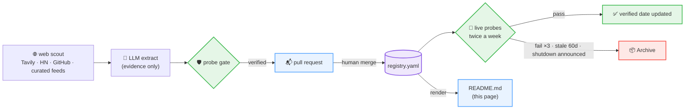

<a name="top"></a>
<div align="center">

<picture>
  <source media="(prefers-color-scheme: dark)" srcset="assets/banner-dark.svg">
  
</picture>

[](https://github.com/mvalentsev/awesome-free-ai-coding/actions/workflows/update.yml)
[](https://github.com/mvalentsev/awesome-free-ai-coding/actions/workflows/ci.yml)


[](LICENSE)
[](CONTRIBUTING.md)

**[🚀 Start now](#-start-in-one-command) · [🤖 Agents](#-coding-agents--clis) · [🔌 APIs](#-llm-apis-with-free-tier) · [🎁 Trials](#-trials-no-card-when-possible) · [🧭 Aggregators](#-aggregators-one-key-many-providers) · [🔧 Plug it in](#-plug-it-into-your-agent) · [📡 How it works](#-how-this-list-stays-fresh)**

</div>

> **Every row on this page is machine-verified.** Legal free tiers, trials and free-model APIs for AI coding — probed twice a week against live model APIs and pricing pages; dead offers drop to the [Archive](#-archive) automatically.

<div align="center">

| **37** | **36** | **2** | **26** | **44** |
|:---:|:---:|:---:|:---:|:---:|
| <sub>live offers</sub> | <sub>need no card</sub> | <sub>need no signup</sub> | <sub>OpenAI-compatible</sub> | <sub>free model families</sub> |

</div>

## 🚀 Start in one command

No account, no key, no card, no waiting — [OVHcloud AI Endpoints](https://endpoints.ai.cloud.ovh.net) answers this in the terminal you already have open:

```bash
curl -s https://oai.endpoints.kepler.ai.cloud.ovh.net/v1/chat/completions \
  -H 'Content-Type: application/json' \
  -d '{"model":"gpt-oss-120b","messages":[{"role":"user","content":"2+2?"}]}'
```

Liked it? **[Wire every provider below into your agent ↓](#-plug-it-into-your-agent)** — the configs for [opencode](https://opencode.ai), [LiteLLM](https://docs.litellm.ai) and plain OpenAI SDKs are generated from the same registry and regenerated on every update.

## 📋 The list

<sub>**Card required** — ✅ No means no card is ever asked for · **🧪** — added recently on fresh evidence, provisional until two weeks of probes confirm it · **Verified** — the day a live probe last confirmed the offer, earned by passing it and never typed by hand.</sub>

### 🤖 Coding agents & CLIs
| Tool | What you get | Free models | Limits | Card required | Verified |
|---|---|---|---|---|---|
| **[opencode](https://opencode.ai)** | Open-source TUI/desktop coding agent with free models included via the opencode Zen gateway (Big Pickle, DeepSeek V4 Flash, MiMo-V2.5, Nemotron 3 Ultra); any provider via BYOK too | `big-pickle`, `deepseek-v4-flash`, `mimo-v2.5`, `nemotron-3-ultra` | <sub>Bundled Zen models priced Free (some marked limited-time); frontier models pay-as-you-go</sub> | ✅ No | `2026-08-10` |
| **[Kilo Code](https://kilo.ai)** | Open-source VS Code / JetBrains / CLI agent; its $0 plan routes "Auto Free" to the zero-priced models the Kilo Gateway carries, and the same gateway answers any OpenAI client directly, with BYOK and local models (Ollama, LM Studio) alongside | `nemotron-3-ultra`, `nemotron-3-super`, `north-mini-code`, `step-3.7-flash`, `laguna-s-2.1`, `laguna-xs-2.1`, `ling-3.0-tiny` | <sub>$0/mo, no hosted credit required — the free lane is a rotating set of zero-priced ids, 13 of them on 2026-08-11 with Nemotron 3 Ultra among them; everything else runs on pay-as-you-go credits or a Kilo Pass subscription</sub> | ✅ No | `2026-08-06` |
| **[Google Antigravity](https://antigravity.google)** | Google's agent-first IDE and CLI, and where the Gemini CLI free tier went — Gemini CLI and the Code Assist IDE extensions stopped serving free, AI Pro and Ultra users on 2026-06-18. The $0 Individual plan carries the same agent models the paid ones do | `gemini-3.1-pro`, `gemini-3.5-flash`, `claude-opus-4.6`, `claude-sonnet-4.6`, `gpt-oss` | <sub>$0/month, no subscription — Gemini 3.1 Pro, Gemini 3.5 Flash, Claude Sonnet & Opus 4.6 and gpt-oss-120b as agent models, unlimited Tab completions and unlimited Command requests, on a quota refreshed weekly. Google publishes no figure for that quota and says the baseline is set by the capacity it has</sub> | ✅ No | `2026-08-11 🧪` |
| **[OpenAI Codex CLI](https://developers.openai.com/codex/)** | Open-source coding CLI, free by signing in with a $0 ChatGPT Free account; local coding tasks included on all plans | `gpt-5.6` | <sub>Free ChatGPT plan carries the smallest allowance; shared 5-hour rolling + weekly rate limits; local tasks only</sub> | ✅ No | `2026-08-10` |
| **[Crush + Charm Hyper](https://hyper.charm.land)** | Charm's Crush terminal agent with Hyper, its official hosted model gateway; the free plan includes monthly Hypercredits, zero data retention | — | <sub>100 Hypercredits (≈$5) refreshed monthly; Hyper is in private beta (sign up from Crush or the site)</sub> | ✅ No | `2026-08-10` |

### 🔌 LLM APIs with free tier
| Tool | What you get | Free models | Limits | Card required | Verified |
|---|---|---|---|---|---|
| **[NVIDIA NIM (build.nvidia.com)](https://build.nvidia.com)** | Free hosted NIM endpoints for 100+ models via the free NVIDIA Developer Program (OpenAI-compatible at integrate.api.nvidia.com/v1) | `nemotron` | <sub>Free to start with no card — the account is gated by phone/business-email verification, and access is metered in API credits rather than left open: NVIDIA staff describe the catalog as "a trial experience of NVIDIA NIM limited to 5000 free API credits", 1000 granted on sign-up. That answer is from 2024 and NVIDIA publishes no current figure; reports since put the ceiling at a ~40 req/min rate limit instead. Production use needs NVIDIA AI Enterprise either way</sub> | ✅ No | `2026-08-10` |
| **[Groq](https://groq.com)** | Fast inference free tier | `llama-4`, `qwen3` | <sub>Free tier daily limits per model</sub> | ✅ No | `2026-08-10` |
| **[Cerebras Inference](https://www.cerebras.ai)** | Very fast inference; $5 in free credits on signup, no card | `qwen3` | <sub>$5 in free credits after making an account, usable on all Cerebras-hosted models; free-tier rate limits below the $10 Developer plan</sub> | ✅ No | `2026-08-10` |
| **[OVHcloud AI Endpoints](https://endpoints.ai.cloud.ovh.net)** | EU-hosted serverless open-model API; anonymous tier needs no signup or API key (OpenAI-compatible) | `qwen3`, `gpt-oss` | <sub>No-key anonymous access, rate-limited; free API key raises limits</sub> | ✅ No | `2026-08-10` |
| **[Z.ai (Zhipu GLM)](https://z.ai)** | GLM Flash models free on the API (OpenAI-compatible at api.z.ai/api/paas/v4) | `glm-4.7-flash` | <sub>GLM-4.7-Flash / GLM-4.5-Flash / GLM-4.6V-Flash priced Free; flagship GLM-5.x not free; rate-limited</sub> | ✅ No | `2026-08-10` |
| **[LongCat API Platform](https://longcat.chat/platform)** | Meituan's LongCat platform — OpenAI- and Anthropic-compatible API with a recurring daily free token quota | `longcat-2.0`, `longcat-flash` | <sub>100K free tokens/day; a larger free tier for Flash-Lite (50M tokens/day) is announced and the model is uncapped during rollout</sub> | ✅ No | `2026-08-10` |
| **[Cloudflare Workers AI](https://workers.cloudflare.com)** | 10k neurons/day free | `llama-4` | <sub>10,000 neurons/day free allocation</sub> | ✅ No | `2026-08-10` |
| **[Ollama Cloud](https://ollama.com/cloud)** | Cloud-hosted open models with free usage tier | `nemotron`, `minimax-3`, `gpt-oss` | <sub>Free tier with hourly/daily limits; open models only — flagship models (DeepSeek V4, GLM-5, Kimi K2.x, Qwen3.5) need a subscription</sub> | ✅ No | `2026-08-10` |
| **[SEA-LION (AI Singapore)](https://sea-lion.ai)** | AI Singapore's open Southeast-Asian model family behind a first-party OpenAI-compatible API — the vendor hosting its own weights rather than a gateway reselling somebody else's | `qwen-sea-lion-v4.5`, `llama-sea-lion-v3.5` | <sub>Free API meant for prototyping — rate limited at 10 calls/min per user, with no credit or token budget published and no expiry stated; production use is pointed at cloud partners (AWS, Cloudflare, GCP, IBM, NVIDIA, Qualcomm) instead</sub> | ✅ No | `2026-08-11 🧪` |
| **[Mistral La Plateforme](https://mistral.ai)** | Free experiment tier on La Plateforme | `mistral-medium` | <sub>Experiment tier rate limits</sub> | ✅ No | `2026-08-10` |
| **[Pollinations.AI](https://pollinations.ai)** | Open GenAI text API, no signup, OpenAI-compatible (POST text.pollinations.ai/openai) | `gpt-oss` | <sub>Anonymous 1 req/15s (no signup); free registration 1 req/5s; anon text model is GPT-OSS-20B</sub> | ✅ No | `2026-08-10` |
| **[Alibaba Cloud Model Studio (DashScope, international)](https://www.alibabacloud.com/en/product/modelstudio)** | Free quota for Qwen models on DashScope, international (Singapore) region; OpenAI-compatible | `qwen3-max`, `qwen3-coder` | <sub>1,000,000 free tokens per model, valid 90 days after activation; Singapore/international scope only</sub> | ✅ No | `2026-08-10` |
| **[Cohere (trial keys)](https://cohere.com)** | Cohere Command models via free trial API keys that never expire | `command-a` | <sub>Trial key: 1,000 API calls/month, rate-limited; production keys unlock paid volume</sub> | ✅ No | `2026-08-10` |
| **[Novita AI](https://novita.ai/)** | Inference cloud for 200+ open models; selected models priced Free plus a small signup trial credit | — | <sub>Selected models priced Free on the pricing page (Ling-3.0-flash, Macaron V1 Venti); ~$0.5 trial credit valid 1 year</sub> | ✅ No | `2026-08-10` |
| **[Scaleway Generative APIs](https://www.scaleway.com/en/generative-apis/)** | EU-made serverless LLM API (OpenAI-compatible); 1M free tokens for every new customer | `glm-5.2`, `qwen3` | <sub>1,000,000 free tokens then pay-per-token; a valid payment method is required</sub> | 💳 Yes | `2026-08-10` |
| **[Google AI Studio (Gemini API)](https://aistudio.google.com)** | Free tier for Gemini 2.5 Flash/Pro API | `gemini-2.5` | <sub>Low per-model daily caps on the free tier (see rate-limits page) — among the stingiest here</sub> | ✅ No | `2026-08-10` |
| **[SambaNova Cloud](https://cloud.sambanova.ai)** | Open models on SambaNova's RDU hardware, OpenAI-compatible; the free tier is the one that applies while no payment method is linked, so linking a card is what ends it | `deepseek`, `gpt-oss`, `gemma-4` | <sub>20 req/min, 20 req/day and 200,000 tokens/day per model on the free tier; five models carry it (DeepSeek V3.1/V3.2, Llama 3.3 70B, gpt-oss-120b, Gemma 4)</sub> | ✅ No | `2026-08-10 🧪` |

### 🎁 Trials (no card when possible)
| Tool | What you get | Free models | Limits | Card required | Verified |
|---|---|---|---|---|---|
| **[GitHub Copilot Free](https://github.com/features/copilot)** | Free Copilot plan for individual developers in VS Code, JetBrains, Visual Studio and CLI; completions, limited chat and agent usage | — | <sub>2,000 code completions/month; limited chat & agent requests; auto model selection only</sub> | ✅ No | `2026-08-10` |
| **[Kiro](https://kiro.dev/)** | Perpetual free tier of AWS's spec-driven agentic IDE (successor to Amazon Q Developer) with Claude Sonnet 4.5 and open-weight models | `claude-sonnet-4.5`, `qwen3-coder` | <sub>50 credits/month; requires social login or AWS Builder ID; credits do not roll over</sub> | ✅ No | `2026-08-10` |
| **[Google Jules](https://jules.google/)** | Free tier of Google's async cloud coding agent powered by Gemini 2.5 Pro; connects to GitHub repos and works autonomously | `gemini-2.5` | <sub>15 tasks per rolling 24 hours; 3 concurrent tasks</sub> | ✅ No | `2026-08-10` |
| **[Cursor (Hobby)](https://cursor.com/)** | Permanent free Hobby plan of the Cursor AI IDE with limited Agent requests and Tab completions, no credit card | — | <sub>Limited Agent requests and Tab completions; Auto model only; pauses at cap until reset</sub> | ✅ No | `2026-08-10` |
| **[Windsurf](https://windsurf.com)** | Free plan + trial of paid tiers | `claude-haiku`, `gpt-5.2-mini`, `kimi-k2.5` | <sub>Free plan credits</sub> | ✅ No | `2026-08-10` |
| **[Qoder](https://qoder.com)** | Alibaba's agentic coding IDE + CLI; Pro trial with credits on signup, then a free plan with basic models | — | <sub>Trial: 300 credits for 2 weeks; free plan afterwards serves basic models with a daily cap</sub> | ✅ No | `2026-08-10` |
| **[Trae](https://www.trae.ai)** | Free access to frontier models in IDE | — | <sub>Free tier quotas</sub> | ✅ No | `2026-08-10` |
| **[Upstage (Solar API)](https://console.upstage.ai/)** | Upstage Solar LLM API; $10 free credit on signup, no card | `solar-pro-3`, `solar-mini` | <sub>$10 signup credit (see console for validity); pay-as-you-go after</sub> | ✅ No | `2026-08-10` |

### 🧭 Aggregators (one key, many providers)
| Tool | What you get | Free models | Limits | Card required | Verified |
|---|---|---|---|---|---|
| **[OpenRouter (free models)](https://openrouter.ai)** | One API key for rotating :free variants of frontier models | `gpt-oss`, `nemotron-3-ultra`, `gemma-4` | <sub>50 req/day free (1000/day with $10 balance)</sub> | ✅ No | `2026-08-10` |
| **[Hugging Face Inference Providers](https://huggingface.co/docs/inference-providers)** | Routed access to 200+ models across providers (Groq, Cerebras, Together, etc.) with a free HF account | `deepseek`, `qwen3` | <sub>Free users get $0.10/month credits (subject to change); credits apply only on HF-routed requests</sub> | ✅ No | `2026-08-10` |
| **[BazaarLink](https://bazaarlink.ai)** | OpenAI-compatible gateway to 199 models, with two always-free open models and an auto:free router | `deepseek-v4-flash`, `qwen3.7-flash` | <sub>10 req/min and 150 req/day on the free models (x3 for accounts that have topped up); the other 196 models are metered at list rates</sub> | ✅ No | `2026-08-10 🧪` |
| **[Requesty](https://www.requesty.ai)** | OpenAI-compatible router over a 500+ model catalog with routing, caching and fallbacks; ten rows in it are priced 0 and the free plan is the same gateway restricted to those | `nemotron-3-ultra`, `nemotron-3-super`, `gemma-4`, `ling-3.0-tiny` | <sub>Free plan is $0 with no credit card — 200 requests a day, free models only, with routing, caching, fallbacks, spend tracking and EU data residency included; past that the same key moves to pay-as-you-go</sub> | ✅ No | `2026-08-11 🧪` |
| **[Routeway](https://routeway.ai)** | OpenAI-compatible gateway carrying ten live zero-priced :free ids — Step 3.7 Flash, Gemma 4 31B, Nemotron 3 Nano, Poolside Laguna XS.2, gpt-oss-120b and the Llama 3.x line — beside a metered 100+ model catalog | `gpt-oss`, `step-3.7-flash`, `gemma-4`, `llama-3.3` | <sub>Starter plan is free — 200 req/day, one concurrent request, shared low-priority queue and best-effort availability; everything outside the :free ids is pay-as-you-go</sub> | ✅ No | `2026-08-06 🧪` |
| **[TokenRouter (PaleBlueDot)](https://www.tokenrouter.com)** | Zero-priced Kimi K3 on the gateway's own deployment, plus a free Nemotron lane, inside a 121-model paid catalog | `kimi-k3`, `nemotron-3-nano-omni` | <sub>both free ids sit in the default group and publish no request cap; the other 119 models are metered at list rates</sub> | ✅ No | `2026-08-10 🧪` |
| **[Vercel AI Gateway](https://vercel.com/ai-gateway)** | One OpenAI-compatible endpoint for 300+ models, with $5 of gateway credits included every month | `laguna-s-2.1-free` | <sub>$5/month credit at provider list rates, renewed monthly; 217 of 316 models eligible, lower per-model rate limits, no BYOK. laguna-s-2.1-free costs $0 and never draws it down. Buying credits ends the monthly free credit</sub> | ✅ No | `2026-08-06 🧪` |

<details>
<summary><b>🧠 Looking for one model in particular?</b> — 44 model families, and everyone who serves them free</summary>
<br>

| Model family | Free at |
|---|---|
| `gpt-oss` | [OpenRouter (free models)](https://openrouter.ai), [Google Antigravity](https://antigravity.google), [OVHcloud AI Endpoints](https://endpoints.ai.cloud.ovh.net), [Ollama Cloud](https://ollama.com/cloud), [Pollinations.AI](https://pollinations.ai), [Routeway](https://routeway.ai), [SambaNova Cloud](https://cloud.sambanova.ai) |
| `qwen3` | [Groq](https://groq.com), [Hugging Face Inference Providers](https://huggingface.co/docs/inference-providers), [Cerebras Inference](https://www.cerebras.ai), [OVHcloud AI Endpoints](https://endpoints.ai.cloud.ovh.net), [Scaleway Generative APIs](https://www.scaleway.com/en/generative-apis/) |
| `gemma-4` | [OpenRouter (free models)](https://openrouter.ai), [Requesty](https://www.requesty.ai), [Routeway](https://routeway.ai), [SambaNova Cloud](https://cloud.sambanova.ai) |
| `nemotron-3-ultra` | [opencode](https://opencode.ai), [OpenRouter (free models)](https://openrouter.ai), [Kilo Code](https://kilo.ai), [Requesty](https://www.requesty.ai) |
| `deepseek` | [Hugging Face Inference Providers](https://huggingface.co/docs/inference-providers), [SambaNova Cloud](https://cloud.sambanova.ai) |
| `deepseek-v4-flash` | [opencode](https://opencode.ai), [BazaarLink](https://bazaarlink.ai) |
| `gemini-2.5` | [Google Jules](https://jules.google/), [Google AI Studio (Gemini API)](https://aistudio.google.com) |
| `ling-3.0-tiny` | [Kilo Code](https://kilo.ai), [Requesty](https://www.requesty.ai) |
| `llama-4` | [Groq](https://groq.com), [Cloudflare Workers AI](https://workers.cloudflare.com) |
| `nemotron` | [NVIDIA NIM (build.nvidia.com)](https://build.nvidia.com), [Ollama Cloud](https://ollama.com/cloud) |
| `nemotron-3-super` | [Kilo Code](https://kilo.ai), [Requesty](https://www.requesty.ai) |
| `qwen3-coder` | [Kiro](https://kiro.dev/), [Alibaba Cloud Model Studio (DashScope, international)](https://www.alibabacloud.com/en/product/modelstudio) |
| `step-3.7-flash` | [Kilo Code](https://kilo.ai), [Routeway](https://routeway.ai) |
| `big-pickle` | [opencode](https://opencode.ai) |
| `claude-haiku` | [Windsurf](https://windsurf.com) |
| `claude-opus-4.6` | [Google Antigravity](https://antigravity.google) |
| `claude-sonnet-4.5` | [Kiro](https://kiro.dev/) |
| `claude-sonnet-4.6` | [Google Antigravity](https://antigravity.google) |
| `command-a` | [Cohere (trial keys)](https://cohere.com) |
| `gemini-3.1-pro` | [Google Antigravity](https://antigravity.google) |
| `gemini-3.5-flash` | [Google Antigravity](https://antigravity.google) |
| `glm-4.7-flash` | [Z.ai (Zhipu GLM)](https://z.ai) |
| `glm-5.2` | [Scaleway Generative APIs](https://www.scaleway.com/en/generative-apis/) |
| `gpt-5.2-mini` | [Windsurf](https://windsurf.com) |
| `gpt-5.6` | [OpenAI Codex CLI](https://developers.openai.com/codex/) |
| `kimi-k2.5` | [Windsurf](https://windsurf.com) |
| `kimi-k3` | [TokenRouter (PaleBlueDot)](https://www.tokenrouter.com) |
| `laguna-s-2.1` | [Kilo Code](https://kilo.ai) |
| `laguna-s-2.1-free` | [Vercel AI Gateway](https://vercel.com/ai-gateway) |
| `laguna-xs-2.1` | [Kilo Code](https://kilo.ai) |
| `llama-3.3` | [Routeway](https://routeway.ai) |
| `llama-sea-lion-v3.5` | [SEA-LION (AI Singapore)](https://sea-lion.ai) |
| `longcat-2.0` | [LongCat API Platform](https://longcat.chat/platform) |
| `longcat-flash` | [LongCat API Platform](https://longcat.chat/platform) |
| `mimo-v2.5` | [opencode](https://opencode.ai) |
| `minimax-3` | [Ollama Cloud](https://ollama.com/cloud) |
| `mistral-medium` | [Mistral La Plateforme](https://mistral.ai) |
| `nemotron-3-nano-omni` | [TokenRouter (PaleBlueDot)](https://www.tokenrouter.com) |
| `north-mini-code` | [Kilo Code](https://kilo.ai) |
| `qwen-sea-lion-v4.5` | [SEA-LION (AI Singapore)](https://sea-lion.ai) |
| `qwen3-max` | [Alibaba Cloud Model Studio (DashScope, international)](https://www.alibabacloud.com/en/product/modelstudio) |
| `qwen3.7-flash` | [BazaarLink](https://bazaarlink.ai) |
| `solar-mini` | [Upstage (Solar API)](https://console.upstage.ai/) |
| `solar-pro-3` | [Upstage (Solar API)](https://console.upstage.ai/) |

</details>

## 📦 Archive

<details>
<summary>Offers that stopped verifying — kept visible so a dead tier is never silently forgotten</summary>
<br>

| Tool | Last verified |
|---|---|
| [GitHub Models](https://github.com/marketplace/models) | `2026-07-30` |
| [MiMo Code](https://mimo.xiaomi.com/coder) | `2026-08-03` |

</details>

## 🔧 Plug it into your agent

Connection details for every live OpenAI-compatible API above — paste the base URL into opencode, Codex CLI, aider, Cline or any OpenAI SDK:

| Provider | Base URL | Key env var | Get a key |
|---|---|---|---|
| **NVIDIA NIM (build.nvidia.com)**<br><sub>the catalog endpoint answers unauthenticated, which is what the probe reads — it confirms NVIDIA still hosts these models, not that your account still has credits to call them with</sub> | `https://integrate.api.nvidia.com/v1` | `NVIDIA_NIM_API_KEY` | [key](https://build.nvidia.com) |
| **OpenRouter (free models)**<br><sub>pick models with the :free suffix; the five listed were zero-priced on 2026-08-11</sub> | `https://openrouter.ai/api/v1` | `OPENROUTER_API_KEY` | [key](https://openrouter.ai/settings/keys) |
| **Groq** | `https://api.groq.com/openai/v1` | `GROQ_API_KEY` | [key](https://console.groq.com/keys) |
| **Hugging Face Inference Providers**<br><sub>chat-only; model ids namespaced (openai/gpt-oss-120b)</sub> | `https://router.huggingface.co/v1` | `HUGGINGFACE_INFERENCE_API_KEY` | [key](https://huggingface.co/settings/tokens) |
| **Kilo Code**<br><sub>every id listed is priced 0 — the same catalog meters 500+ paid models. kilo-auto/free and openrouter/free are routers, and nemotron-3.5-content-safety is a guardrail classifier, so none of the three is a coding model. The lane rotates — Ling 3.0 Flash left it in 2026-08 and ling-3.0-tiny:free stands in its place</sub> | `https://api.kilo.ai/api/gateway` | `KILO_CODE_API_KEY` | [key](https://app.kilo.ai/profile) |
| **Cerebras Inference** | `https://api.cerebras.ai/v1` | `CEREBRAS_API_KEY` | [key](https://cloud.cerebras.ai) |
| **OVHcloud AI Endpoints**<br><sub>anonymous, rate-limited; free key raises limits</sub> | `https://oai.endpoints.kepler.ai.cloud.ovh.net/v1` | — | not needed |
| **Z.ai (Zhipu GLM)**<br><sub>Coding-Plan keys use https://api.z.ai/api/coding/paas/v4 instead</sub> | `https://api.z.ai/api/paas/v4` | `ZAI_GLM_API_KEY` | [key](https://z.ai/manage-apikey/apikey-list) |
| **LongCat API Platform**<br><sub>Anthropic-compatible sibling at /anthropic/v1/messages; docs include a Claude Code setup guide (cc-switch)</sub> | `https://api.longcat.chat/openai/v1` | `LONGCAT_API_KEY` | [key](https://longcat.chat/platform) |
| **Cloudflare Workers AI**<br><sub>substitute {account_id} with your Cloudflare account ID</sub> | `https://api.cloudflare.com/client/v4/accounts/{account_id}/ai/v1` | `CLOUDFLARE_WORKERS_AI_API_KEY` | [key](https://dash.cloudflare.com/profile/api-tokens) |
| **Ollama Cloud**<br><sub>Free-tier model set verified live 2026-07-20; /v1/models lists the full catalog including subscription-only models</sub> | `https://ollama.com/v1` | `OLLAMA_CLOUD_API_KEY` | [key](https://ollama.com/settings/keys) |
| **SEA-LION (AI Singapore)**<br><sub>the key manager calls it a Trial API Key but publishes no expiry and no credit balance — the documented ceiling is the 10 calls/min rate limit. /v1/models needs the key, so the probe reads the offer page</sub> | `https://api.sea-lion.ai/v1` | `SEA_LION_API_KEY` | [key](https://playground.sea-lion.ai/key-manager) |
| **Upstage (Solar API)** | `https://api.upstage.ai/v1` | `UPSTAGE_API_KEY` | [key](https://console.upstage.ai/api-keys) |
| **Mistral La Plateforme**<br><sub>Experiment tier needs account activation</sub> | `https://api.mistral.ai/v1` | `MISTRAL_API_KEY` | [key](https://console.mistral.ai/api-keys) |
| **Pollinations.AI**<br><sub>anonymous works; optional token raises rate limits</sub> | `https://text.pollinations.ai/openai` | — | [key](https://auth.pollinations.ai) |
| **Alibaba Cloud Model Studio (DashScope, international)**<br><sub>international (Singapore) endpoint; keys are region-specific</sub> | `https://dashscope-intl.aliyuncs.com/compatible-mode/v1` | `ALIBABA_MODEL_STUDIO_API_KEY` | [key](https://modelstudio.console.alibabacloud.com) |
| **Cohere (trial keys)**<br><sub>OpenAI-compatible endpoint; native API lives at https://api.cohere.com/v2</sub> | `https://api.cohere.com/compatibility/v1` | `COHERE_API_KEY` | [key](https://dashboard.cohere.com/api-keys) |
| **Novita AI** | `https://api.novita.ai/openai` | `NOVITA_API_KEY` | [key](https://novita.ai/settings/key-management) |
| **Scaleway Generative APIs**<br><sub>non-default project: https://api.scaleway.ai/{project_id}/v1</sub> | `https://api.scaleway.ai/v1` | `SCALEWAY_GENERATIVE_API_KEY` | [key](https://console.scaleway.com) |
| **Google AI Studio (Gemini API)**<br><sub>pass the key as Bearer</sub> | `https://generativelanguage.googleapis.com/v1beta/openai/` | `GOOGLE_AI_STUDIO_API_KEY` | [key](https://aistudio.google.com/apikey) |
| **BazaarLink**<br><sub>only the :free ids and auto:free cost nothing; auto:free picks a free model for you</sub> | `https://bazaarlink.ai/api/v1` | `BAZAARLINK_API_KEY` | [key](https://bazaarlink.ai/keys) |
| **Requesty**<br><sub>the ten ids listed are every row the catalog prices at 0, and the free plan serves those alone — ids here carry no :free suffix, so the price is the only thing separating them from the 585 metered rows beside them. nemotron-3.5-content-safety is a guardrail classifier rather than a coding model</sub> | `https://router.requesty.ai/v1` | `REQUESTY_API_KEY` | [key](https://app.requesty.ai/api-keys) |
| **Routeway**<br><sub>all ten ids are priced 0 and answering — the Free-models column names the four the probe anchors on, because a promo lane that rotates out must not archive a gateway that still has a free tier; laguna-m.1:free is priced 0 too but the catalog still marks it unavailable, so it is left out, and ling-3.0-flash:free left the catalog altogether in 2026-08. Only the :free suffix is zero-priced — the same catalog meters Claude and GPT at list rates. The gateway publishes no legal entity or terms of service and supports users through Discord alone, so treat these ids as a fallback lane, not a dependency</sub> | `https://api.routeway.ai/v1` | `ROUTEWAY_API_KEY` | [key](https://routeway.ai/dashboard/keys) |
| **SambaNova Cloud**<br><sub>model ids are case-sensitive; the catalog publishes list prices for every row, so the free tier is a quota rather than a zero-priced lane</sub> | `https://api.sambanova.ai/v1` | `SAMBANOVA_CLOUD_API_KEY` | [key](https://cloud.sambanova.ai/apis) |
| **TokenRouter (PaleBlueDot)**<br><sub>only the ids priced 0 are free — the paid moonshotai/kimi-k3 sits in the same catalog. PaleBlueDot AI runs this gateway on tokenrouter.com; same-name gateways on other TLDs are separate services and their keys do not work here</sub> | `https://api.tokenrouter.com/v1` | `TOKENROUTER_API_KEY` | [key](https://www.tokenrouter.com/console/token) |
| **Vercel AI Gateway**<br><sub>laguna-s-2.1-free costs nothing; any other Free-Tier-eligible model spends the $5 monthly credit. inclusionai/ling-3.0-flash-free left the catalog in 2026-08 and the ling-3.0-tiny-free standing where it was publishes an empty pricing object, so nothing here says it is free</sub> | `https://ai-gateway.vercel.sh/v1` | `VERCEL_AI_GATEWAY_API_KEY` | [key](https://vercel.com/dashboard/ai-gateway/api-keys) |

Ready-made artifacts, regenerated on every update:

| File | What it gives you |
|---|---|
| [`configs/opencode.json`](configs/opencode.json) | Drop-in [opencode](https://opencode.ai) config with every provider wired up — keys via `{env:...}`, keyless endpoints work immediately |
| [`configs/free-llm.env.example`](configs/free-llm.env.example) | Commented env exports for any OpenAI-compatible tool |
| [`configs/litellm.yaml`](configs/litellm.yaml) | [LiteLLM](https://docs.litellm.ai) proxy config: `litellm --config configs/litellm.yaml` puts every free model behind one local endpoint |
| [`index.json`](index.json) | Machine-readable registry: `curl -s https://raw.githubusercontent.com/mvalentsev/awesome-free-ai-coding/main/index.json \| jq '.entries[].id'` |

## 📡 How this list stays fresh

This repository is an autonomous system, not a hand-curated list:


```mermaid
flowchart LR
    S["🌐 web scout<br/>Tavily · HN · GitHub · curated feeds"] --> L["🧠 LLM extract<br/>(evidence only)"]
    L --> G{"🛡 probe gate"}
    G -->|verified| PR["📬 pull request"]
    PR -->|human merge| R[("registry.yaml")]
    R --> P{"📡 live probes<br/>twice a week"}
    P -->|pass| V["✅ verified date updated"]
    P -->|fail ×3 · stale 60d · shutdown announced| A["📦 Archive"]
    R -->|render| MD["README.md<br/>(this page)"]

    classDef pass fill:#3fb95022,stroke:#3fb950,stroke-width:2px
    classDef drop fill:#f8514922,stroke:#f85149,stroke-width:2px
    classDef human fill:#58a6ff22,stroke:#58a6ff,stroke-width:2px
    classDef store fill:#8957e522,stroke:#8957e5,stroke-width:2px
    class G,P,V pass
    class A drop
    class PR,MD human
    class R store
```

- **Live probes, twice a week.** GitHub Actions hits every entry's public models API or pricing page and re-verifies the free offer. `Verified` dates are earned by passing a probe, never typed by hand.
- **Anchored on the offer, not on the word "free".** Each probe anchors on something that dies with the offer — the free model's id, its quota figure, its price row, or a sentence quoted from the vendor's own page. The word "free" survives on a vendor's page for months after the free tier does not, and so do "hobby" and "monthly credits"; validation rejects all of them. Where a gateway publishes prices, the probe also demands that the free model still costs zero — an id can stay in the catalog long after it stops being free. And a bot wall answering in place of a vendor's page counts as "could not check", never as "the offer is gone".
- **Web-evidence scout.** A discovery layer sweeps Tavily search, Hacker News, GitHub and curated feeds; an LLM extracts candidates strictly from fetched page evidence — it has no authority to invent anything.
- **Probe-gated proposals.** Every candidate must pass its own live probe before it is even proposed, and lands only through a reviewable pull request. The LLM never writes to this README or to `main`.
- **Self-pruning.** Entries that keep failing probes or stay unverified for 60+ days move to the Archive automatically, as does any entry whose vendor has announced a shutdown date once that day arrives. A newer model generation never archives a row — it just means the row's model list needs a bump, and one a reviewer has already declined is recorded in [`dismissed.yaml`](dismissed.yaml) instead of being proposed again. Rejected-for-cause domains live in [`blocklist.yaml`](blocklist.yaml).
- **Zero-secret resilient.** The scout's LLM chain falls back across providers down to a keyless anonymous endpoint, so the pipeline keeps running even with no API keys configured.

## 🤝 Contributing

`registry.yaml` is the single source of truth; this README is generated from it — don't edit it by hand.
Know a legal free offer that's missing? **[Suggest a service](../../issues/new?template=suggest-a-service.yml)** — it will be probed like everything else. Details in [CONTRIBUTING.md](CONTRIBUTING.md).

<div align="center">

**⭐ If this list saved you a credit-card form, star the repo — it keeps the radar visible.**

<sub>Maintained by robots · reviewed by humans · MIT · <a href="#top">back to top ↑</a></sub>

</div>
