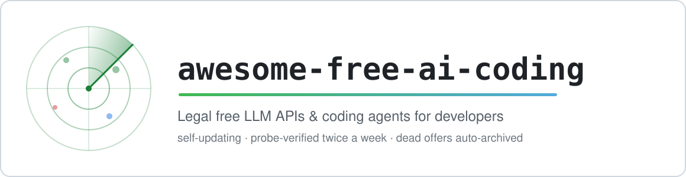

<a name="top"></a>
<div align="center">

<picture>
  <source media="(prefers-color-scheme: dark)" srcset="assets/banner-dark.svg">
  
</picture>

[](https://github.com/mvalentsev/awesome-free-ai-coding/actions/workflows/update.yml)
[](https://github.com/mvalentsev/awesome-free-ai-coding/actions/workflows/ci.yml)


[](LICENSE)
[](CONTRIBUTING.md)

**[🚀 Start here](#-start-here) · [🤖 Agents](#-coding-agents--clis) · [🔌 APIs](#-llm-apis-with-free-tier) · [🎁 Trials](#-trials-no-card-when-possible) · [🧭 Aggregators](#-aggregators-one-key-many-providers) · [🔧 Plug it in](#-plug-it-into-your-agent) · [📡 How it works](#-how-this-list-stays-fresh)**

</div>

> **Every row on this page is machine-verified.** Legal free tiers, trials and free-model APIs for AI coding — probed twice a week against live model APIs and pricing pages; dead offers drop to the [Archive](#-archive) automatically.

<div align="center">

| **44** | **42** | **3** | **32** | **48** |
|:---:|:---:|:---:|:---:|:---:|
| <sub>live offers</sub> | <sub>need no card</sub> | <sub>need no signup</sub> | <sub>OpenAI-compatible</sub> | <sub>free model families</sub> |

</div>

## 🚀 Start here

**Free is not the same as weak.** These agents run on a $0 plan, ask for no card, and this is what they hand you:

| Agent | Models you get for nothing |
|---|---|
| **[opencode](https://opencode.ai)** | `big-pickle` · `mimo-v2.5` · `ling-3.0-flash-fin` · `nemotron-3-ultra` · `nemotron-3.5-lightning` · `muse-spark-1.2` |
| **[Kilo Code](https://kilo.ai)** | `nemotron-3-ultra` · `nemotron-3-super` · `north-mini-code` · `step-3.7-flash` · `laguna-s-2.1` · `laguna-xs-2.1` |
| **[Google Antigravity](https://antigravity.google)** | `gemini-3.1-pro` · `gemini-3.5-flash` · `claude-opus-4.6` · `claude-sonnet-4.6` · `gpt-oss` |
| **[OpenAI Codex CLI](https://learn.chatgpt.com/docs/codex/cli)** | `gpt-5.6` |

<sub>Every model name above is read back from the vendor's own API or pricing page twice a week, and the quota that comes with it is in the [table below](#-coding-agents--clis).</sub>

**No account at all?** [OVHcloud AI Endpoints](https://www.ovhcloud.com/en/public-cloud/ai-endpoints/catalog/) answers in the terminal you already have open — a rate-limited lane to prove this page is live, not a setup to write code on:

```bash
curl -s https://oai.endpoints.kepler.ai.cloud.ovh.net/v1/chat/completions \
  -H 'Content-Type: application/json' \
  -d '{"model":"gpt-oss-120b","messages":[{"role":"user","content":"2+2?"}]}'
```
<sub>no key at all on the anonymous lane, which OVHcloud rate-limits at 2 requests per minute per IP per model — a 429 means wait about half a minute, not that the offer is gone. An API access key from a Public Cloud project raises that to 400 per minute and bills per token from then on</sub>

Liked it? **[Wire every provider below into your agent ↓](#-plug-it-into-your-agent)** — the configs for [opencode](https://opencode.ai), [LiteLLM](https://docs.litellm.ai) and plain OpenAI SDKs are generated from the same registry and regenerated on every update.

## 📋 The list

<sub>**💳** beside a name is the whole of the fine print about payment — 2 rows of 44 carry it, and nothing else here asks for a card · **Last verified** — the day a live probe last confirmed the offer, earned by passing it and never typed by hand.</sub>

### 🤖 Coding agents & CLIs
<sub>**6** live · not one of them asks for a card · sorted by how much work you can get done for free</sub>

| Tool | What you get | Free models | Limits | Last verified |
|---|---|---|---|---|
| **[opencode](https://opencode.ai)** | <details><summary>Open-source TUI/desktop coding agent with six zero-priced models included via the opencode Zen gateway (Big Pickle, MiMo-V2.5 …</summary>Open-source TUI/desktop coding agent with six zero-priced models included via the opencode Zen gateway (Big Pickle, MiMo-V2.5, Ling 3.0 Flash Fin, Nemotron 3 Ultra, Nemotron 3.5 Lightning, Muse Spark 1.2 Contributor); any provider via BYOK too</details> | `big-pickle`, `mimo-v2.5`, `ling-3.0-flash-fin`, `nemotron-3-ultra`, `nemotron-3.5-lightning`, `muse-spark-1.2` | <details><summary><sub>Zen prices six ids at zero — big-pickle, mimo-v2.5-free, ling-3.0-flash-fin-free, nemotron-3-ultra-free, nemotron-3.5-lightning-free and …</sub></summary><sub>Zen prices six ids at zero — big-pickle, mimo-v2.5-free, ling-3.0-flash-fin-free, nemotron-3-ultra-free, nemotron-3.5-lightning-free and muse-spark-1.2-contributor-free — and calls every one of them "available on OpenCode for a limited time" while the team collects feedback. That feedback is the price: the privacy section exempts each free model from Zen's zero-retention policy ("during its free period, collected data may be used to improve the model"), the two NVIDIA-backed ones are "trial use only — do not submit personal or confidential data", and the newest buys its zero with training rights — "heavily discounted token pricing in exchange for permission to use your prompts and completions to train future Meta models", on a row the pricing table still prints as Free in and Free out. Mind the suffix: plain muse-spark-1.2 is the paid row at $1.25/$4.25 per 1M tokens. Two ids left the free table by the 2026-08-20 read — deepseek-v4-flash is now metered at $0.22/$0.66 off-peak and $0.44/$1.32 peak, and laguna-s-2.1 is off the page entirely — though both -free ids are still in the catalog. Zen documents signup as "sign in to OpenCode Zen, add your billing details, and copy your API key", but the free ids answer without payment details on file — tested by hand rather than read, 2026-08-15. Billing is what the metered ids want, and once it is on, auto-reload tops the balance up by $20 whenever it falls below $5 (read 2026-08-20). The lane still counts six, but not the same six: on 2026-08-30 hy3-free was gone from the page altogether — no row in the pricing table, no id in the endpoints table, and not listed under Deprecated models either — while ling-3.0-flash-fin-free had arrived priced Free in, Free out</sub></details> | `2026-08-31` |
| **[Kilo Code](https://kilo.ai)** | <details><summary>Open-source VS Code / JetBrains / CLI agent; its $0 plan routes "Auto Free" to the zero-priced models the Kilo Gateway carries …</summary>Open-source VS Code / JetBrains / CLI agent; its $0 plan routes "Auto Free" to the zero-priced models the Kilo Gateway carries, and the same gateway answers any OpenAI client directly, with BYOK and local models (Ollama, LM Studio) alongside</details> | `nemotron-3-ultra`, `nemotron-3-super`, `north-mini-code`, `step-3.7-flash`, `laguna-s-2.1`, `laguna-xs-2.1` | <sub>$0/mo, no hosted credit required — the free lane is a rotating set of zero-priced ids, 13 of them on 2026-08-14 with Nemotron 3 Ultra among them; everything else runs on pay-as-you-go credits or a Kilo Pass subscription</sub> | `2026-08-31` |
| **[Google Antigravity](https://antigravity.google)** | <details><summary>Google's agent-first IDE and CLI, and where the Gemini CLI free tier went — Gemini CLI and the Code Assist IDE extensions stopped …</summary>Google's agent-first IDE and CLI, and where the Gemini CLI free tier went — Gemini CLI and the Code Assist IDE extensions stopped serving free, AI Pro and Ultra users on 2026-06-18. The $0 Individual plan carries the same agent models the paid ones do</details> | `gemini-3.1-pro`, `gemini-3.5-flash`, `claude-opus-4.6`, `claude-sonnet-4.6`, `gpt-oss` | <details><summary><sub>$0/month, no subscription — Gemini 3.1 Pro, Gemini 3.5 Flash, Claude Sonnet & Opus 4.6 and gpt-oss-120b as agent models, unlimited Tab completions …</sub></summary><sub>$0/month, no subscription — Gemini 3.1 Pro, Gemini 3.5 Flash, Claude Sonnet & Opus 4.6 and gpt-oss-120b as agent models, unlimited Tab completions and unlimited Command requests, on a quota refreshed weekly. Google publishes no figure for that quota and says the baseline is set by the capacity it has</sub></details> | `2026-08-31` |
| **[OpenAI Codex CLI](https://learn.chatgpt.com/docs/codex/cli)** | Open-source coding CLI, free by signing in with a $0 ChatGPT Free account; local coding tasks included on all plans | `gpt-5.6` | <sub>Free ChatGPT plan carries the smallest allowance; shared 5-hour rolling + weekly rate limits; local tasks only</sub> | `2026-08-31` |
| **[Crush + Charm Hyper](https://hyper.charm.land)** | Charm's Crush terminal agent with Hyper, its official hosted model gateway; the free plan includes monthly Hypercredits, zero data retention | — | <sub>100 Hypercredits (≈$5) refreshed monthly; Hyper is in private beta (sign up from Crush or the site)</sub> | `2026-08-31` |
| **[CodeGPT](https://www.codegpt.co)** | <details><summary>VS Code / JetBrains coding agent whose $0 plan includes model usage rather than only BYOK — a small daily allowance on its own …</summary>VS Code / JetBrains coding agent whose $0 plan includes model usage rather than only BYOK — a small daily allowance on its own Economy models, plus BYOK across 15+ providers and local models (Ollama, LM Studio) beside it</details> | — | <details><summary><sub>10 free interactions a day on Economy models, described as free forever, plus a one-off $1.50 welcome credit for the premium ones; the pricing page …</sub></summary><sub>10 free interactions a day on Economy models, described as free forever, plus a one-off $1.50 welcome credit for the premium ones; the pricing page says plainly "No credit card required". Unlimited use of the same Economy models is the paid Professional plan at $9-10/mo. CodeGPT does not publish which models the Economy tier routes to, so this row names none</sub></details> | `2026-08-31` |

### 🔌 LLM APIs with free tier
<sub>**18** live · **17** of them ask for no card · sorted by how much work you can get done for free</sub>

| Tool | What you get | Free models | Limits | Last verified |
|---|---|---|---|---|
| **[Google AI Studio (Gemini API)](https://aistudio.google.com)** | Free tier on the Gemini API, priced model by model rather than as one account quota | `gemini-3.7-flash`, `gemini-3.5-flash-lite`, `gemini-2.5-pro` | <details><summary><sub>Google prices the free tier per model: its pricing page reads "Free of charge" for input, output and context caching on Gemini 3.7 Flash, 3.6 Flash …</sub></summary><sub>Google prices the free tier per model: its pricing page reads "Free of charge" for input, output and context caching on Gemini 3.7 Flash, 3.6 Flash, 3.5 Flash, 3.5 Flash-Lite, 3.1 Flash-Lite, 3 Flash Preview, 2.5 Pro and 2.5 Flash, and "Not available" in the same column for Gemini 3.1 Pro Preview, Omni Flash Preview and the Live previews. What the free tier costs instead is one row lower in each table: "Used to improve our products" is Yes on the free tier and No on the paid one. The per-model RPM/TPM/RPD figures are no longer published anywhere a probe can read — as of its own "Last updated 2026-08-13" the rate-limits page keeps only the usage-tier table ("Free — Active project or free trial") and sends you to aistudio.google.com/rate-limit, which needs a sign-in (read 2026-08-14)</sub></details> | `2026-08-31` |
| **[Groq](https://groq.com)** | Fast inference against a free plan Groq publishes as a per-model rate table | `llama-3.3`, `gpt-oss`, `qwen3.6` | <details><summary><sub>Groq states the free plan as a table rather than one quota, in RPM / RPD / TPM / TPD: 30 / 14.4K / 6K / 500K on llama-3.1-8b-instant, 30 / 1K / 12K / …</sub></summary><sub>Groq states the free plan as a table rather than one quota, in RPM / RPD / TPM / TPD: 30 / 14.4K / 6K / 500K on llama-3.1-8b-instant, 30 / 1K / 12K / 100K on llama-3.3-70b-versatile, 30 / 1K / 8K / 200K on openai/gpt-oss-120b, gpt-oss-20b and qwen/qwen3.6-27b, 30 / 250 / 70K on groq/compound and compound-mini, 20 / 2K on the two whisper models (read 2026-08-14). Those thirteen rows are the whole free plan — no llama-4 among them, though the page carries the id in the API schema it embeds. Groq calls the table "a high level summary and there may be exceptions", and points at the limits page in an account for the exact figures</sub></details> | `2026-08-31` |
| **[Z.ai (Zhipu GLM)](https://z.ai)** | GLM Flash models free on the API, vision included (OpenAI-compatible at api.z.ai/api/paas/v4) | `glm-4.7-flash`, `glm-4.5-flash`, `glm-4.6v-flash` | <sub>GLM-4.7-Flash, GLM-4.5-Flash and the GLM-4.6V-Flash vision model are the three rows z.ai's own price table reads Free on all four columns — every other model there says "Limited-time Free" instead, including the flagship GLM-5.x. Rate-limited</sub> | `2026-08-31` |
| **[Cloudflare Workers AI](https://workers.cloudflare.com)** | 10k neurons/day free | `llama-4` | <details><summary><sub>Cloudflare's free allocation "allows anyone to use a total of 10,000 Neurons per day at no charge", which at its own $0.011 per 1,000 Neurons is …</sub></summary><sub>Cloudflare's free allocation "allows anyone to use a total of 10,000 Neurons per day at no charge", which at its own $0.011 per 1,000 Neurons is about $0.11 of inference a day. "All limits reset daily at 00:00 UTC", and past the cap "further operations will fail with an error" rather than being billed. Rate limits are per task type — 300 requests per minute for Text Generation. Three catalog models sit outside the free lane whatever the neuron count: the same page notes that @cf/moonshotai/kimi-k2.6, @cf/moonshotai/kimi-k2.7-code and @cf/zai-org/glm-5.2 "require a paid billing method" (read 2026-08-14)</sub></details> | `2026-08-31` |
| **[SambaNova Cloud](https://cloud.sambanova.ai)** | Open models on SambaNova's RDU hardware, OpenAI-compatible; the free tier is the one that applies while no payment method is linked, so linking a card is what ends it | `deepseek`, `gpt-oss`, `gemma-4` | <sub>20 req/min, 20 req/day and 200,000 tokens/day per model on the free tier; five models carry it (DeepSeek V3.1/V3.2, Llama 3.3 70B, gpt-oss-120b, Gemma 4)</sub> | `2026-08-31` |
| **[Hetzner Inference API](https://docs.hetzner.com/general/company-and-policy/experiments/inference/)** | OpenAI-compatible API on Hetzner's own EU hardware, free for as long as the experiment runs | `qwen3.6`, `qwen3.8` | <details><summary><sub>Hetzner answers it in its own FAQ: "As long as the Inference API remains in experimental status, it is free of charge. Should this status change, we …</sub></summary><sub>Hetzner answers it in its own FAQ: "As long as the Inference API remains in experimental status, it is free of charge. Should this status change, we will notify you in advance via email with detailed information." Published per API key: 4M input and 100k output tokens per 60s, plus 10 requests per 60s, HTTP 429 over either. No daily, monthly or lifetime cap is published and no end date is named — the same page calls the service experimental, "provided for experimental purposes only and offered as is", with performance and availability not guaranteed and no backups. A Hetzner account is needed to mint a token and the docs do not say whether a payment method is required; Hetzner's own fraud-prevention page offers a card charge as one of several verification routes (read 2026-08-30)</sub></details> | `2026-08-31` |
| **[Alibaba Cloud Model Studio (DashScope, international)](https://www.alibabacloud.com/en/product/modelstudio)** | Free quota for Qwen models on DashScope, international (Singapore) region; OpenAI-compatible | `qwen3-max`, `qwen3-coder` | <details><summary><sub>1,000,000 free tokens per model, on the Singapore (international) region alone — the newer of the two versions the CDN serves says so outright, over …</sub></summary><sub>1,000,000 free tokens per model, on the Singapore (international) region alone — the newer of the two versions the CDN serves says so outright, over every table: "the following models offer a free quota only in Singapore. No free quota is available in other regions". That same rollout rewords the validity, from "valid for 90 days after you activate Alibaba Cloud Model Studio" to "valid for 90 days from the date of Model Studio activation, model release, or application approval, whichever is later", and both versions were being served minutes apart, so the probe anchors on the half they share (read 2026-08-28)</sub></details> | `2026-08-31` |
| **[NVIDIA NIM (build.nvidia.com)](https://build.nvidia.com)** | Free hosted NIM endpoints for 100+ models via the free NVIDIA Developer Program (OpenAI-compatible at integrate.api.nvidia.com/v1) | `nemotron` | <details><summary><sub>Free to start with no card — the account is gated by phone/business-email verification, and access is metered in API credits rather than left open …</sub></summary><sub>Free to start with no card — the account is gated by phone/business-email verification, and access is metered in API credits rather than left open: NVIDIA staff describe the catalog as "a trial experience of NVIDIA NIM limited to 5000 free API credits", 1000 granted on sign-up. That answer is from 2024 and NVIDIA publishes no current figure; reports since put the ceiling at a ~40 req/min rate limit instead. Production use needs NVIDIA AI Enterprise either way</sub></details> | `2026-08-31` |
| **[Cohere (trial keys)](https://cohere.com)** | Cohere Command models via free trial API keys that never expire, plus North Mini Code — a 30B/3B Apache-2.0 coding model Cohere prices at zero on every key type | `command-a`, `north-mini-code` | <details><summary><sub>Trial keys are "limited to 1,000 API calls a month" and rate-limited per model — 20 req/min on every Chat model, Command A and North Mini Code …</sub></summary><sub>Trial keys are "limited to 1,000 API calls a month" and rate-limited per model — 20 req/min on every Chat model, Command A and North Mini Code included, with Rerank at 10/min, Tokenize at 100/min, Embed at 2,000 inputs/min and audio transcription at 5/min. Two things that page does not say. Cohere's pricing page states that trial keys "are not permitted to be used for production or commercial purposes", and that every account "begins as a personal account and only has access to Trial API keys" — so the 1,000 calls are for evaluation, not for a product. And the North Mini Code page states that "for both trial keys and production keys, North Mini Code is free until rate limits are reached", which makes the one model here built for agentic coding the one that stays free on a paid key too (read 2026-08-14)</sub></details> | `2026-08-31` |
| **[OVHcloud AI Endpoints](https://www.ovhcloud.com/en/public-cloud/ai-endpoints/catalog/)** | EU-hosted serverless open-model API — 24 models, and the anonymous lane needs no signup, no key and no card (OpenAI-compatible) | `gpt-oss`, `qwen3.6`, `qwen3-coder` | <details><summary><sub>OVHcloud documents the anonymous lane rather than leaving it to be inferred: "Anonymous: 2 requests per minute, per IP and per model. Authenticated …</sub></summary><sub>OVHcloud documents the anonymous lane rather than leaving it to be inferred: "Anonymous: 2 requests per minute, per IP and per model. Authenticated with an API access key: 400 requests per minute, per PCI project and per model" (help.ovhcloud.com, read 2026-08-19), and its own product page invites you to "Try all our models for free". The keyless calls really do answer — gpt-oss-120b, gpt-oss-20b, Qwen3.6-27B and Qwen3-Coder-30B returned 200 with no Authorization header on 2026-08-19, while Qwen3.5-397B-A17B answered 429 on every attempt — so a 429 here is the quota, not a refusal. The per-token prices in the catalog are what an authenticated project pays: 15 of the 24 models carry one, gpt-oss-120b at $0.00000047 per completion token, and the rows priced zero on both sides are the two Qwen3Guard safety classifiers, the two whisper models, four TTS voices and stable-diffusion-xl. None of those is a coding model, which is why this row names what the anonymous lane serves instead of what the price column zeroes</sub></details> | `2026-08-31` |
| **[SEA-LION (AI Singapore)](https://sea-lion.ai)** | AI Singapore's open Southeast-Asian model family behind a first-party OpenAI-compatible API — the vendor hosting its own weights rather than a gateway reselling somebody else's | — | <details><summary><sub>Free API meant for prototyping — rate limited at 10 calls/min per user, with no credit or token budget published and no expiry stated; production use …</sub></summary><sub>Free API meant for prototyping — rate limited at 10 calls/min per user, with no credit or token budget published and no expiry stated; production use is pointed at cloud partners (AWS, Cloudflare, GCP, IBM, NVIDIA, Qualcomm) instead. The two surfaces do not overlap — the page that calls the API free names no model, and the docs page that names aisingapore/Qwen-SEA-LION-v4.5-27B-IT — and dates the 10 RPM limit to 04 Jun 2026 — never says free</sub></details> | `2026-08-31` |
| **[SenseNova (SenseTime 商汤)](https://www.sensenova.cn)** | SenseTime's own SenseNova models behind an OpenAI-compatible url, free for everyone while the token plan is in public beta | — | <details><summary><sub>The plan page still says 公测期完全免费开放，付费档位即将上线 — free during the public beta, paid tiers coming — at ¥0/month, but the unit under it changed between the …</sub></summary><sub>The plan page still says 公测期完全免费开放，付费档位即将上线 — free during the public beta, paid tiers coming — at ¥0/month, but the unit under it changed between the 2026-08-27 probe and the 2026-08-28 one: 每模型 1,500 次调用 / 5 小时 became 60,000 积分 / 5 小时, a rolling 60,000 credits per five hours, still 特殊模型除外, with 最多 20 个 API Key and the tier marked 限时放量. The Free card now names the two models it covers, SenseNova 6.8 Flash Lite and SenseNova U1 Fast; the DeepSeek and GLM this row used to claim are on neither the plan page nor sensenova.cn/models. Signup needs a phone number; whether a non-mainland one is accepted could not be verified from any served page</sub></details> | `2026-08-31` |
| **[Pollinations.AI](https://pollinations.ai)** | Open GenAI text API, no signup, OpenAI-compatible (POST text.pollinations.ai/openai) | `gpt-oss` | <details><summary><sub>Anonymous 1 req/15s (no signup). The keyless catalog publishes exactly one model and tags it with the tier it belongs to — "openai-fast", described …</sub></summary><sub>Anonymous 1 req/15s (no signup). The keyless catalog publishes exactly one model and tags it with the tier it belongs to — "openai-fast", described as "GPT-OSS 20B Reasoning LLM (OVH)", tier "anonymous", aliased to openai / gpt-oss / gpt-oss-20b. The documented free registration that lifts the rate to 1 req/5s is unreachable — its host stopped resolving on 2026-08-14</sub></details> | `2026-08-31` |
| **[Ollama Cloud](https://ollama.com/cloud)** | Cloud-hosted open models with free usage tier | — | <details><summary><sub>The $0 plan reads "Access cloud models" and nothing more: which models it reaches is not published anywhere on ollama.com, only implied by a …</sub></summary><sub>The $0 plan reads "Access cloud models" and nothing more: which models it reaches is not published anywhere on ollama.com, only implied by a per-model "usage level" from 1 (gpt-oss:20b) to 4 (deepseek-v4-pro), while Pro is sold as "Access larger, more powerful cloud models". Tested by hand rather than read: nemotron-3 ultra/super/nano, gpt-oss 120b/20b, gemma4:31b and minimax-m3 answered on the free plan on 2026-08-03, and every flagship (DeepSeek V4, GLM-5.x, Kimi K2.x, Qwen3.5, Mistral Large 3) returned 403 subscription-required</sub></details> | `2026-08-31` |
| **[Mistral La Plateforme](https://mistral.ai)** | Free mode on La Plateforme — API keys plus an included monthly usage allowance | — | <details><summary><sub>Mistral states the offer in one sentence and publishes no figure for it: "Free mode lets you create API keys and use included monthly usage within …</sub></summary><sub>Mistral states the offer in one sentence and publishes no figure for it: "Free mode lets you create API keys and use included monthly usage within the limits shown on the Limits page". The limits it describes are per model — tokens per minute, requests per second, audio seconds per month — and are shown only inside an account, and paid use is documented as an extension of the same plan rather than a second one ("It is not a separate plan for the API"). The page names no model, which is why the Free models column here is empty (read 2026-08-14)</sub></details> | `2026-08-31` |
| **[Poolside Platform](https://poolside.ai)** | Free self-serve developer access to the Laguna coding models, direct from the vendor whose models this list already carries second-hand through OpenRouter and Kilo Gateway | — | <details><summary><sub>Poolside publishes none. Its quickstart offers "fast, free developer access" as the recommended of four access paths, with the organisation's own …</sub></summary><sub>Poolside publishes none. Its quickstart offers "fast, free developer access" as the recommended of four access paths, with the organisation's own deployment a separate enterprise one, but poolside.ai/pricing is a 404 and no page on the docs site states a quota, a rate limit or a duration. Treat it as unquantified rather than as generous</sub></details> | `2026-08-31` |
| **[uncloseai (unturf)](https://uncloseai.com)** | Keyless OpenAI-compatible chat endpoint — no signup, no key, no account | — | <details><summary><sub>No quota is published anywhere on the site. The offer is a sentence — "we offer free AI services powered by multiple AI models and a TTS endpoint …</sub></summary><sub>No quota is published anywhere on the site. The offer is a sentence — "we offer free AI services powered by multiple AI models and a TTS endpoint ... embodying the principles of both free as in beer & free as in freedom" — and the page names three endpoints, of which one serves text today: hermes.ai.unturf.com/v1 answered a keyless chat completion on 2026-08-30, while qwen.ai.unturf.com/v1 answers 403 "Access denied - This endpoint is closed". The served id is not the one the page's own examples call, and the vendor says so — "See our Model Discovery docs to query the current model IDs being hosted" — so the id lives in api.model_ids and the Free models column stays empty</sub></details> | `2026-08-31` |
| **[Scaleway Generative APIs](https://www.scaleway.com/en/generative-apis/)** 💳 | EU-made serverless LLM API (OpenAI-compatible); 1M free tokens for every new customer | — | <details><summary><sub>1,000,000 free tokens then pay-per-token; a valid payment method is required. The allowance is not a model lane — "The Free Tier is applied to the …</sub></summary><sub>1,000,000 free tokens then pay-per-token; a valid payment method is required. The allowance is not a model lane — "The Free Tier is applied to the most expensive tokens first", across the whole serverless catalog, which on 2026-08-14 read glm-5.2, deepseek-v4-flash-0731, gpt-oss-120b/20b, qwen3.5-397b-a17b, qwen3-235b, llama-3.3-70b and the Mistral line</sub></details> | `2026-08-31` |

### 🎁 Trials (no card when possible)
<sub>**12** live · **11** of them ask for no card · sorted by how much work you can get done for free</sub>

| Tool | What you get | Free models | Limits | Last verified |
|---|---|---|---|---|
| **[GitHub Copilot Free](https://github.com/features/copilot)** | Free Copilot plan for individual developers in VS Code, JetBrains, Visual Studio and CLI; completions, limited chat and agent usage | — | <details><summary><sub>GitHub folded its Copilot billing-concepts page into the plans page on or before 2026-08-20 and restated the figures there. Inline suggestions are …</sub></summary><sub>GitHub folded its Copilot billing-concepts page into the plans page on or before 2026-08-20 and restated the figures there. Inline suggestions are "limited to 2000 completions per month on Copilot Free"; for everything agentic, "Copilot Free and Copilot Student both have an allowance of AI credits" — an allowance GitHub numbers for every paid plan (1,500 monthly credits on Pro, 7,000 on Pro+, 20,000 on Max) and leaves unnumbered for Free, whose row in the plans table reads only "An allowance of GitHub AI Credits" and "Limited" agents. Model choice is not offered: "on Copilot Free and Copilot Student plans, access to models is available through auto model selection only". The plan is still scoped to developers no employer covers — "Copilot Free plans are only available to individual developers who don't have access to Copilot through an organization or enterprise" — but the list of business features it withholds went with the old page and is not on this one (read 2026-08-20)</sub></details> | `2026-08-31` |
| **[Kiro](https://kiro.dev/)** | Perpetual free tier of AWS's spec-driven agentic IDE (successor to Amazon Q Developer) with Claude Sonnet 4.5 and open-weight models | `claude-sonnet-4.5`, `qwen3-coder`, `deepseek-v3.2`, `minimax-2.1` | <details><summary><sub>50 credits/month; requires social login or AWS Builder ID; credits do not roll over; not available in AWS GovCloud, and free-tier requests are always …</sub></summary><sub>50 credits/month; requires social login or AWS Builder ID; credits do not roll over; not available in AWS GovCloud, and free-tier requests are always served from the US. Kiro's docs settle what those credits reach, in a table with a Free column: ticked for Claude Sonnet 4.5 and 4.0, Auto, GLM-5, Qwen3 Coder Next, DeepSeek 3.2 and MiniMax M2.5 and M2.1; blank for Claude Sonnet 4.6 and 5, every Opus, Haiku 4.5 and all three GPT-5.6 tiers. The pricing page contradicts itself on exactly that point — its plan card and footnote both say Sonnet 4.5, its FAQ prose says the free tier includes Sonnet 4.6 — so read the docs table, not the FAQ (checked 2026-08-14)</sub></details> | `2026-08-31` |
| **[Google Jules](https://jules.google/)** | Free tier of Google's async cloud coding agent powered by Gemini 2.5 Pro; connects to GitHub repos and works autonomously | `gemini-2.5` | <details><summary><sub>15 tasks per rolling 24 hours and 3 concurrent tasks, against 100 and 15 on Jules in Pro and 300 and 60 on Jules in Ultra. The same table pins the …</sub></summary><sub>15 tasks per rolling 24 hours and 3 concurrent tasks, against 100 and 15 on Jules in Pro and 300 and 60 on Jules in Ultra. The same table pins the free plan to Gemini 2.5 Pro while both paid rows read "starting with Gemini 3 Pro". Upgrading runs through a Google AI plan, "currently available only for individual Google Accounts (ending in @gmail.com)"; task limits are "not shared or pooled" on a family plan; and Google states it "may adjust limits and features as we learn how people are using the product" (read 2026-08-14)</sub></details> | `2026-08-31` |
| **[Cerebras Inference](https://www.cerebras.ai)** 💳 | Very fast inference; $5 in trial credits that expire in 30 days, card required before the API answers at all | `gpt-oss`, `gemma-4` | <details><summary><sub>Cerebras' own docs: "New accounts receive $5 in free credits after adding a verified payment method", credits "expire 30 days after they're granted" …</sub></summary><sub>Cerebras' own docs: "New accounts receive $5 in free credits after adding a verified payment method", credits "expire 30 days after they're granted", and "If you skip adding a payment method at sign-up, Playground and API access remain inactive until you do". Asked "Is there a permanently free tier?" the same page answers "No". Free Trial rate limits are per model — 5 RPM / 30K TPM / 1M TPH / 1M TPD on each of the two the public catalog now lists, GLM 4.7 having been deprecated on 2026-08-17 exactly as that catalog announced; the TPM figure is the uncached bucket, and cached tokens run against a separate total limit of 3× it (read 2026-08-19). The marketing pricing page still promises the credits "after making an account" and mentions no card — that was the old API tier, which accounts opened before the change kept until 2026-08-17 and which is now gone</sub></details> | `2026-08-31` |
| **[Cursor (Hobby)](https://cursor.com/)** | Permanent free Hobby plan of the Cursor AI IDE with limited Agent requests and Tab completions, no credit card | — | <details><summary><sub>Cursor publishes no figure for Hobby anywhere. Its pricing card reads "No credit card required", "Limited Agent requests" and "Access to Composer" …</sub></summary><sub>Cursor publishes no figure for Hobby anywhere. Its pricing card reads "No credit card required", "Limited Agent requests" and "Access to Composer"; the plan table in its own help centre prints "Limited" in the included-usage column where Pro reads $20 and Ultra $400; and the help page adds only that "the Hobby plan gives you access to Cursor's core features with limited usage. You can use Agent, Chat, and Tab completions with the Auto model". Usage "resets monthly with your billing cycle" and "does not roll over"; at the cap Cursor shows a notification and offers on-demand billing or an upgrade. Which models Hobby reaches is never enumerated — "Hobby users have access to a smaller set" — and Cursor Router has not reached individual plans yet (read 2026-08-14)</sub></details> | `2026-08-31` |
| **[Devin Desktop (formerly Windsurf)](https://devin.ai/desktop)** | Free plan of Cognition's desktop coding agent — the IDE that shipped as Windsurf | — | <details><summary><sub>The $0 plan is "Light quota to code with agents", "Limited model availability", unlimited inline edits and unlimited Tab completions. Which models …</sub></summary><sub>The $0 plan is "Light quota to code with agents", "Limited model availability", unlimited inline edits and unlimited Tab completions. Which models that quota reaches is published nowhere. "Access to OpenAI, Claude, and Gemini frontier models" is what the $20 Pro plan adds; the only mention of a small model on the whole page is a tip about making a quota last; and the one tier-tagged catalogue Cognition serves, docs.devin.ai/desktop/models, carries TEAMS_TIER_PRO and TEAMS_TIER_ENTERPRISE_SAAS and no free tier at all, pricing Claude Haiku 4.5 under Enterprise. The product was renamed on 2 June 2026 — "Windsurf is now Devin Desktop" — and windsurf.com, windsurf.com/pricing and docs.windsurf.com all 308 to devin.ai, where the word Windsurf no longer appears on the pricing page (read 2026-08-14). That pricing page has since gone behind a Vercel Security Checkpoint — every devin.ai path answers HTTP 429 and "Enable JavaScript to continue", from CI and from a laptop alike — so the probe reads Cognition's docs instead, which are open and still describe the plan: a "daily and weekly usage allowance that refreshes automatically", where Free means "Wait until your next daily or weekly reset" and only the paid plans can buy their way past it (read 2026-08-19)</sub></details> | `2026-08-31` |
| **[Qoder](https://qoder.com)** | Alibaba's agentic coding IDE + CLI; Pro trial with credits on signup, then a free plan with basic models | — | <details><summary><sub>The free plan is "basic models for limited user messages" plus limited completions and next edits and BYOK, and the daily cap on those basic models …</sub></summary><sub>The free plan is "basic models for limited user messages" plus limited completions and next edits and BYOK, and the daily cap on those basic models carries no published number: "basic models have a daily limit; if you reach this limit, you'll need to wait until the next day to continue using the service". What is quantified is the trial that comes with it — a 2-week Pro trial carrying 300 credits, unlimited completions and next edits, chat, agent, Experts Mode, Quest, Repo Wiki and Knowledge Card. Paid plans buy premium-model credits (2,000/month on Pro) that reset to zero when the subscription period ends, and running out of them drops you back to the same basic models (read 2026-08-14)</sub></details> | `2026-08-31` |
| **[Trae](https://www.trae.ai)** | Free access to frontier models in IDE | — | <details><summary><sub>Trae publishes the free plan as words in its comparison table — "Limited usage", "Standard queue", "Autocompletion 5000 / month", "Concurrent Cloud …</sub></summary><sub>Trae publishes the free plan as words in its comparison table — "Limited usage", "Standard queue", "Autocompletion 5000 / month", "Concurrent Cloud Tasks 2" — and as numbers in the payload that table is rendered from: the same basic_usage_limit field that prints "$5 Basic usage" on Lite and "$20" on Pro reads 3 on Free, alongside advanced_model_request_limit 1000, premium_model_fast_request_limit 10, premium_model_slow_request_limit 50 and no_bonus_quota true. So the free plan is $3 of monthly Basic usage with no bonus quota, and the FAQ entry that would define Basic usage is collapsed with its answer absent from the page (read 2026-08-14)</sub></details> | `2026-08-31` |
| **[Regolo AI](https://regolo.ai/pricing/)** | EU (Italian) zero-retention inference; a month of full model access on a daily token allowance, no card | `glm-5`, `gpt-oss`, `qwen3.8`, `llama-3.3`, `apertus-70b` | <details><summary><sub>"Start free for one month ... No credit card, no commitment": the trial card names 1 month duration, "1M tokens per day" and "Stricter rate limits …</sub></summary><sub>"Start free for one month ... No credit card, no commitment": the trial card names 1 month duration, "1M tokens per day" and "Stricter rate limits — fair usage throttling applies", against "All Core Models", which on the same page is every chat model in the library table (each marked Included under Core). Nothing survives the 30 days — the page names no grant after it, only paid plans — and the daily figure is the only number the trial publishes. One model is priced at €0.00 in and out outside any trial, the in-house brick-v1-beta (read 2026-08-30)</sub></details> | `2026-08-31` |
| **[Upstage (Solar API)](https://console.upstage.ai/)** | Upstage Solar LLM API; $10 free credit on signup, no card | `solar-pro-3`, `solar-mini` | <sub>$10 signup credit (see console for validity); pay-as-you-go after</sub> | `2026-08-31` |
| **[AI21 Labs (Jamba)](https://www.ai21.com)** | AI21's Jamba models on a no-card trial credit — hybrid Mamba/attention models built for 256K-token context, so the trial is worth spending on a long file rather than on a chat | `jamba-mini`, `jamba-large` | <sub>$10 of credits for 7 days, stated on AI21's own pricing page, with no card asked for; sign-in is email, Google, GitHub or SSO. The shortest trial window on this page — after it, Jamba Mini is $0.2/$0.4 and Jamba Large $2/$8 per 1M tokens</sub> | `2026-08-31` |
| **[Inception Labs (Mercury)](https://platform.inceptionlabs.ai)** | <details><summary>A signup grant on the Mercury diffusion models, one for chat and one built for fill-in-the-middle and code edits — the second is …</summary>A signup grant on the Mercury diffusion models, one for chat and one built for fill-in-the-middle and code edits — the second is the reason this row is here, since an FIM endpoint is what an IDE completion plugin actually calls</details> | `mercury-2`, `mercury-edit-2` | <details><summary><sub>100 million tokens on every new account, no payment details required, and the grant does not refill — past it the account moves to pay-as-you-go at …</sub></summary><sub>100 million tokens on every new account, no payment details required, and the grant does not refill — past it the account moves to pay-as-you-go at $0.25 per 1M input and $0.75 per 1M output. The Free tier is rate-limited separately at 100-1,000 requests, 100,000-1,000,000 input tokens and 10,000-100,000 output tokens per minute</sub></details> | `2026-08-31` |

### 🧭 Aggregators (one key, many providers)
<sub>**8** live · not one of them asks for a card · sorted by how much work you can get done for free</sub>

| Tool | What you get | Free models | Limits | Last verified |
|---|---|---|---|---|
| **[OpenRouter (free models)](https://openrouter.ai)** | One API key for rotating :free variants of frontier models | `nemotron-3-ultra`, `gemma-4` | <details><summary><sub>20 requests per minute on any :free id, 50 requests per day, and 1,000 per day once the account has purchased at least 10 credits all-time. Those …</sub></summary><sub>20 requests per minute on any :free id, 50 requests per day, and 1,000 per day once the account has purchased at least 10 credits all-time. Those four figures are in the page only as JS constants — FREE_MODEL_RATE_LIMIT_RPM, FREE_MODEL_NO_CREDITS_RPD, FREE_MODEL_HAS_CREDITS_RPD and FREE_MODEL_CREDITS_THRESHOLD — and the table that should show them serves empty cells to anything reading the HTML. OpenRouter describes :free as "always provided for free and has low rate limits", warns that a negative credit balance can produce errors "including for free models", and notes a 429 may come from the upstream provider rather than the platform (read 2026-08-14)</sub></details> | `2026-08-31` |
| **[Requesty](https://www.requesty.ai)** | OpenAI-compatible router over a 500+ model catalog with routing, caching and fallbacks; ten rows in it are priced 0 and the free plan is the same gateway restricted to those | `nemotron-3-ultra`, `nemotron-3-super`, `gemma-4`, `ling-3.0-tiny` | <sub>Free plan is $0 with no credit card — 200 requests a day, free models only, with routing, caching, fallbacks, spend tracking and EU data residency included; past that the same key moves to pay-as-you-go</sub> | `2026-08-31` |
| **[AIHubMix (free models)](https://aihubmix.com)** | <details><summary>One OpenAI-compatible gateway over 850+ models, 49 of which the platform prices at 0 and subsidises itself; both …</summary>One OpenAI-compatible gateway over 850+ models, 49 of which the platform prices at 0 and subsidises itself; both /v1/chat/completions and Anthropic-format /v1/messages are served, so a free id can back Claude Code directly</details> | `glm-5`, `mimo-v2.5`, `north-mini-code`, `gpt-oss` | <details><summary><sub>per-model RPM and daily token caps, published on each model's own page rather than in one table; the vendor states the quotas reset daily with no …</sub></summary><sub>per-model RPM and daily token caps, published on each model's own page rather than in one table; the vendor states the quotas reset daily with no trial expiry and no payment method on file. Every free id carries a -free suffix and the paid twin beside it is metered at list rates</sub></details> | `2026-08-31` |
| **[Routeway](https://routeway.ai)** | OpenAI-compatible gateway carrying three live zero-priced :free ids — Gemma 4 31B, gpt-oss-120b and Meta's Muse Glimmer 30B — beside 238 metered rows in the same catalog | `gpt-oss`, `gemma-4` | <details><summary><sub>Free models, meaning every id ending :free, are capped at 5 requests per minute and 200 requests per day and return 429 past either; on the …</sub></summary><sub>Free models, meaning every id ending :free, are capped at 5 requests per minute and 200 requests per day and return 429 past either; on the pay-as-you-go ids beside them Routeway "does not enforce API-level rate limits", only edge DDoS protection (docs.routeway.ai rate-limits, re-read 2026-08-30). What churns here is the lane rather than the caps: ten zero-priced ids on 2026-08-14, six on 2026-08-28 and three on 2026-08-30 — gemma-4-31b-it, gpt-oss-120b and muse-glimmer-30b — with step-3.7-flash and the whole Llama 3.x line gone in the last two days. The gateway publishes no legal entity or terms of service and is supported through Discord alone: a fallback lane, not a dependency</sub></details> | `2026-08-31` |
| **[Vercel AI Gateway](https://vercel.com/ai-gateway)** | One OpenAI-compatible endpoint for 300+ models, with $5 of gateway credits included every month and one model that never touches the credit | `laguna-s-2.1` | <details><summary><sub>$5/month credit at provider list rates, renewed monthly; lower per-model rate limits, no BYOK. Exactly one of the 350 catalogued models is a chat …</sub></summary><sub>$5/month credit at provider list rates, renewed monthly; lower per-model rate limits, no BYOK. Exactly one of the 350 catalogued models is a chat model priced 0 in and 0 out — poolside's Laguna S 2.1 Free — and it does not draw the credit down; the only other zero row is xai/grok-stt, which is speech-to-text. z.ai's GLM-4.6V-Flash, free here until it left the catalog by the 2026-08-20 read, is gone: the 14 GLM rows that remain are all priced. Mind the suffix, since the same catalog carries poolside/laguna-s-2.1 without it at $0.10/$0.20 per 1M tokens (read 2026-08-20). Buying credits ends the monthly free credit</sub></details> | `2026-08-31` |
| **[BazaarLink](https://bazaarlink.ai)** | OpenAI-compatible gateway to a 183-id catalog with exactly two zero-priced rows — Qwen3.7 Flash and the auto:free router | `qwen3.7-flash` | <details><summary><sub>BazaarLink prints the figures on its free page: 10 requests per minute and 50 per day, ×1 for an account without credit and ×2 for one that has …</sub></summary><sub>BazaarLink prints the figures on its free page: 10 requests per minute and 50 per day, ×1 for an account without credit and ×2 for one that has topped up, against the single model it counts as free ("Free Models Right Now: 1", read 2026-08-19). Past the quota "requests on free-quota models continue at the normal paid rate if you have credit; otherwise they are rate-limited until the quota resets"; everything else in the catalog is metered at list rates. The second free id this entry was registered for is gone — deepseek/deepseek-v4-flash:free left between the 2026-08-13 and 2026-08-17 probes, and only the metered deepseek-v4-flash remains</sub></details> | `2026-08-31` |
| **[TokenRouter (PaleBlueDot)](https://www.tokenrouter.com)** | One zero-priced id — Nemotron 3 Nano Omni, in the default group — inside a 127-model catalog metered at list rates | `nemotron-3-nano-omni` | <details><summary><sub>the free id sits in the default group and publishes no request cap; the other 126 models are metered at list rates. The zero-priced Kimi K3 this …</sub></summary><sub>the free id sits in the default group and publishes no request cap; the other 126 models are metered at list rates. The zero-priced Kimi K3 this entry was registered for is gone — moonshotai/kimi-k3-free had left the catalog by 2026-08-14 and only the paid moonshotai/kimi-k3 remains</sub></details> | `2026-08-31` |
| **[Hugging Face Inference Providers](https://huggingface.co/docs/inference-providers)** | Routed access to 200+ models across providers (Groq, Cerebras, Together, etc.) with a free HF account | — | <details><summary><sub>Free users get $0.10/month credits (subject to change); credits apply only on HF-routed requests. There is no free model list to publish — the credit …</sub></summary><sub>Free users get $0.10/month credits (subject to change); credits apply only on HF-routed requests. There is no free model list to publish — the credit is spent at each provider's own rate across everything the router reaches, so which models it buys depends on their price, not on a tier (read 2026-08-14)</sub></details> | `2026-08-31` |

<details>
<summary><b>🧠 Looking for one model in particular?</b> — 48 model families, and everyone who serves them free</summary>
<br>

| Model family | Free at |
|---|---|
| `gpt-oss` | [Groq](https://groq.com), [Google Antigravity](https://antigravity.google), [AIHubMix (free models)](https://aihubmix.com), [Cerebras Inference](https://www.cerebras.ai), [Routeway](https://routeway.ai), [SambaNova Cloud](https://cloud.sambanova.ai), [Regolo AI](https://regolo.ai/pricing/), [OVHcloud AI Endpoints](https://www.ovhcloud.com/en/public-cloud/ai-endpoints/catalog/), [Pollinations.AI](https://pollinations.ai) |
| `gemma-4` | [OpenRouter (free models)](https://openrouter.ai), [Requesty](https://www.requesty.ai), [Cerebras Inference](https://www.cerebras.ai), [Routeway](https://routeway.ai), [SambaNova Cloud](https://cloud.sambanova.ai) |
| `nemotron-3-ultra` | [opencode](https://opencode.ai), [OpenRouter (free models)](https://openrouter.ai), [Kilo Code](https://kilo.ai), [Requesty](https://www.requesty.ai) |
| `north-mini-code` | [Kilo Code](https://kilo.ai), [AIHubMix (free models)](https://aihubmix.com), [Cohere (trial keys)](https://cohere.com) |
| `qwen3-coder` | [Kiro](https://kiro.dev/), [Alibaba Cloud Model Studio (DashScope, international)](https://www.alibabacloud.com/en/product/modelstudio), [OVHcloud AI Endpoints](https://www.ovhcloud.com/en/public-cloud/ai-endpoints/catalog/) |
| `qwen3.6` | [Groq](https://groq.com), [Hetzner Inference API](https://docs.hetzner.com/general/company-and-policy/experiments/inference/), [OVHcloud AI Endpoints](https://www.ovhcloud.com/en/public-cloud/ai-endpoints/catalog/) |
| `glm-5` | [AIHubMix (free models)](https://aihubmix.com), [Regolo AI](https://regolo.ai/pricing/) |
| `laguna-s-2.1` | [Kilo Code](https://kilo.ai), [Vercel AI Gateway](https://vercel.com/ai-gateway) |
| `llama-3.3` | [Groq](https://groq.com), [Regolo AI](https://regolo.ai/pricing/) |
| `mimo-v2.5` | [opencode](https://opencode.ai), [AIHubMix (free models)](https://aihubmix.com) |
| `nemotron-3-super` | [Kilo Code](https://kilo.ai), [Requesty](https://www.requesty.ai) |
| `qwen3.8` | [Hetzner Inference API](https://docs.hetzner.com/general/company-and-policy/experiments/inference/), [Regolo AI](https://regolo.ai/pricing/) |
| `apertus-70b` | [Regolo AI](https://regolo.ai/pricing/) |
| `big-pickle` | [opencode](https://opencode.ai) |
| `claude-opus-4.6` | [Google Antigravity](https://antigravity.google) |
| `claude-sonnet-4.5` | [Kiro](https://kiro.dev/) |
| `claude-sonnet-4.6` | [Google Antigravity](https://antigravity.google) |
| `command-a` | [Cohere (trial keys)](https://cohere.com) |
| `deepseek` | [SambaNova Cloud](https://cloud.sambanova.ai) |
| `deepseek-v3.2` | [Kiro](https://kiro.dev/) |
| `gemini-2.5` | [Google Jules](https://jules.google/) |
| `gemini-2.5-pro` | [Google AI Studio (Gemini API)](https://aistudio.google.com) |
| `gemini-3.1-pro` | [Google Antigravity](https://antigravity.google) |
| `gemini-3.5-flash` | [Google Antigravity](https://antigravity.google) |
| `gemini-3.5-flash-lite` | [Google AI Studio (Gemini API)](https://aistudio.google.com) |
| `gemini-3.7-flash` | [Google AI Studio (Gemini API)](https://aistudio.google.com) |
| `glm-4.5-flash` | [Z.ai (Zhipu GLM)](https://z.ai) |
| `glm-4.6v-flash` | [Z.ai (Zhipu GLM)](https://z.ai) |
| `glm-4.7-flash` | [Z.ai (Zhipu GLM)](https://z.ai) |
| `gpt-5.6` | [OpenAI Codex CLI](https://learn.chatgpt.com/docs/codex/cli) |
| `jamba-large` | [AI21 Labs (Jamba)](https://www.ai21.com) |
| `jamba-mini` | [AI21 Labs (Jamba)](https://www.ai21.com) |
| `laguna-xs-2.1` | [Kilo Code](https://kilo.ai) |
| `ling-3.0-flash-fin` | [opencode](https://opencode.ai) |
| `ling-3.0-tiny` | [Requesty](https://www.requesty.ai) |
| `llama-4` | [Cloudflare Workers AI](https://workers.cloudflare.com) |
| `mercury-2` | [Inception Labs (Mercury)](https://platform.inceptionlabs.ai) |
| `mercury-edit-2` | [Inception Labs (Mercury)](https://platform.inceptionlabs.ai) |
| `minimax-2.1` | [Kiro](https://kiro.dev/) |
| `muse-spark-1.2` | [opencode](https://opencode.ai) |
| `nemotron` | [NVIDIA NIM (build.nvidia.com)](https://build.nvidia.com) |
| `nemotron-3-nano-omni` | [TokenRouter (PaleBlueDot)](https://www.tokenrouter.com) |
| `nemotron-3.5-lightning` | [opencode](https://opencode.ai) |
| `qwen3-max` | [Alibaba Cloud Model Studio (DashScope, international)](https://www.alibabacloud.com/en/product/modelstudio) |
| `qwen3.7-flash` | [BazaarLink](https://bazaarlink.ai) |
| `solar-mini` | [Upstage (Solar API)](https://console.upstage.ai/) |
| `solar-pro-3` | [Upstage (Solar API)](https://console.upstage.ai/) |
| `step-3.7-flash` | [Kilo Code](https://kilo.ai) |

</details>

<details>
<summary><b>🕰 What changed</b> — the last 10 registry events, and an <a href="https://mvalentsev.github.io/awesome-free-ai-coding/feed.xml">Atom feed</a> of the rest</summary>
<br>

| When | What | Details |
|---|---|---|
| `2026-08-31` | ➕ Added **[Hetzner Inference API](https://docs.hetzner.com/general/company-and-policy/experiments/inference/)** | <sub>OpenAI-compatible API on Hetzner's own EU hardware, free for as long as the experiment runs</sub> |
| `2026-08-31` | 🔄 Free models **[opencode](https://opencode.ai)** | <sub>added ling-3.0-flash-fin; dropped hy3</sub> |
| `2026-08-31` | ➕ Added **[Regolo AI](https://regolo.ai/pricing/)** | <sub>EU (Italian) zero-retention inference; a month of full model access on a daily token allowance, no card</sub> |
| `2026-08-31` | 🔄 Free models **[Routeway](https://routeway.ai)** | <sub>dropped llama-3.3, step-3.7-flash</sub> |
| `2026-08-31` | ➕ Added **[uncloseai (unturf)](https://uncloseai.com)** | <sub>Keyless OpenAI-compatible chat endpoint — no signup, no key, no account</sub> |
| `2026-08-27` | 🔄 Free models **[OpenRouter (free models)](https://openrouter.ai)** | <sub>dropped gpt-oss</sub> |
| `2026-08-24` | 🔄 Free models **[Kiro](https://kiro.dev/)** | <sub>added deepseek-v3.2, minimax-2.1</sub> |
| `2026-08-24` | 🔄 Free models **[opencode](https://opencode.ai)** | <sub>added muse-spark-1.2; dropped deepseek-v4-flash</sub> |
| `2026-08-20` | 🔄 Free models **[opencode](https://opencode.ai)** | <sub>dropped laguna-s-2.1</sub> |
| `2026-08-20` | 🔄 Free models **[Vercel AI Gateway](https://vercel.com/ai-gateway)** | <sub>dropped glm-4.6v-flash</sub> |

<sub>Every event is a change to what this page publishes: a row appearing, a row dropping to the Archive, a provider's free-model list moving. The full log is [`history.jsonl`](history.jsonl), append-only, one line per event — subscribe to <a href="https://mvalentsev.github.io/awesome-free-ai-coding/feed.xml">the feed</a> instead of re-reading the table.</sub>

</details>

## 📦 Archive

<details>
<summary>Offers that stopped verifying — kept visible so a dead tier is never silently forgotten</summary>
<br>

| Tool | Last verified |
|---|---|
| [GitHub Models](https://github.com/marketplace/models) | `2026-07-30` |
| [MiMo Code](https://mimo.xiaomi.com/coder) | `2026-08-03` |

</details>

<details>
<summary><b>🔭 Checked and not listed</b> — 69 services whose free tier this list could not find or could not verify, and what would change the answer</summary>
<br>

<sub>Nothing here is disqualified — these are legitimate services with no free tier a developer can reach on the date checked. Each verdict expires after 90 days and gets asked again. The reasons live in [`watchlist.yaml`](watchlist.yaml); domains rejected for cause are a separate file, [`blocklist.yaml`](blocklist.yaml).</sub>

| Service | Why it is not on the list | Checked |
|---|---|---|
| **BluesMinds** | OmniRoute credits it with 22 free models and ~7M tokens a month; the vendor publishes nothing of the kind. www.bluesminds.com is an enterprise page whose only two calls to action are "Sign in" and "Request access", /pricing 404s, and there is no docs host to read. The one thing its API does say is what it runs on: api.bluesminds.com/v1/models answers {"error":{"message":"Invalid token ...","type":"new_api_error"}}, the error shape of the New API resale panel, which is the software a key-pooling gateway is usually built from. Nothing here is verifiable and the free claim is a third party's. <sub>**Reopens if:** BluesMinds publishes a pricing or docs page an ordinary HTTP client can read, and that page names a free allowance of its own.</sub> | `2026-08-30` |
| **Bytez** | Nothing on this domain can be read by a probe. bytez.com serves a 63KB shell that renders 22 characters of text, docs.bytez.com renders 900 from half a megabyte, /pricing 404s into a client-side not-found, and api.bytez.com/models/v2/list/models answers {"error":"Unauthorized"}. The free claim carried by OmniRoute is a ~1M-token signup credit — a one-time grant even as reported — and no page here states it. The verification rule settles it the way it settled Coze and Morph. <sub>**Reopens if:** Bytez serves a pricing or docs page to an ordinary HTTP client and that page names a recurring free allowance rather than signup credits.</sub> | `2026-08-30` |
| **CrofAI** | A free account is not a free tier. crof.ai/home sells the on-ramp — "Get an API key — free account, no credit card required" — and crof.ai/pricing states the offer in one line: "Pay for what you use. Per-token pricing across every model we serve. No subscriptions, no minimums — only the tokens you actually burn." The catalog behind it, ai.nahcrof.com/v1/models, is public and prices all 23 models; not one is at zero (the cheapest row read on 2026-08-30 was $0.35 in / $0.80 out per 1M). Reached from OmniRoute's provider table, where it is filed under paid. <sub>**Reopens if:** A model priced at 0 appears in ai.nahcrof.com/v1/models, or the pricing page starts naming a recurring free allowance.</sub> | `2026-08-30` |
| **Liquid AI (LFM / LEAP)** | The wrong shape rather than the wrong price. Liquid's product is the LEAP edge platform — "Discover, specialize, and deploy models on any device" — whose models run on the phone or laptop you ship them to, not behind a hosted endpoint an agent can call: api.liquid.ai/v1/models does not exist (404 from the marketing app) and labs.liquid.ai serves no catalog either. A local runtime is out of scope here for the same reason Ollama's desktop build is, and the "keyless" row OmniRoute files for it names no endpoint. <sub>**Reopens if:** Liquid opens a hosted LFM API with a free lane a developer can call from outside its own SDK.</sub> | `2026-08-30` |
| **Nara / NaraRouter** | An Indonesian startup's product page, not an offer. bynara.id describes NaraRouter as "one OpenAI-compatible gateway to route, track, and control AI usage across providers" and says nothing about price, quota or a free lane anywhere in its 3,362 characters; router.bynara.id/v1/models answers 401 "A valid API key is required", so the catalog cannot be read either. The three free models OmniRoute lists for it are a third party's claim with no vendor page behind them. <sub>**Reopens if:** Nara publishes pricing or docs naming a free allowance, or its catalog becomes readable and carries a model at zero.</sub> | `2026-08-30` |
| **NavyAI** | Moved off the blocklist because the fact it rested on is not what the catalog says. The reason read "163 models, 77 of them paid frontier ids — claude-opus-5, claude-opus-4.8, the gpt-5.6 line, o3 — offered on a free plan of 150K tokens/day", and api.navy/v1/models carries a `premium` flag per row: 50 rows are premium and they are precisely that frontier line (gpt-5.6-sol/terra/luna, 5.5, 5.4, 5.3-codex), while the frontier-named rows that are NOT premium are the mini, nano and lite tiers. There is also a `token_multiplier` per row — 20 for claude-opus-5, 16 for gpt-5.6-sol, 1 for the ordinary rows — so the quota is spent at a rate that matches the model's cost. That is the shape of a metered plan, not of capacity given away. Not listed because nothing here can be read: api.navy and its docs answer a Cloudflare challenge to every non-browser client, so the free plan's terms cannot be verified from outside a browser. <sub>**Reopens if:** NavyAI serves a pricing or docs page to an ordinary HTTP client, and that page states what the free plan grants and which models it covers.</sub> | `2026-08-30` |
| **Public AI Inference Utility** | The word "Free" here names a rate-limit tier, not free inference. platform.publicai.co/plans puts four tiers side by side and the Free one buys "100 requests/minute — default when you create an API key"; the same page keeps the money in a separate paragraph — "Rate limits and token usage billing are separate ... Token usage is billed against wallet credits", with "New accounts receive starter credits when they first use billing features" and no figure attached to those credits anywhere on the portal. The catalog agrees: every one of the eleven models on platform.publicai.co/models carries a price (swiss-ai/apertus-v1.5-8b at $0.10/$0.20 per 1M, up to $0.82/$2.92 for the 70b), and none is listed at zero. An unnamed starter credit is the SiliconFlow reasoning again: a sign-up courtesy is not a free tier. The nonprofit itself is exactly what it says — a public-AI gateway fronting Apertus, SEA-LION, Olmo, Bielik and EuroLLM, and this list already carries SEA-LION from its own vendor. <sub>**Reopens if:** The portal names the starter credit, or /v1/models starts returning a model priced at zero.</sub> | `2026-08-30` |
| **Reka AI** | Moved off the blocklist, where it sat since 2026-08-11 with a reason that ended "delete this line if an account shows otherwise" — a verdict written to expire, filed where nothing expires. The finding itself still holds and is a watchlist finding: the entry once claimed "$10 free credits at the start of every month" on the strength of one dated announcement post, and no live vendor page corroborates a recurring grant. platform.reka.ai/pricing today sells Pay as you go at $0/mo with "Credits — Top up anytime", and the only free thing it names is in the past tense, a banner reading "Free credits used". A legitimate vendor with no free tier a developer can reach is the definition of this file, not of the blocklist. <sub>**Reopens if:** A Reka page states a recurring free grant, or the signup credit is named with a figure.</sub> | `2026-08-30` |
| **UnoRouter** | Blocked on 2026-08-30 and un-blocked the same day for the same error as xKiro: the frontier ids that triggered it are the paid catalog, not the free lane. Of 227 `:free` ids only nine are frontier-named, and all nine are Google's cheap tier (gemini-flash-lite, gemini-3.5/3.6-flash-lite, embeddings, robotics previews) — no Claude, no GPT. What keeps it off the list is what cannot be read rather than what was found: its catalog publishes no prices at all, so no probe here can tell a free id from a metered one; its 338 rows are `owned_by: "custom"` on 318 of them; and 17 Claude ids are spelled in a vocabulary no public catalog uses — claude-opus-5[1m], claude-sonnet-5-thinking[1m] — which a router may well have invented for a context-and-reasoning preset, but which nothing on the site explains. Its paid plans sell $50 of credit for $25, permanently. <sub>**Reopens if:** Its catalog starts publishing per-model prices, or a page states what the free lane grants and where the `[1m]` ids come from.</sub> | `2026-08-30` |
| **xKiro** | Blocked on 2026-08-30 and un-blocked the same day: the reason given — "sells a 5,000,000 free tokens/day plan over models it does not own" — confused the catalog with the free lane, which is the mistake this repository has a written rule against. api.xkiro.com/v1/models carries an `access_tier` field per row, and every one of the 17 `:free` ids is Qwen at `access_tier: free` with pricing 0/0, while claude-opus-5, the gpt-5.6 line and grok-4.6 are all `access_tier: paid`. The paid prices are not relay-shaped either: measured against each vendor's list, gpt-5.6-sol is sold ABOVE list ($4.50/$27 against $4/$20), claude-opus-5 at 85% and grok-4.6 at 75% — ordinary markup and discount, not the order of magnitude that disqualified llm7.io. It publishes terms, privacy, about, contact, docs and a status page, all served. Its own plan card reads "Free — $0/month — Free forever — Free tokens 100K / day — Access to 35+ free models — no card required". Not listed only because nothing here has called that lane, and because the page's "35+ free models" overstates its own catalog by double. <sub>**Reopens if:** Anyone verifies a keyless-of-charge call on the free lane, or the catalog's `:free` set stops matching what the pricing page promises.</sub> | `2026-08-30` |
| **Zed (Personal plan)** | The blocklist said "free plan is BYOK / external agents only, no bundled model usage", and zed.dev/pricing contradicts it: the Personal plan is "$0 forever" and lists "2,000 accepted edit predictions" beside "Unlimited use with your API keys or external agents". Those predictions run on Zed's own hosted model, which is bundled usage in exactly the shape that keeps GitHub Copilot Free on this list at 2,000 completions a month. Two things stop it short of a row rather than of a re-check: the number carries no period anywhere on the page, and Zed's own FAQ describes Personal as being "for users who want a best-in-class code editor without AI capabilities", so the vendor's two statements about its own free plan disagree. Edit predictions are also completions and nothing else — no chat, no agent, no model you can aim at a task. <sub>**Reopens if:** Zed states the period on the 2,000 predictions, or the Personal plan gains any chat or agent usage of its own.</sub> | `2026-08-30` |
| **Agnes AI** | The site titles itself "Free Omni-Modal AI API" and then publishes nothing to back it — /pricing and /docs both 404, the pages are a client-rendered shell, and api.agnes-ai.com answers its own JSON 404 for /v1/models, so no catalog, no prices and no quota are public. A free claim with no page behind it is exactly what this list refuses to repeat. <sub>**Reopens if:** Public docs or a keyless catalog appear that state what is free and on what terms.</sub> | `2026-08-14` |
| **AI Horde** | Genuinely free and genuinely legitimate — "A free, community-powered generation service: volunteers share spare computer power so anyone can generate images and text", open source, kudos-priority rather than payment, and its status endpoints answer keyless. It fails this list's bar on shape, not on honesty. There is no OpenAI-compatible route to point a coding agent at: generation goes through /api/v2/generate/text/async as a queued job, and the client that added it to a proxy had to write a dedicated adapter because max_tokens must be >=16, stop must be an array, there is no tool calling and no upstream streaming. Nor is there a model set to publish: /api/v2/status/models?type=text is a live census of whichever volunteers are online, today mostly roleplay fine-tunes (aphrodite/TheDrummer/Cydonia-24B, koboldcpp/Angelic_Eclipse-12B) beside one google/gemma-4-31b, each row carrying its own queue and ETA. <sub>**Reopens if:** AI Horde publishes an OpenAI-compatible chat endpoint with tool calling, or a stable set of models it guarantees.</sub> | `2026-08-14` |
| **AINative Studio** | Carried elsewhere as "a recurring ~10M tokens/month free allocation (no card)". Its own pricing page says otherwise, twice on one screen: the heading "Hobbyist (free)" is followed by "Just getting started? Start the Hobbyist plan — 3-day free trial, then $5/mo", and the model table under it is titled "Hobbyist $5/mo and up ... Token usage billed per rates below" with a real price on every row (Qwen3 Coder 30B $0.04/$0.04, GPT OSS 120B $0.42/$0.90, Gemma 4 31B $0.99/$1.49, GLM-4.7 Preview $1.25/$2.75). So the free part is a three-day trial on a paid plan that also meters tokens, and the words "free tier", "10M" and "no credit card" appear nowhere on the page. Its keyless api.ainative.studio/api/v1/models does answer 200 with 84 rows, but they carry no prices and include other vendors' catalogs (claude-3-sonnet owned_by anthropic, arcee-trinity owned_by digitalocean) tagged source "playground". <sub>**Reopens if:** AINative publishes a recurring no-card allowance on a served page, with the models it covers.</sub> | `2026-08-14` |
| **Aion Labs** | Re-checked 2026-08-14, and the first reason recorded here was wrong: this is an LLM API vendor, not the email-agent company of the same name. The site sells "Powerful AI Models & Agents" with "access via an OpenAI-compatible API"; api.aionlabs.ai/v1/models answers keyless with four models — aion-2.0, aion-3.0, aion-3.0-mini and aion-rp-llama-3.1-8b, roleplay and storytelling variants of DeepSeek and GLM. The verdict is unchanged for a different reason: every one of the four publishes a price and none of them is zero, the cheapest being aion-3.0-mini at $0.0000007 per prompt token. Note the catalog answers {"models": [...]} rather than the OpenAI {"data": [...]} shape, so an api-models probe here would need that read first. <sub>**Reopens if:** A zero-priced row appears in the api.aionlabs.ai catalog.</sub> | `2026-08-14` |
| **Amazon Q Developer** | The free tier is real — aws.amazon.com/q/developer/pricing is server-rendered and says "Amazon Q Developer offers a perpetual Free Tier with monthly limits", 50 agentic requests a month, "Access latest Claude models", "Use in the IDE or CLI", with IDE limits reserved for AWS Builder ID users. It is not listed because it is the predecessor of an entry this list already carries. AWS has folded both of its surfaces into Kiro: the product page runs an End of support notice reading "On April 30, 2027, AWS will discontinue support for Amazon Q Developer IDE plugins. For capabilities similar to Amazon Q Developer IDE plugins, explore Kiro", and the user guide is blunter about the other half — "The Q CLI has become the Kiro CLI." Kiro is listed with its own perpetual free tier, so carrying both would be one offer twice, the second copy with a shutdown date on it. Recorded because the pricing page still advertises the tier and keeps reaching us through curated feeds. <sub>**Reopens if:** Amazon Q Developer outlives the 2027-04-30 plugin end-of-support as a product with a free tier of its own rather than as a route into Kiro.</sub> | `2026-08-14` |
| **AnyAPI** | The free plan is real, published and server-rendered: anyapi.ai/pricing reads "Free / Getting started / $0 / mo", "ANY Tokens: 100K / day", "Core features: All free and basic models", "No credit card required", and docs.anyapi.ai repeats it — "$0/month 100 000 ₳nyTokens per day for free / Basic and free models access" and "Free: Your 100K daily ₳nytokens reset every 24 hours". What stops it is that nothing says what the quota buys. The plan cards count ₳nyTokens; the FAQ on the same pricing page defines a different unit and never reconciles them — "A credit is our universal currency for API usage across all 400+ models. One credit equals roughly 1,000 tokens for most models, but premium models like GPT-4 or Claude 3 Opus consume more credits per token". At 1,000 tokens a unit the free plan would be 100M model tokens a day, and the $19.90 plan 100 billion a month, which cannot be what is meant. Which models count as "free and basic" is published nowhere, api.anyapi.ai/v1/models answers 401, and there is no per-model price page — so there is nothing to probe that ties a model to the tier, and no arithmetic to tell a real gateway from a resold pool. The pricing copy still headlines GPT-4 and Claude 3 Opus in 2026, which is its own answer about how current it is. <sub>**Reopens if:** AnyAPI publishes which models the free plan serves, or a keyless catalog, or defines its token unit against real model tokens.</sub> | `2026-08-14` |
| **Atlassian Rovo Dev** | The free beta that third-party lists still quote at 5M tokens a day is over. atlassian.com/software/rovo-dev now says Rovo Dev is generally available and that "limited monthly Rovo Dev credits per developer will be gradually rolled out to customers with a Standard, Premium, or Enterprise Cloud plan of Jira" — an allowance that rides on a paid subscription, which is the same reason Copilot's paid tiers are not entries here. <sub>**Reopens if:** Atlassian publishes a Rovo Dev allowance reachable without a paid Jira Cloud plan.</sub> | `2026-08-14` |
| **Badgr** | Not an inference free tier — GPU capacity by the hour, advertised as "Available now Badgr 4090". The pricing page's $0 is a subscription that does not exist: "Pay as you go $0 /month + usage: every account gets the same features", "no setup fee, no monthly minimum". A wallet, and not even a wallet with anything in it. <sub>**Reopens if:** Badgr starts granting inference credits, or serves models rather than renting the cards they run on.</sub> | `2026-08-14` |
| **Baseten** | Its pricing FAQ says only that "new Baseten accounts come with credits so you can get to know the UI and experiment with deployments for free" — no figure, anywhere on the page. There is nothing a probe could anchor on, and a sentence with no number in it reads the same the day the credit stops being granted. <sub>**Reopens if:** Baseten publishes the size of the signup credit.</sub> | `2026-08-14` |
| **Blackbox AI** | Two tiers on its own pricing page and neither is free: "PAY AS YOU GO", metered per token against prepaid credits, and "ENTERPRISE", "Your model, your keys, your contract". The $0 in the first column is the monthly commitment — "$0 / MO COMMIT ... Committed spend None — pay for what you use" — not a token allowance, which is the same shape this repository rejected for AIHubMix's neighbours and for ZenMux. The 300+ model table below prices every row. <sub>**Reopens if:** Blackbox publishes a free tier with a token or request allowance, on the pricing page rather than in an extension listing.</sub> | `2026-08-14` |
| **Bolt.new** | A real bundled free tier — bolt.new/pricing gives the $0 plan "300K tokens daily limit, 1M tokens per month" — spent inside a hosted app builder. It buys generations in Bolt's own workspace, not model access a developer can point at a repository they already have, and there is no client to install and no endpoint to call. That is the line this list draws: an entry has to hand you model access you can aim at your own code. <sub>**Reopens if:** Bolt ships a CLI or an API whose free plan includes the model usage.</sub> | `2026-08-14` |
| **Cerebrium** | The wrong shape twice over. It is a serverless platform you deploy your own container to rather than a model endpoint you can aim an agent at, which is the BYOK case CONTRIBUTING excludes; and the free thing on cerebrium.ai/pricing is the Hobby plan's allowance of seats and slots — "Up to 3 deployed apps", 3 seats, 1 day of log retention — while the compute underneath is billed throughout, the page's own worked example putting 500,000 requests at "roughly $309" a month. No $30 credit appears anywhere on it. <sub>**Reopens if:** Cerebrium starts serving hosted models on a free allowance rather than hosting yours.</sub> | `2026-08-14` |
| **Chutes** | Re-confirms the 2026-08-06 reading, which was never written down. Its pricing page states the model outright — "Pay per token. No subscription, no minimum, no markup" — and the cheapest thing on it is a $10-a-month Plus plan bundling a daily request quota. The free-trial FAQ entry is a collapsed client-rendered answer with nothing behind it in the HTML. <sub>**Reopens if:** Chutes publishes a zero-priced model or a no-card trial quota.</sub> | `2026-08-14` |
| **Coze** | Nothing here can be read, so nothing can be verified: www.coze.com answers every path tried with the same 43,754-byte SPA shell — the API overview, the pricing guide, /robots.txt and /sitemap.xml alike — and the document API behind that shell replies {"code":700012006,"msg":"Login verification is invalid"}. No quota, model list or terms are served anywhere a probe could anchor. The shape is doubtful as well — its own og:title calls it an "AI Agent Intelligent Office Platform" and its API is /v3/chat against bots built inside its workspace, which is the hosted-app-builder case CONTRIBUTING excludes — but the verification rule alone settles it, the way it settled Morph LLM. <sub>**Reopens if:** Coze serves its developer docs or pricing to an ordinary HTTP client, and that page describes model access rather than bot invocations.</sub> | `2026-08-14` |
| **Deep Hat (formerly WhiteRabbitNeo, Kindo)** | Renamed since gpt4free wrote its adapter — whiterabbitneo.com now redirects to deephat.ai, "Deep Hat, formerly Whiterabbitneo, is Kindo's uncensored cybersecurity model". The four "Use it for free" and "Try it for free" buttons on that page all lead to the hosted app; the API route on the same page is "Get a demo". The weights are on Hugging Face, which is a licence rather than a free tier, and is not an endpoint anyone can point an agent at without hosting it themselves. <sub>**Reopens if:** Deep Hat publishes an API with a free lane, rather than a hosted app and open weights.</sub> | `2026-08-14` |
| **DeepInfra** | deepinfra.com/pricing serves 17,500 characters of text and not one of them is "free" or "credit" — the whole page is per-token rates for language models and per-execution-time rates for everything else. The signup credit it is still credited with elsewhere is not on the vendor's own page. <sub>**Reopens if:** DeepInfra publishes a signup credit or a free model on its pricing page.</sub> | `2026-08-14` |
| **DeepSeek** | Re-checked against api-docs.deepseek.com/quick_start/pricing, which is server-rendered and prices every model — $0.14 in / $0.28 out per 1M for the cache-miss tier, no zero row anywhere. This confirms the 2026-07-27 removal: the 5M-token signup grant that used to be cited for DeepSeek was only ever reported by third parties and appears on no official page. <sub>**Reopens if:** An official DeepSeek page states a free grant or a zero-priced model.</sub> | `2026-08-14` |
| **DX TOKEN** | Blocklisted earlier the same day on a reason that turned out to be wrong, and moved here rather than left standing. The claim was that its model ids anonymise the upstream they route to; dxnt.com/byok refutes it in its own words — "在控制台添加自有端点，用 {身份码}/{模型名} 调用。请求直接转发到你的供应商" — so the opaque four-character prefixes (ot5k/, its0/, ry5b/) are per-user identity codes for a customer's OWN endpoint, not a hidden supplier, and dxnt's own catalog names its models plainly as dxnt/qwen3.5-397b-a17b and the like. Its free route is four models at multiplier 0, mostly open-weight (nemotron-3-nano, llama-3.2-90b-vision, step-3.7-flash, sensenova-6.7-flash-lite), which is capacity anyone may host. What is left is not enough to block and not enough to list: the service calls itself a 中转网关, a relay gateway, discloses no sourcing for the proprietary Chinese models it relays, and its footer links 服务条款 and 隐私政策 both resolve to a page containing neither, so there are no terms and no legal entity behind any of it. <sub>**Reopens if:** DX TOKEN publishes terms of service and a legal entity, or states where the models on its own dxnt/ prefix are licensed from.</sub> | `2026-08-14` |
| **Fireworks AI** | fireworks.ai/pricing offers "Get started with $1 in free credits" against serverless inference with "postpaid billing" — a grant that sits on top of a billing relationship rather than instead of one, and a fortieth of what the trials listed here carry ($10 at Upstage and AI21). Every model on the page is priced per token. <sub>**Reopens if:** Fireworks publishes a recurring free tier, or a signup grant reachable without postpaid billing that is worth an agent session.</sub> | `2026-08-14` |
| **ForgeCode** | A coding harness that brings no model usage of its own. Its installation docs say ForgeCode "needs access to at least one AI model", walk you through entering an API key, and recommend reusing a ChatGPT Plus or Claude subscription you already pay for; forgecode.dev/pricing is a 404. The "10K tokens a day via OpenRouter" credited to it elsewhere is OpenRouter's own free tier reached with the reader's key, and OpenRouter is already an entry here. <sub>**Reopens if:** ForgeCode Services bundles model usage on a plan that costs nothing.</sub> | `2026-08-14` |
| **FriendliAI** | friendli.ai/pricing prices everything it serves: per-token rates for the Model APIs — GLM-5.2 at $1.4 in / $4.4 out per 1M, gemma-4-31B-it at $0.14 / $0.4 — and per-second GPU time for dedicated endpoints, $2.9 an hour on an A100 up to $12.0 on a B300. The word "free" does not occur in the served text of that page at all, and its own "How do I get started?" answer is sign up, generate a key, make a request, with no grant in between. The $10 signup credit third-party lists quote is on none of it. <sub>**Reopens if:** FriendliAI states a signup grant or a zero-priced model on a page it serves.</sub> | `2026-08-14` |
| **GigaChat API (Sber)** | The largest free grant this repository has ever verified, and it still cannot be listed. Sber's own tariff page, updated 22 July 2026, says "В рамках Freemium-режима пользователи получают 365 000 000 бесплатных токенов для генерации текста" and breaks it down in a served table that glues each figure to the ids it applies to — 250 000 000 for Lite (GigaChat, GigaChat-2), 40 000 000 for Pro, 25 000 000 for Max, 50 000 000 for GigaChat-3-Ultra — each valid 12 months, "Генерация текста выполняется в одном потоке", one stream at a time. Every new account gets the Freemium tariff by default and no card is asked for; only the paid packages take one. The endpoint is OpenAI-shaped and printed in the docs: base_url "https://api.giga.chat/v1", model "GigaChat". What blocks it is the transport. Both api.giga.chat and gigachat.devices.sberbank.ru serve certificates issued by "C = RU, O = The Ministry of Digital Development and Communications, CN = Russian Trusted Sub CA", chaining to a Russian Trusted Root CA that is in no mainstream trust store — measured here, not inferred: httpx fails both with CERTIFICATE_VERIFY_FAILED, and Sber documents the fix as installing the НУЦ Минцифры certificates at application or OS level. That is a change to the reader's machine, and to what their machine trusts for every other TLS connection, which is not a thing a row in a table can ask for in a footnote. Registration is a second gate on top: the console takes a Сбер ID and issues scope GIGACHAT_API_PERS. <sub>**Reopens if:** api.giga.chat serves a certificate from a publicly trusted CA, or Sber documents an endpoint that does. At that point only the Сбер ID gate is left, which is the SenseNova case and lives inside an entry, and the anchor is already measured: the 365 000 000 sentence and the per-tier table sit in served HTML with ordinary spaces.</sub> | `2026-08-14` |
| **glhf.chat** | The service does not answer. Both the site and its OpenAI-compatible endpoint return Cloudflare 522 "Connection timed out" — the origin is down, not the edge. An offer that cannot be reached cannot be verified, and a dead host is not evidence of a withdrawn tier either, which is why this is a watch and not a block. <sub>**Reopens if:** The origin answers again and its free lane is still there.</sub> | `2026-08-14` |
| **Hyperbolic** | The business is GPU rental now, not a free inference lane — hyperbolic.ai/pricing is a 404 and the home page sells on-demand GPUs "billed by the hour" and reserved capacity at discounted rates. The $1 inference credit third-party lists still quote is not on any page it serves. Both domains are recorded because the lists still point at the older one: hyperbolic.xyz/pricing and app.hyperbolic.xyz redirect to the .ai host (measured 2026-08-14), so a verdict filed under one name would have left the other free to be re-proposed. <sub>**Reopens if:** Hyperbolic publishes an inference free tier or signup credit again.</sub> | `2026-08-14` |
| **iFlow** | Reached through the models.dev digest, which lists iflowcn with 14 of 14 models at cost 0 — and a rival list that says iFlow shut down on 2026-04-17, which is wrong. The service is alive: iflow.cn serves 67k characters of a Chinese consumer assistant, and apis.iflow.cn answers 405 Method Not Allowed on /v1/chat/completions, so the route exists and only rejects a GET. What is missing is anything to verify. The catalog path /v1/models answers 404, platform.iflow.cn is a client-rendered shell (3446 characters of text inside 35262 bytes, all of it login config), and the only prices served anywhere are the consumer packages on iflow.cn, whose free column lists its features at "0 次/月" and disabled. A row this list cannot probe is a row it will not carry — the ModelScope bar. <sub>**Reopens if:** apis.iflow.cn serves a model catalog, or iFlow publishes a server-rendered page stating the free quota of its developer platform.</sub> | `2026-08-14` |
| **iFlytek Spark (讯飞星火)** | The free model is real and the vendor says so on its own page: the HTTP docs describe Lite as "轻量级大语言模型 ... 具有更高的响应速度，支持免费使用" (a lightweight model, faster to respond, free to use), give the model id as `lite` and publish an OpenAI-compatible base url, https://spark-api-open.xf-yun.com/v1/. An anchor exists too, contrary to an earlier note here: 「具有更高的响应速度,支持免费使用」 sits in the Lite column of that page's version table in served HTML, glued to the id by 「lite指向Lite版本」 beside it. What blocks the listing is reachability. No served page states a quota, a QPS or a duration for the Lite lane; the figures that exist — the 0元/百万tokens cell and the 200,000-token free package — appear only after JavaScript runs on xinghuo.xfyun.cn/sparkapi, and that same table conditions the package on 个人认证 or 企业认证, real-name verification. Whether `lite` itself is reachable without it is stated nowhere, and console.xfyun.cn renders 「加载中……」 and nothing else. That is the ModelScope case: a real free model this list cannot yet tell a developer how to reach. <sub>**Reopens if:** iFlytek states, on a served page, what the Lite lane costs and whether it needs 实名认证 — or the registration gate turns out not to need a mainland-China identity.</sub> | `2026-08-14` |
| **Inference.net** | The $0 plan is a gateway and observability tier, not free inference: it lists "1M included Gateway requests, 1M tracing spans, 14-day data retention, 1 seat, 30 req/min" and is priced "$0 + usage", so the tokens themselves are still bought. The only opening credit on the page, $50, is attached to the $250-a-month Growth plan. <sub>**Reopens if:** The $0 plan includes inference credits or a zero-priced model rather than routing quota.</sub> | `2026-08-14` |
| **Intern AI (书生 / InternLM, Shanghai AI Lab)** | The docs are readable after all, at internlm.intern-ai.org.cn/doc/docs/ — and the trailing slash is load-bearing, since the same path without it answers a 168-byte stub, which is what an earlier check here mistook for an empty domain. 197KB of served HTML confirms the base url chat.intern-ai.org.cn/api/v1, the four model ids, an Anthropic-format endpoint with a Claude Code guide, and a quota: 「API 流控限制：默认每用户 每分钟限制30次」, thirty requests a minute rather than the ten a feed credits it with. What is missing is the offer itself. Across all nine doc pages the words 免费, 收费, 付费, 计费 and 价格 do not occur once: the service states no price, free or otherwise, so there is nothing to verify and nothing an anchor could hang on — 每分钟限制30次 is a rate limit that would read exactly the same the day it started billing. <sub>**Reopens if:** Intern AI states a price, or states that the API is free, on a served page.</sub> | `2026-08-14` |
| **JetBrains AI Assistant** | jetbrains.com/ai serves 71 characters of text and the buy page is the same, so the AI Free quota cannot be read off anything this project can fetch. Recorded as unreadable rather than as absent. <sub>**Reopens if:** JetBrains publishes the AI Free quota in server-rendered HTML.</sub> | `2026-08-14` |
| **LongCat API Platform (Meituan)** | Listed here from 2026-07-22 for a recurring 100K free tokens a day, and delisted because that quota is published nowhere on Meituan's own site today. Two dated entries in its change log explain what happened. "Version: 2026-05-29 — LongCat Model Service Sunset" retired the whole Flash line the free quota applied to: "Effective May 29, 2026, the platform will retire the following 6 models: LongCat-Flash-Chat, LongCat-Flash-Thinking, LongCat-Flash-Thinking-2601, LongCat-Flash-Lite, LongCat-Flash-Omni-2603, LongCat-Flash-Chat-2602-Exp". Then "Version: 2026-06-30 — LongCat-2.0 Release & Billing Now Available" turned on Token Packs and pay-as-you-go. The API is alive and good, but it is now priced: "Pay-As-You-Go currently supports LongCat-2.0" at $0.75 uncached input and $2.95 output per 1M tokens, and its prerequisites end with "Top up your balance at Billing → Recharge". The words "free" and 免费 appear nowhere in Quick Start, Token Pack, API Pay-As-You-Go, the FAQ, the API overview or the pricing page — the one "free" in the change log is about chatting on the consumer LongCat Chat app, not the API. The platform page itself is a 21-character client-rendered shell. Complimentary credits exist as a concept ("If you also have complimentary credits, those are consumed before your paid balance") but nothing states that a new account is granted any, how many, or how often. Our probe never noticed, because it anchored on the endpoint path and the model name rather than on the offer — novita's failure, again. Where our figure came from, for whoever is tempted to re-add it: free daily quotas at LongCat belong to the era before GA. The Chinese change log grants one on 2026-04-20, to the PREVIEW model — "初始额度5,000,000 Tokens/天 ... 每日最多可获得120,000,000 Tokens" — and 赠送 appears nowhere in that log at all. The reference response for GET /openai/v1/models in the docs now lists exactly one entry, "id": "LongCat-2.0", "owned_by": "LongCat". <sub>**Reopens if:** LongCat publishes a free daily token quota, or a stated signup grant, on a server-rendered page of its own.</sub> | `2026-08-14` |
| **Lovable** | Same hosted-builder shape as Bolt, and thinner: its own FAQ says "Paid plans have access to a credit balance" and describes the free plan only as having "grants included in the free plan", with no figure in the served HTML. <sub>**Reopens if:** Lovable publishes a free-plan allowance in server-rendered HTML and a way to spend it outside its own workspace.</sub> | `2026-08-14` |
| **Modal** | Recurring and real — modal.com/pricing gives the $0/month Starter plan "$30 / month free credits" — but the credits buy compute, not inference. They are spent on containers and GPU-seconds running a model the developer deploys themselves, so there is no vendor in the transaction, nothing to probe behind an OpenAI-compatible URL and nothing to put in a Models column. It fails this list's bar on shape, the way a free Colab GPU does. <sub>**Reopens if:** Modal serves models of its own behind an OpenAI-compatible endpoint on a free allowance.</sub> | `2026-08-14` |
| **ModelScope (Alibaba)** | The free tier is real and large — 2,000 API calls a day across a catalog whose keyless api-inference.modelscope.cn/v1/models lists 43 served ids, DeepSeek V4 Flash/Pro, Qwen3.5-397B, Qwen3-Coder, GLM-5.2, MiniMax M3 and Step-3.7-Flash among them. Two things keep it off the list. Registration binds an Alibaba Cloud account and requires real-name verification, which is not something a developer outside mainland China can simply complete, so the offer is not directly usable the way this list means it. And there is nothing to probe — every docs page under /docs/model-service is a client-rendered shell (the served HTML carries 15 characters of text and an empty window.__detail_data__), while the models endpoint publishes no prices and no quota, so a probe there could only ever confirm that ids exist. A row this list cannot verify is a row it will not carry. <sub>**Reopens if:** ModelScope publishes a server-rendered quota page, or the free tier becomes reachable without real-name verification.</sub> | `2026-08-14` |
| **Nebius Token Factory** | Rebranded from Nebius AI Studio — studio.nebius.com now redirects to tokenfactory.nebius.com. Its served pages carry no free tier at all: the pricing page prices storage and GPU-hours, the product page offers a "Start free" button and a sales contact, and the docs quickstart carries no grant, quota or trial. The catalog answers 401 without a key. Nothing here is a free offer a developer can name, so there is nothing to list. <sub>**Reopens if:** Token Factory publishes a signup grant or a free model lane on a served page.</sub> | `2026-08-14` |
| **NLP Cloud** | Unprobeable from here rather than judged: nlpcloud.com/pricing.html answers HTTP 403 to a request carrying a normal browser User-Agent, so there is no served page to read the offer off — the x.ai case. Nothing is claimed about the offer itself. <sub>**Reopens if:** The pricing page answers a plain HTTP request, and what it then says about a free tier.</sub> | `2026-08-14` |
| **Novita AI** | Listed here from 2026-07-19 until 2026-08-14, when a hand check found the free lane gone with no announcement anywhere. novita.ai/pricing carries 102 published prices and not one of them is zero; the two models this entry named as free are now billed — inclusionai/ling-3.0-flash at $0.06/$0.18 per Mt and mindai/macaron-v1-venti at 15000/45000 micro-units — and novita.ai/models marks every one of its 102 rows "isFree": false in its own page data. The keyless catalog does carry eleven rows at input_token_price_per_m 0, but they publish no pricing object, four are plainly internal (ai_infer_test_1/2/3, bunny) and the rest 404 on their own model pages, so that is an unpriced shelf and not an offer. What is left is the ~$0.5 signup credit, and a trial is not a tier. The old probe passed through all of this because it anchored on the id "ling-3.0-flash" plus the word "free" — both still on the page — instead of on the price beside the id. <sub>**Reopens if:** novita.ai/pricing shows a zero price, or a model on novita.ai/models carries "isFree": true.</sub> | `2026-08-14` |
| **Nscale** | The serverless inference API exists — inference.api.nscale.com/v1/models answers 401 rather than 404 — but the company's public site is now enterprise AI-cloud marketing with no pricing page (/pricing and /serverless both 404) and the documentation redirects to a login wall. There is no public page stating a free tier and no public page a probe could read, which is two independent reasons the row cannot exist. <sub>**Reopens if:** Nscale puts its serverless pricing or free credits back on a public, server-rendered page.</sub> | `2026-08-14` |
| **OfoxAI** | An OpenAI-compatible gateway with a keyless catalog — api.ofox.ai/v1/models answers 130 rows unauthenticated — and every text model in it is priced. Its eight GLM rows start at glm-4.7-flashx for $0.072 per M input, and there is no glm-4.7-flash in the catalog at all, so the third-party claim that it serves GLM-4.7-Flash at $0 per M is about a model it does not carry. The fourteen rows that do read prompt 0 and completion 0 are video, image and transcription models whose real price sits in a per-second or per-image field beside them. <sub>**Reopens if:** A text model in api.ofox.ai/v1/models prices both prompt and completion at zero.</sub> | `2026-08-14` |
| **OrcaRouter** | A router whose free plan is free routing, not free tokens: "Hacker Free Forever. Zero markup on all tokens ... 3 API keys · 0% token markup", and in its own words "You pay each provider's published rate; OrcaRouter adds $0 per token". Its structured pricing data agrees — an Offer named "Free" at price 0 with the description "Pay provider cost only". That is the standing rule here that a zero in a price column is not a lane you can reach: nothing is granted, the $0 is the fee for the routing. <sub>**Reopens if:** OrcaRouter grants credits or a free model lane of its own, rather than charging nothing to pass a paid one through.</sub> | `2026-08-14` |
| **Perplexity (Sonar API)** | Pay-per-use with no free allowance of its own. The word "free" does not occur in the served text of docs.perplexity.ai/getting-started/pricing, which prices Sonar at $1 in and $1 out per 1M tokens, search requests at $5 per 1000 and each tool per invocation; the page's only credit language is "Purchase API credits through AWS Marketplace". Credits bundled with a paid subscription, if any, would be a wallet behind a paywall rather than a free tier. <sub>**Reopens if:** Perplexity publishes an API allowance reachable without a paid subscription or a credit purchase.</sub> | `2026-08-14` |
| **Phind** | Nothing could be verified, and that is the finding. www.phind.com and www.phind.com/plans both answer HTTP 403 to every client tried here, including one sending a full browser header set — so no probe on this domain can read an offer, and this list would be repeating a claim rather than checking one. Worth the record because the name is otherwise a plausible candidate: a developer-facing answer engine with an editor extension is exactly the shape CONTRIBUTING admits when the free usage is bundled. Note also that gpt4free does not call phind.com at all — its adapter points at phindai.org, an unrelated clone, now on the blocklist. <sub>**Reopens if:** Phind serves its plans page to a non-browser client, or publishes free terms anywhere a probe can reach.</sub> | `2026-08-14` |
| **Replicate** | replicate.com/pricing says "You only pay for what you use on Replicate" and prices every model by hardware-second or by token. The only "free" in the served text is the "Try for free" sign-in button in the header — no signup grant, no recurring allowance, no zero-priced model. <sub>**Reopens if:** Replicate publishes a signup grant or a recurring allowance rather than pay-as-you-go only.</sub> | `2026-08-14` |
| **SiliconFlow** | siliconflow.com/pricing is server-rendered and states the whole offer in one sentence — "postpaid billing—plus $1 in free credits to get you started". One dollar is a sign-up courtesy, not a free tier: the same reasoning that kept Nous Portal off this list. No model in the pricing tables is priced at zero, and the catalog endpoint answers 401 on both the .com and .cn hosts, so there is no free lane to point an agent at. <sub>**Reopens if:** A zero-priced model appears in the served catalog, or the free grant becomes a recurring quota rather than a one-off dollar.</sub> | `2026-08-14` |
| **Supermaven** | The free tier is real, recurring and cardless — supermaven.com/pricing is server-rendered and states "Free Tier $0 /month", "Fast, high-quality code suggestions", "Works with large codebases". It is completions and nothing else: the same page marks "Adapts to your coding style", the 1M-token context, the largest model and the "$5/month in Supermaven Chat credits" as Pro only, and there is no API. So the free plan hands a developer no model access to point a coding tool at, which is the bar that keeps BYOK-only tools off this list. Copilot Free is listed and this is not for exactly that reason: its free plan carries chat and agent use, not only inline completions. <sub>**Reopens if:** Supermaven's free plan gains chat credits, agent use, or an API endpoint.</sub> | `2026-08-14` |
| **Tabnine** | tabnine.com/pricing serves 187 characters of text — a client-rendered shell with the plan table assembled in the browser. Whatever its free tier is today, there is nothing in the HTML for a probe to anchor on, which is the same reason Morph is not listed. <sub>**Reopens if:** Tabnine's pricing page carries its plan limits in server-rendered HTML.</sub> | `2026-08-14` |
| **Together AI** | Serverless inference priced per token with no free lane on its own pages. together.ai/pricing is a per-1M-token table whose cheapest row is still paid, and the word "free" does not occur once in the served text of that page, of docs.together.ai/docs/serverless/rate-limits, or of the quickstart; no model id ending in -Free is served on any of the three. The rate-limit page talks about bursts and real-time capacity and never about a tier. <sub>**Reopens if:** Together publishes a free tier or a zero-priced model row, or a model id ending in -Free returns to its catalog.</sub> | `2026-08-14` |
| **v0 (Vercel)** | The closest of the three to qualifying and still out. Its free plan is "$5 of included monthly credits" with a "7 message/day limit", and it does have an API — api.v0.dev/v1, keyed by V0_API_KEY — but that API is /chats/:id/messages, a product endpoint for driving v0's own builder, not a model endpoint. The credit buys v0 messages, not tokens you can spend on your own codebase. Vercel's model credits that can be spent that way are already listed here as Vercel AI Gateway. <sub>**Reopens if:** The v0 free plan's credits become spendable through an OpenAI-compatible or otherwise general model endpoint.</sub> | `2026-08-14` |
| **Venice.ai** | The Free plan does carry an "API Access" checkmark, and the docs say what it is worth: "You can create a key before funding the account, but model requests will not succeed until the account can consume DIEM, bundled credits, or USD". DIEM comes from staking VVV and bundled credits from a subscription, which venice.ai/pricing states from the other side — "Pro subscribers get free-tier API access". So the free lane is a key that cannot call anything, and every row of the docs price table is quoted in dollars per million tokens. <sub>**Reopens if:** An unfunded Venice account gets a callable allowance, or a model appears priced at zero for the Free plan.</sub> | `2026-08-14` |
| **Warp** | The Free plan is real and costs nothing, but it bundles no model usage: warp.dev/pricing lists it as "Reload credits at pay-as-you-go rates" and "Bring your own AI inference", while the 1,500 included credits begin on the $20 Build plan. Third-party lists still credit the free plan with 150 then 75 AI credits a month; that allowance is no longer on the vendor's own page. A terminal that asks for your own key is the cline and aider case, not the opencode one. <sub>**Reopens if:** The Free plan on warp.dev/pricing lists an included monthly credit or token allowance instead of pay-as-you-go reloads.</sub> | `2026-08-14` |
| **xAI (Grok API)** | docs.x.ai prices every surface — text, Agent, TTS, STT, Imagine — and names no free tier or signup grant. x.ai/api answers HTTP 403 to every non-browser client, so even a stated offer could not be probed from here. The free API credits xAI ran in exchange for data sharing are not on any current page. <sub>**Reopens if:** A free tier or signup grant appears on a page that answers a plain HTTP client.</sub> | `2026-08-14` |
| **Xiaomi MiMo (API platform)** | A separate surface from the archived MiMo Code entry, and also paid. The keyless platform.xiaomimimo.com/api/v1/models publishes five models and prices all of them, the cheapest being mimo-v2.5 at $0.14 in / $0.28 out per M. The Token Plan is a paid subscription — the site advertises MiMo Claw at 14.9 yuan a month as "stackable with Token Plan" — and both mimo.mi.com/pricing and platform.xiaomimimo.com/pricing are client- rendered shells serving 29 characters of text, so no probe could read an offer there even if one appeared. <sub>**Reopens if:** The keyless catalog carries a zero-priced row, or a free tier appears in server-rendered HTML.</sub> | `2026-08-14` |
| **You.com API** | A genuinely free, genuinely keyless lane that is the wrong kind of thing. you.com/docs offers "Try it free — no API key required": point any MCP-enabled tool at https://api.you.com/mcp?profile=free and "use you-search with no signup or credentials", capped at 100 queries a day, with new accounts getting $100 in credits for the rest. It names Claude Code, Cursor, VS Code and JetBrains by name, so it is aimed squarely at the readers of this list — but what it hands them is web search, not model access, and CONTRIBUTING asks an entry for a lane you can point a coding agent's model at. <sub>**Reopens if:** You.com opens a free lane on an inference endpoint rather than on search and retrieval — or this list decides that free agent tooling belongs in a section of its own, in which case this is the first row in it.</sub> | `2026-08-14` |
| **Yupp** | Unreadable rather than absent: yupp.ai answers HTTP 429 to every request made here, browser headers included, and the docs.yupp.ai its adapter implies does not resolve at all. gpt4free's own class for it carries working = False and needs cloudscraper, which is the same verdict from the other side. Nothing states an offer, so there is nothing to verify. <sub>**Reopens if:** Yupp serves a plan or docs page to an ordinary HTTP client, and that page describes an API rather than a chat product.</sub> | `2026-08-14` |
| **ZenMux** | The scout proposed this on 2026-08-14 and the probe passed, because zenmux.ai/api/v1/models prices six of its 156 rows at 0 — z-ai/glm-4.6v-flash-free, z-ai/glm-4.7-flash-free, deepseek/deepseek-v4-flash-free, inclusionai/ling-3.0-tiny and the two sapiens-ai/agnes-*-flash. A zero in a price column is not a lane you can reach: ZenMux's own subscription guide says of its $0 Free tier "The Free plan can only be used in Studio Chat on the web (roughly 5 conversations per 5 hours) and provides no API Request access", and the other billing system, Pay As You Go, is documented as "prepaid balance + pay-as-you-consume" with a $5 minimum top-up. Neither published path hands a developer an API key that calls those six ids without paying, so the free price is a discount inside a paid plan rather than a free tier. <sub>**Reopens if:** ZenMux documents that a zero-balance Pay As You Go key may call the -free ids, or the Free Builder tier gains API access.</sub> | `2026-08-14` |
| **TokenRouter.io** | Legitimate commercial routing layer, and the third unrelated service to carry the TokenRouter name — check the TLD before acting on any lead here, because .com is the listed PaleBlueDot gateway and .me is blocklisted. Its quickstart says "You need at least one AI provider key to route requests" and sends you to platform.openai.com, i.e. BYOK-only with no bundled model usage, and its "Free tier available" covers the routing plan, not tokens — the pricing page's own words are "Pay only for routing and insights". Not blocklisted precisely because nothing is wrong with it. <sub>**Reopens if:** TokenRouter.io starts bundling model usage rather than routing only.</sub> | `2026-08-05` |
| **Arcee (Trinity)** | Direct API grants are application-gated, and an application with a selection step is not an offer a developer can simply use — the same bar that keeps TokenRouter's builder programme out of its entry. The :free Trinity variants that are open live on OpenRouter, which this list already covers. <sub>**Reopens if:** Arcee opens direct API credits without an application.</sub> | `2026-07-22` |
| **Morph (fast-apply)** | The one entry here with a free tier that is probably real — roughly 200 requests a month on the fast-apply model — and no way to verify it: morphllm.com/pricing is client-rendered, so the figure appears in no served HTML. Kept out on the verification rule alone, not on the offer. <sub>**Reopens if:** Morph's docs or pricing become server-rendered with the quota in them.</sub> | `2026-07-22` |
| **Nous Portal** | The free tier is $0.10 a month of credit — decorative rather than usable, and far below what the third-party claim of "50 RPM free" suggested. The date stays at the July reading on purpose: re-asked on 2026-08-14 after a list credited it with a no-card free tier, portal.nousresearch.com answered 429 "Vercel Security Checkpoint" to every client tried, home page and pricing alike, so nothing there could be re-read either way. <sub>**Reopens if:** The monthly grant becomes large enough to run an agent session on, on a page the portal serves to an ordinary HTTP client.</sub> | `2026-07-22` |

<sub>⏰ — the verdict is older than 90 days, no longer suppresses anything, and is due for a fresh look.</sub>

</details>

## 🔧 Plug it into your agent

Connection details for every live OpenAI-compatible API above — paste the base URL into opencode, Codex CLI, aider, Cline or any OpenAI SDK:

| Provider | Base URL | Key env var | Get a key |
|---|---|---|---|
| **Google AI Studio (Gemini API)**<br><sub>pass the key as Bearer</sub> | `https://generativelanguage.googleapis.com/v1beta/openai/` | `GOOGLE_AI_STUDIO_API_KEY` | [key](https://aistudio.google.com/apikey) |
| **opencode**<br><sub>these are the six ids Zen prices at zero; inside an opencode config the same id is written opencode/<model-id>. Every other id on the same base URL is metered. The catalog also still returns deepseek-v4-flash-free and laguna-s-2.1-free, which the pricing table stopped listing at zero — treat them as metered until it says otherwise</sub> | `https://opencode.ai/zen/v1` | `OPENCODE_API_KEY` | [key](https://opencode.ai/auth) |
| **OpenRouter (free models)**<br><sub>pick models with the :free suffix; all eighteen ids carrying it are priced 0/0 and the other 354 rows are metered (read 2026-08-28). openai/gpt-oss-20b:free left that set between the 2026-08-20 and 2026-08-24 probes, leaving its metered twin behind and taking gpt-oss out of the column. Five are not coding models: openrouter/free is the Free Models Router, priced 0/0, picking whichever free model is up and the id that survives this lane rotating; nemotron-3.5-content-safety is a guardrail, ling-3.0-flash-fin finance-tuned, nemotron-3-nano-omni a perception sub-agent, and LiquidAI warns lfm-2.5-2.6b off agentic coding</sub> | `https://openrouter.ai/api/v1` | `OPENROUTER_API_KEY` | [key](https://openrouter.ai/settings/keys) |
| **Groq**<br><sub>the ids Groq's own Free Plan Limits table names</sub> | `https://api.groq.com/openai/v1` | `GROQ_API_KEY` | [key](https://console.groq.com/keys) |
| **Kilo Code**<br><sub>every id listed is priced 0 — the same catalog meters 346 more. kilo-auto/free and openrouter/free are routers, and nemotron-3.5-content-safety is a guardrail classifier, so none of the three is a coding model. The lane rotates fast — Ling 3.0 Flash left it in 2026-08, ling-3.0-tiny:free stood in its place for three days and was gone by 2026-08-14, with liquid/lfm-2.5-2.6b:free arriving instead — which is why the ids that come and go stay here and out of the Models column</sub> | `https://api.kilo.ai/api/gateway` | `KILO_CODE_API_KEY` | [key](https://app.kilo.ai/profile) |
| **Requesty**<br><sub>the ten ids listed are every row the catalog prices at 0, and the free plan serves those alone — ids here carry no :free suffix, so the price is the only thing separating them from the 585 metered rows beside them. nemotron-3.5-content-safety is a guardrail classifier rather than a coding model</sub> | `https://router.requesty.ai/v1` | `REQUESTY_API_KEY` | [key](https://app.requesty.ai/api-keys) |
| **AIHubMix (free models)**<br><sub>the ten ids listed are the coding-relevant half of the 49 rows the catalog priced at 0 on 2026-08-14. The proprietary ones beside them (gpt-5.5-free, gpt-4.1-free, gemini-3.7-flash-free) are the platform paying for inference it resells, so they rotate faster than the open-weight rows and are deliberately not listed here. `model_id` is the callable string; `model_name` in the same catalog is a display title</sub> | `https://aihubmix.com/v1` | `AIHUBMIX_API_KEY` | [key](https://aihubmix.com/token) |
| **Z.ai (Zhipu GLM)**<br><sub>Coding-Plan keys use https://api.z.ai/api/coding/paas/v4 instead</sub> | `https://api.z.ai/api/paas/v4` | `ZAI_GLM_API_KEY` | [key](https://z.ai/manage-apikey/apikey-list) |
| **Cerebras Inference**<br><sub>the Free Trial tier reaches every model in the public catalog, which is these two: "Every model on the public Model Catalog is available on the Free Trial tier, subject to the per-model Free Trial rate limits"</sub> | `https://api.cerebras.ai/v1` | `CEREBRAS_API_KEY` | [key](https://cloud.cerebras.ai) |
| **Cloudflare Workers AI**<br><sub>substitute {account_id} with your Cloudflare account ID</sub> | `https://api.cloudflare.com/client/v4/accounts/{account_id}/ai/v1` | `CLOUDFLARE_WORKERS_AI_API_KEY` | [key](https://dash.cloudflare.com/profile/api-tokens) |
| **Routeway**<br><sub>all three are priced 0 and marked available in the catalog the probe reads (2026-08-30), and only the :free suffix is zero-priced — the same catalog meters Claude and GPT at list rates. muse-glimmer-30b is carried here and not in the Models column: it arrived two days ago, and every family in that column is a tripwire the api-models probe re-checks on every run</sub> | `https://api.routeway.ai/v1` | `ROUTEWAY_API_KEY` | [key](https://routeway.ai/dashboard/keys) |
| **SambaNova Cloud**<br><sub>model ids are case-sensitive; the catalog publishes list prices for every row, so the free tier is a quota rather than a zero-priced lane</sub> | `https://api.sambanova.ai/v1` | `SAMBANOVA_CLOUD_API_KEY` | [key](https://cloud.sambanova.ai/apis) |
| **Vercel AI Gateway**<br><sub>this id costs nothing; any other Free-Tier-eligible model spends the $5 monthly credit. zai/glm-4.6v-flash was the second one until it left the catalog by the 2026-08-20 read. inclusionai/ling-3.0-flash-free left in 2026-08 too, and the ling-3.0-tiny-free standing where it was publishes an empty pricing object, so nothing there says it is free</sub> | `https://ai-gateway.vercel.sh/v1` | `VERCEL_AI_GATEWAY_API_KEY` | [key](https://vercel.com/dashboard/ai-gateway/api-keys) |
| **Hetzner Inference API**<br><sub>both ids are 262K-context and take text and images; /v1/models, /v1/completions and /v1/chat/completions are the whole surface. The key is minted in the Inference tab of experiments.hetzner.com, which is a client-rendered page behind a Hetzner login — the readable copy of the terms is the docs page this row probes</sub> | `https://inference.hetzner.com/api/v1` | `HETZNER_INFERENCE_API_KEY` | [key](https://experiments.hetzner.com/inference) |
| **Alibaba Cloud Model Studio (DashScope, international)**<br><sub>international (Singapore) endpoint; keys are region-specific</sub> | `https://dashscope-intl.aliyuncs.com/compatible-mode/v1` | `ALIBABA_MODEL_STUDIO_API_KEY` | [key](https://modelstudio.console.alibabacloud.com) |
| **BazaarLink**<br><sub>only the :free id and auto:free cost nothing — the plain qwen3.7-flash beside it in the catalog is the metered twin ($0.03/$0.13 per 1M). auto:free picks a free model for you, and on a funded account it can fall through to the paid routing table "unless paid fallback is disabled"</sub> | `https://api.bazaarlink.ai/v1` | `BAZAARLINK_API_KEY` | [key](https://bazaarlink.ai/keys) |
| **NVIDIA NIM (build.nvidia.com)**<br><sub>the catalog endpoint answers unauthenticated, which is what the probe reads — it confirms NVIDIA still hosts these models, not that your account still has credits to call them with, and it publishes no price field at all, so hosting is the only question it can answer. Read 2026-08-28: deepseek-v4-flash is now dated deepseek-v4-flash-0731, and meta/llama-4-maverick-17b-128e-instruct went with every other Llama 4 — the open Meta row NVIDIA hosts in their place is muse-glimmer-30b</sub> | `https://integrate.api.nvidia.com/v1` | `NVIDIA_NIM_API_KEY` | [key](https://build.nvidia.com) |
| **TokenRouter (PaleBlueDot)**<br><sub>one id in the catalog is priced 0 and it is the whole free lane here. PaleBlueDot AI runs this gateway on tokenrouter.com; same-name gateways on other TLDs are separate services and their keys do not work here</sub> | `https://api.tokenrouter.com/v1` | `TOKENROUTER_API_KEY` | [key](https://www.tokenrouter.com/console/token) |
| **Cohere (trial keys)**<br><sub>OpenAI-compatible endpoint; native API lives at https://api.cohere.com/v2. Both ids are the Model ID Cohere's own model pages publish — north-mini-code-1-0 is the free-on-any-key one</sub> | `https://api.cohere.com/compatibility/v1` | `COHERE_API_KEY` | [key](https://dashboard.cohere.com/api-keys) |
| **Regolo AI**<br><sub>GET /v1/models is public and needs no key, but it publishes ids only — the prices and the trial terms are on the pricing page this row probes. brick-v1-beta is the one id priced at zero on that page</sub> | `https://api.regolo.ai/v1` | `REGOLO_API_KEY` | [key](https://dashboard.regolo.ai) |
| **Hugging Face Inference Providers**<br><sub>chat-only; model ids namespaced (openai/gpt-oss-120b)</sub> | `https://router.huggingface.co/v1` | `HUGGINGFACE_INFERENCE_API_KEY` | [key](https://huggingface.co/settings/tokens) |
| **OVHcloud AI Endpoints**<br><sub>no key at all on the anonymous lane, which OVHcloud rate-limits at 2 requests per minute per IP per model — a 429 means wait about half a minute, not that the offer is gone. An API access key from a Public Cloud project raises that to 400 per minute and bills per token from then on</sub> | `https://oai.endpoints.kepler.ai.cloud.ovh.net/v1` | — | not needed |
| **Upstage (Solar API)** | `https://api.upstage.ai/v1` | `UPSTAGE_API_KEY` | [key](https://console.upstage.ai/api-keys) |
| **SEA-LION (AI Singapore)**<br><sub>the key manager calls it a Trial API Key but publishes no expiry and no credit balance — the documented ceiling is the 10 calls/min rate limit. /v1/models needs the key, so the probe reads the offer page</sub> | `https://api.sea-lion.ai/v1` | `SEA_LION_API_KEY` | [key](https://playground.sea-lion.ai/key-manager) |
| **SenseNova (SenseTime 商汤)**<br><sub>the base url is not printed on any server-rendered page — it is taken from the vendor's console docs and corroborated directly, since token.sensenova.cn/v1/models answers 401 "Authorization Not Found" in an OpenAI-shaped envelope. The callable ids live only in that JavaScript console, which no probe here can read, so none are published; the plan page names "SenseNova 6.8 Flash Lite" in prose alone. Beware sensenova-6.7-flash-lite, which third-party lists still carry — the vendor routes it to 6.8 and retires the alias on 2026-08-31</sub> | `https://token.sensenova.cn/v1` | `SENSENOVA_API_KEY` | [key](https://platform.sensenova.cn) |
| **Inception Labs (Mercury)**<br><sub>mercury-2 answers /v1/chat/completions; mercury-edit-2 answers /v1/fim/completions and /v1/edit/completions instead, so an OpenAI-shaped chat client cannot call it — point an autocomplete plugin at it, not a chat agent</sub> | `https://api.inceptionlabs.ai/v1` | `INCEPTION_LABS_API_KEY` | [key](https://platform.inceptionlabs.ai) |
| **Pollinations.AI**<br><sub>anonymous works and needs no key. The optional token that raises the rate limit has no working signup — auth.pollinations.ai, the host the vendor's own APIDOCS still sends you to, stopped resolving (NXDOMAIN from both Cloudflare and Google resolvers, 2026-08-14)</sub> | `https://text.pollinations.ai/openai` | — | not needed |
| **Ollama Cloud**<br><sub>Free-tier model set verified live 2026-08-03 by calling them; /v1/models lists the full catalog including subscription-only models</sub> | `https://ollama.com/v1` | `OLLAMA_CLOUD_API_KEY` | [key](https://ollama.com/settings/keys) |
| **Mistral La Plateforme**<br><sub>Experiment tier needs account activation</sub> | `https://api.mistral.ai/v1` | `MISTRAL_API_KEY` | [key](https://console.mistral.ai/api-keys) |
| **Poolside Platform**<br><sub>the two ids come from docs.poolside.ai/api/overview, a different page from the one the probe reads — the vendor documents no free-versus-paid split for Platform keys anywhere, so this row claims no free models and names none in its column. The key is created by signing in to Poolside Platform, whose dashboard sits behind a Cloudflare check no probe can read</sub> | `https://inference.poolside.ai/v1` | `POOLSIDE_API_KEY` | [key](https://platform.poolside.ai) |
| **uncloseai (unturf)**<br><sub>anonymous: the catalog and chat/completions both answer with no Authorization header at all. One id is served at a time and it rotates — the endpoint is named after Hermes and serves a Qwen build today — so treat the id as this week's, not the offer</sub> | `https://hermes.ai.unturf.com/v1` | — | not needed |
| **Scaleway Generative APIs**<br><sub>non-default project: https://api.scaleway.ai/{project_id}/v1</sub> | `https://api.scaleway.ai/v1` | `SCALEWAY_GENERATIVE_API_KEY` | [key](https://console.scaleway.com) |

Ready-made artifacts, regenerated on every update:

| File | What it gives you |
|---|---|
| [`configs/opencode.json`](configs/opencode.json) | Drop-in [opencode](https://opencode.ai) config with every provider wired up — keys via `{env:...}`, keyless endpoints work immediately |
| [`configs/free-llm.env.example`](configs/free-llm.env.example) | Commented env exports for any OpenAI-compatible tool |
| [`configs/litellm.yaml`](configs/litellm.yaml) | [LiteLLM](https://docs.litellm.ai) proxy config: `litellm --config configs/litellm.yaml` puts every free model behind one local endpoint |
| [`index.json`](index.json) | Machine-readable registry: `curl -s https://raw.githubusercontent.com/mvalentsev/awesome-free-ai-coding/main/index.json \| jq '.entries[].id'` |
| [`history.jsonl`](history.jsonl) · [feed](https://mvalentsev.github.io/awesome-free-ai-coding/feed.xml) | Append-only log of every change to this list — one JSON object per line, and the same thing as an Atom feed your reader can subscribe to |

## 📡 How this list stays fresh

This repository is an autonomous system, not a hand-curated list:


```mermaid
flowchart LR
    S["🌐 web scout<br/>Tavily · HN · GitHub · feeds · models.dev"] --> L["🧠 LLM extract<br/>(evidence only)"]
    L --> G{"🛡 probe gate"}
    G -->|verified| PR["📬 pull request"]
    PR -->|human merge| R[("registry.yaml")]
    R --> P{"📡 live probes<br/>twice a week"}
    P -->|pass| V["✅ verified date updated"]
    P -->|fail ×3 · stale 60d · shutdown announced| A["📦 Archive"]
    R -->|render| MD["README.md<br/>(this page)"]

    classDef pass fill:#3fb95022,stroke:#3fb950,stroke-width:2px
    classDef drop fill:#f8514922,stroke:#f85149,stroke-width:2px
    classDef human fill:#58a6ff22,stroke:#58a6ff,stroke-width:2px
    classDef store fill:#8957e522,stroke:#8957e5,stroke-width:2px
    class G,P,V pass
    class A drop
    class PR,MD human
    class R store
```

- **Live probes, twice a week.** GitHub Actions hits every entry's public models API or pricing page and re-verifies the free offer. `Verified` dates are earned by passing a probe, never typed by hand.
- **Anchored on the offer, not on the word "free".** Each probe anchors on something that dies with the offer — the free model's id, its quota figure, its price row, or a sentence quoted from the vendor's own page. The word "free" survives on a vendor's page for months after the free tier does not, and so do "hobby" and "monthly credits"; validation rejects all of them. Where a gateway publishes prices, the probe also demands that the free model still costs zero — an id can stay in the catalog long after it stops being free. And a bot wall answering in place of a vendor's page counts as "could not check", never as "the offer is gone".
- **Web-evidence scout.** A discovery layer sweeps Tavily search, Hacker News, GitHub, curated feeds and a digest of every models.dev provider publishing a zero-cost model; an LLM extracts candidates strictly from fetched page evidence — it has no authority to invent anything.
- **Probe-gated proposals.** Every candidate must pass its own live probe before it is even proposed, and lands only through a reviewable pull request. The LLM never writes to this README or to `main`.
- **Self-pruning.** Entries that keep failing probes or stay unverified for 60+ days move to the Archive automatically, as does any entry whose vendor has announced a shutdown date once that day arrives. A newer model generation never archives a row — it just means the row's model list needs a bump, and one a reviewer has already declined is recorded in [`dismissed.yaml`](dismissed.yaml) instead of being proposed again. Rejected-for-cause domains live in [`blocklist.yaml`](blocklist.yaml).
- **A "no" that expires.** Most services checked here are neither listed nor rejected: they are legitimate and simply have nothing free today. Those go to [`watchlist.yaml`](watchlist.yaml) with the date and the reason, which stops the scout re-proposing them and stops a reviewer re-deriving the same answer — and then stops suppressing anything after 90 days, so the question comes back around instead of hardening into a verdict nobody revisits. Every one of them is on this page, above, with what would change the answer.
- **The lists it reads, and the lists it read once.** Discovery draws on a handful of curated lists, and most lists offered to it turn out to carry nothing this registry can use — which costs a full read to find out, every time the link comes round again. Those verdicts go to [`sources.yaml`](sources.yaml) with the date, the overlap actually measured and what would change the answer, and they expire after 180 days, so a directory that grows into a feed is still noticed without re-reading every list each quarter.
- **Nothing changes silently.** Every arrival, archival, delisting and free-model change is appended to [`history.jsonl`](history.jsonl) and published as an [Atom feed](https://mvalentsev.github.io/awesome-free-ai-coding/feed.xml) — the log is compared against the list itself rather than against the previous run, so an entry that goes stale without a single field changing is still reported.
- **Zero-secret resilient.** The scout's LLM chain falls back across providers down to a keyless anonymous endpoint, so the pipeline keeps running even with no API keys configured.

## 🤝 Contributing

`registry.yaml` is the single source of truth; this README is generated from it — don't edit it by hand.
Know a legal free offer that's missing? **[Suggest a service](../../issues/new?template=suggest-a-service.yml)** — it will be probed like everything else. Details in [CONTRIBUTING.md](CONTRIBUTING.md).

<div align="center">

**⭐ If this list saved you a credit-card form, star the repo — it keeps the radar visible.**

<sub>Maintained by robots · reviewed by humans · MIT · <a href="#top">back to top ↑</a></sub>

</div>
