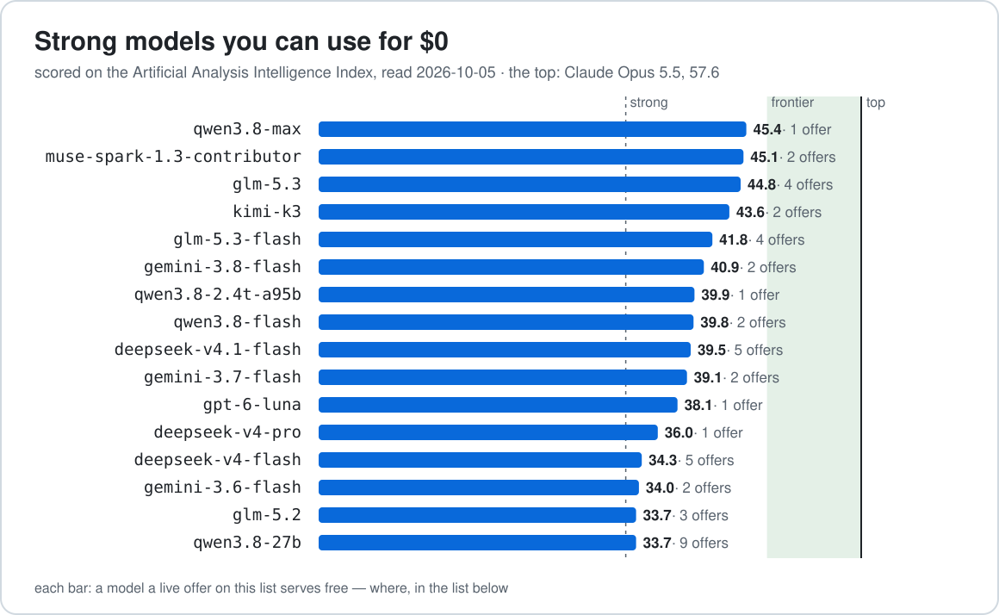
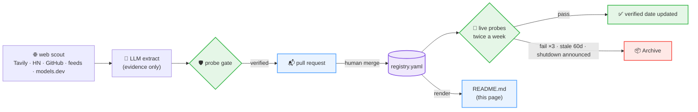

<a name="top"></a>
<div align="center">

<picture>
  <source media="(max-width: 600px)" srcset="assets/readme/hero-narrow.svg">
  <source media="(prefers-color-scheme: dark)" srcset="assets/readme/hero-dark.svg">
  
</picture>

[](https://github.com/mvalentsev/awesome-free-ai-coding/actions/workflows/update.yml)
[](https://github.com/mvalentsev/awesome-free-ai-coding/actions/workflows/ci.yml)


**[🌐&nbsp;Website](https://mvalentsev.github.io/awesome-free-ai-coding/) · [🔎&nbsp;Search](https://mvalentsev.github.io/awesome-free-ai-coding/#search) · [🤖&nbsp;Agents](#-coding-agents--clis) · [🔌&nbsp;APIs](#-llm-apis-with-free-tier) · [🎁&nbsp;Trials](#-trials-no-card-when-possible) · [🧭&nbsp;Aggregators](#-aggregators-one-key-many-providers) · [🔧&nbsp;Plug&nbsp;it&nbsp;in](#-plug-it-into-your-agent) · [📡&nbsp;How&nbsp;it&nbsp;works](#-how-this-list-stays-fresh)**

</div>

> **Machine-verified, not copy-pasted.** A live probe re-reads every row against the vendor's own API or pricing page twice a week; an offer that dies drops to the [Archive](#-archive) on its own, and each date below opens the row's evidence.

🆕 **New this week:** [MiniMax Code](https://mvalentsev.github.io/awesome-free-ai-coding/providers/minimax-code/)

## 🚀 Start here

**Free is not the same as weak.** These agents run on a $0 plan, ask for no card, and this is what they hand you:

- **[opencode](https://opencode.ai)** — `muse-spark-1.3-contributor` · `mimo-v2.5` · `ling-3.0-flash-fin` · `nemotron-3-ultra` · [+2&nbsp;more](https://mvalentsev.github.io/awesome-free-ai-coding/providers/opencode/)
- **[Kilo Code](https://kilo.ai)** — `qwen3.8-27b` · `nemotron-3-ultra` · `nemotron-3-super` · `step-3.7-flash` · [+8&nbsp;more](https://mvalentsev.github.io/awesome-free-ai-coding/providers/kilo-code/)
- **[Google Antigravity](https://antigravity.google)** — `gemini-3.8-flash` · `gemini-3.7-flash` · `gemini-3.6-flash` · `gemini-3.1-pro` · [+3&nbsp;more](https://mvalentsev.github.io/awesome-free-ai-coding/providers/antigravity/)
- **[Freebuff](https://freebuff.com)** — `glm-5.3-flash` · `deepseek-v4.1-flash`

**Strong models, free.** Each of these scores within 25 points of the top of the [Artificial Analysis Intelligence Index](https://artificialanalysis.ai/leaderboards/models), re-read twice a week, and every row beside it serves it free:

<div align="center">
<a href="https://mvalentsev.github.io/awesome-free-ai-coding/models/"><picture>
  <source media="(max-width: 600px)" srcset="assets/readme/strong-narrow.svg">
  <source media="(prefers-color-scheme: dark)" srcset="assets/readme/strong-dark.svg">
  
</picture></a>
</div>

<details>
<summary><b>Where each one is free</b> — every live offer beside its model, in the chart's order</summary>
<br>

- [`qwen3.8-max`](https://mvalentsev.github.io/awesome-free-ai-coding/models/qwen3.8-max/) — [Alibaba Cloud Model Studio (DashScope, international)](https://www.alibabacloud.com/en/product/modelstudio)
- [`muse-spark-1.3-contributor`](https://mvalentsev.github.io/awesome-free-ai-coding/models/muse-spark-1.3-contributor/) — [opencode](https://opencode.ai) · [Cline](https://cline.bot)
- [`glm-5.3`](https://mvalentsev.github.io/awesome-free-ai-coding/models/glm-5.3/) — [NVIDIA NIM (build.nvidia.com)](https://build.nvidia.com) · [AIHubMix (free models)](https://aihubmix.com) · [Alibaba Cloud Model Studio (DashScope, international)](https://www.alibabacloud.com/en/product/modelstudio) · [ZCode (Z.ai)](https://zcode.z.ai/en)
- [`kimi-k3`](https://mvalentsev.github.io/awesome-free-ai-coding/models/kimi-k3/) — [NVIDIA NIM (build.nvidia.com)](https://build.nvidia.com) · [AIHubMix (free models)](https://aihubmix.com)
- [`glm-5.3-flash`](https://mvalentsev.github.io/awesome-free-ai-coding/models/glm-5.3-flash/) — [NVIDIA NIM (build.nvidia.com)](https://build.nvidia.com) · [Freebuff](https://freebuff.com) · [AIHubMix (free models)](https://aihubmix.com) · [FreeInference (Harvard SEAS)](https://freeinference.org)
- [`gemini-3.8-flash`](https://mvalentsev.github.io/awesome-free-ai-coding/models/gemini-3.8-flash/) — [Google AI Studio (Gemini API)](https://aistudio.google.com) · [Google Antigravity](https://antigravity.google)
- [`qwen3.8-2.4t-a95b`](https://mvalentsev.github.io/awesome-free-ai-coding/models/qwen3.8-2.4t-a95b/) — [Alibaba Cloud Model Studio (DashScope, international)](https://www.alibabacloud.com/en/product/modelstudio)
- [`qwen3.8-flash`](https://mvalentsev.github.io/awesome-free-ai-coding/models/qwen3.8-flash/) — [Alibaba Cloud Model Studio (DashScope, international)](https://www.alibabacloud.com/en/product/modelstudio) · [Yolo-Auto](https://yolo-auto.com)
- [`deepseek-v4.1-flash`](https://mvalentsev.github.io/awesome-free-ai-coding/models/deepseek-v4.1-flash/) — [NVIDIA NIM (build.nvidia.com)](https://build.nvidia.com) · [Freebuff](https://freebuff.com) · [Cline](https://cline.bot) · [Alibaba Cloud Model Studio (DashScope, international)](https://www.alibabacloud.com/en/product/modelstudio) · [Token Harbor](https://tokenharbor.ai)
- [`gemini-3.7-flash`](https://mvalentsev.github.io/awesome-free-ai-coding/models/gemini-3.7-flash/) — [Google AI Studio (Gemini API)](https://aistudio.google.com) · [Google Antigravity](https://antigravity.google)
- [`gpt-6-luna`](https://mvalentsev.github.io/awesome-free-ai-coding/models/gpt-6-luna/) — [Zed](https://zed.dev)
- [`deepseek-v4-pro`](https://mvalentsev.github.io/awesome-free-ai-coding/models/deepseek-v4-pro/) — [Alibaba Cloud Model Studio (DashScope, international)](https://www.alibabacloud.com/en/product/modelstudio)
- [`deepseek-v4-flash`](https://mvalentsev.github.io/awesome-free-ai-coding/models/deepseek-v4-flash/) — [Routeway](https://routeway.ai) · [Alibaba Cloud Model Studio (DashScope, international)](https://www.alibabacloud.com/en/product/modelstudio) · [BazaarLink](https://bazaarlink.ai) · [AtomCode](https://atomcode.atomgit.com/) · [FreeInference (Harvard SEAS)](https://freeinference.org)
- [`gemini-3.6-flash`](https://mvalentsev.github.io/awesome-free-ai-coding/models/gemini-3.6-flash/) — [Google AI Studio (Gemini API)](https://aistudio.google.com) · [Google Antigravity](https://antigravity.google)
- [`glm-5.2`](https://mvalentsev.github.io/awesome-free-ai-coding/models/glm-5.2/) — [AIHubMix (free models)](https://aihubmix.com) · [Alibaba Cloud Model Studio (DashScope, international)](https://www.alibabacloud.com/en/product/modelstudio) · [Regolo AI](https://regolo.ai/pricing/)
- [`qwen3.8-27b`](https://mvalentsev.github.io/awesome-free-ai-coding/models/qwen3.8-27b/) — [OpenRouter (free models)](https://openrouter.ai) · [Groq](https://groq.com) · [Kilo Code](https://kilo.ai) · [LLM Tech](https://llmtech.eu) · [Hetzner Inference API](https://docs.hetzner.com/general/company-and-policy/experiments/inference/) · [Alibaba Cloud Model Studio (DashScope, international)](https://www.alibabacloud.com/en/product/modelstudio) · [Regolo AI](https://regolo.ai/pricing/) · [VLM Run Gateway](https://vlm.run) · [OVHcloud AI Endpoints](https://www.ovhcloud.com/en/public-cloud/ai-endpoints/catalog/)

</details>

**Or pick by what you need:**

- **An API key that gets the most done for free** — [Google AI Studio (Gemini API)](https://aistudio.google.com) · [Groq](https://groq.com) · [NVIDIA NIM (build.nvidia.com)](https://build.nvidia.com)
- **One key, many free models** — [OpenRouter (free models)](https://openrouter.ai) · [Requesty](https://www.requesty.ai) · [AIHubMix (free models)](https://aihubmix.com)
- **No account at all** — [Kilo Code](https://kilo.ai) · [LLM Tech](https://llmtech.eu) · [VLM Run Gateway](https://vlm.run)
- **A trial that asks for no card** — [GitHub Copilot Free](https://github.com/features/copilot) · [Kiro](https://kiro.dev/) · [Google Jules](https://jules.google/)
- **Claude Code on a free lane** — [OpenRouter (free models)](https://openrouter.ai) · [Requesty](https://www.requesty.ai) · [AIHubMix (free models)](https://aihubmix.com)
- **Codex CLI on a free lane** — [OpenRouter (free models)](https://openrouter.ai) `codex -p openrouter-free` · [Kilo Code](https://kilo.ai) `codex -p kilo-code` · [AIHubMix (free models)](https://aihubmix.com) `codex -p aihubmix` · [any lane of the LiteLLM config](configs/codex/litellm.config.toml) `codex -p litellm`


<sub>The top of each section in the list's own order — [how rows are ordered](CONTRIBUTING.md#how-rows-are-ordered); the Claude Code line names gateways with an Anthropic-format route every run calls, one shell function each in [`configs/claude-code.sh`](configs/claude-code.sh); the Codex CLI line names lanes Codex calls directly — ones that took its request with no key, which every run sends again, and ones whose vendor's own page sets Codex up, which every run reads back — one profile each in [`configs/codex/`](configs/codex/).</sub>

**No account at all?** [Kilo Code](https://kilo.ai) answers in the terminal you already have open — a rate-limited lane to prove this page is live, not a setup to write code on:

```bash
curl -s https://api.kilo.ai/api/gateway/chat/completions \
  -H 'Content-Type: application/json' \
  -d '{"model":"kilo-auto/free","messages":[{"role":"user","content":"2+2? MAKE NO MISTAKES."}]}'
```
<sub>Free IDs need no key, with 200 requests/hour per IP; metered IDs require sign-in. Free catalog entries allow training on prompts. kilo-auto/free and openrouter/free choose a free model automatically; stealth/space-bunny-alpha names no model. LiquidAI advises against agentic coding with lfm-2.5-2.6b.</sub>

**Ready to wire one in?** Base URL and key name for every OpenAI-compatible API on this page are in [`configs/README.md`](configs/README.md), beside drop-in configs for [opencode](https://opencode.ai), [LiteLLM](https://docs.litellm.ai), [Claude Code](https://code.claude.com/docs) and [Codex CLI](https://developers.openai.com/codex) — all generated from the same registry and regenerated on every update.

## 📋 The list

<sub>**💳** — the row wants a card on file, 4 of 85, and no other row asks for one · **👁** — what you send may be used to train models, in the vendor's own words · **🧪** — new, provisional for two weeks of probes · **verified** — the last day a live probe confirmed the offer; it opens the row's page: the quota in the vendor's words, the evidence, the history</sub>

### 🤖 Coding agents & CLIs
<sub>**10** live · not one of them asks for a card · sorted by how much work you can get done for free</sub>

- **[opencode](https://opencode.ai)** 👁 — Open-source coding agent whose opencode Zen gateway prices a rotating set of models at zero — inside OpenCode only, no sign-in; any provider via BYOK<br><sub>[verified 2026-10-05](https://mvalentsev.github.io/awesome-free-ai-coding/providers/opencode/) · `big-pickle` · [`mimo-v2.5`](https://mvalentsev.github.io/awesome-free-ai-coding/models/mimo-v2.5/) · [`ling-3.0-flash-fin`](https://mvalentsev.github.io/awesome-free-ai-coding/models/ling-3.0-flash-fin/) · [`nemotron-3-ultra`](https://mvalentsev.github.io/awesome-free-ai-coding/models/nemotron-3-ultra/) · [`nemotron-3.5-lightning`](https://mvalentsev.github.io/awesome-free-ai-coding/models/nemotron-3.5-lightning/) · [`muse-spark-1.3-contributor`](https://mvalentsev.github.io/awesome-free-ai-coding/models/muse-spark-1.3-contributor/)</sub>
- **[Kilo Code](https://kilo.ai)** 👁 — Open-source VS Code / JetBrains / CLI agent whose $0 plan routes "Auto Free" to the models the Kilo Gateway marks free; the same gateway serves them to any OpenAI client without a key, with BYOK and local models alongside<br><sub>[verified 2026-10-05](https://mvalentsev.github.io/awesome-free-ai-coding/providers/kilo-code/) · [`nemotron-3-ultra`](https://mvalentsev.github.io/awesome-free-ai-coding/models/nemotron-3-ultra/) · [`nemotron-3-super`](https://mvalentsev.github.io/awesome-free-ai-coding/models/nemotron-3-super/) · [`north-mini-code`](https://mvalentsev.github.io/awesome-free-ai-coding/models/north-mini-code/) · [`step-3.7-flash`](https://mvalentsev.github.io/awesome-free-ai-coding/models/step-3.7-flash/) · [`laguna-s-2.1`](https://mvalentsev.github.io/awesome-free-ai-coding/models/laguna-s-2.1/) · [`laguna-xs-2.1`](https://mvalentsev.github.io/awesome-free-ai-coding/models/laguna-xs-2.1/) · [`nemotron-3.5-lightning`](https://mvalentsev.github.io/awesome-free-ai-coding/models/nemotron-3.5-lightning/) · [`inkling-small`](https://mvalentsev.github.io/awesome-free-ai-coding/models/inkling-small/) · [+4 more](https://mvalentsev.github.io/awesome-free-ai-coding/providers/kilo-code/)</sub>
- **[Google Antigravity](https://antigravity.google)** 👁 — Google's agent-first IDE and CLI, with a $0 Individual plan serving Gemini and third-party agent models<br><sub>[verified 2026-10-01](https://mvalentsev.github.io/awesome-free-ai-coding/providers/antigravity/) · [`gemini-3.1-pro`](https://mvalentsev.github.io/awesome-free-ai-coding/models/gemini-3.1-pro/) · [`gemini-3.8-flash`](https://mvalentsev.github.io/awesome-free-ai-coding/models/gemini-3.8-flash/) · [`gemini-3.7-flash`](https://mvalentsev.github.io/awesome-free-ai-coding/models/gemini-3.7-flash/) · [`gemini-3.6-flash`](https://mvalentsev.github.io/awesome-free-ai-coding/models/gemini-3.6-flash/) · [`claude-opus-4.6`](https://mvalentsev.github.io/awesome-free-ai-coding/models/claude-opus-4.6/) · [`claude-sonnet-4.6`](https://mvalentsev.github.io/awesome-free-ai-coding/models/claude-sonnet-4.6/) · [`gpt-oss-120b`](https://mvalentsev.github.io/awesome-free-ai-coding/models/gpt-oss-120b/)</sub>
- **[Freebuff](https://freebuff.com)** 👁 — Ad-funded coding agent — CLI, desktop, web, cloud and chat — with no API key and no card, on a daily budget of free model hours<br><sub>[verified 2026-10-05](https://mvalentsev.github.io/awesome-free-ai-coding/providers/freebuff/) · [`glm-5.3-flash`](https://mvalentsev.github.io/awesome-free-ai-coding/models/glm-5.3-flash/) · [`deepseek-v4.1-flash`](https://mvalentsev.github.io/awesome-free-ai-coding/models/deepseek-v4.1-flash/)</sub>
- **[Cline](https://cline.bot)** 👁 — Open-source coding agent for VS Code, JetBrains and the terminal; signing in to its own Cline provider unlocks a rotating set of free models, each with a daily allowance, beside pay-as-you-go credits, the $9.99 ClinePass plan and BYOK<br><sub>[verified 2026-10-05](https://mvalentsev.github.io/awesome-free-ai-coding/providers/cline/) · [`muse-spark-1.3-contributor`](https://mvalentsev.github.io/awesome-free-ai-coding/models/muse-spark-1.3-contributor/) · [`deepseek-v4.1-flash`](https://mvalentsev.github.io/awesome-free-ai-coding/models/deepseek-v4.1-flash/)</sub>
- **[Crush + Charm Hyper](https://hyper.charm.land)** — Charm's Crush terminal agent with Hyper, its official hosted model gateway; the free plan includes monthly Hypercredits, zero data retention<br><sub>[verified 2026-10-05](https://mvalentsev.github.io/awesome-free-ai-coding/providers/charm-hyper/)</sub>
- **[Autohand Code](https://www.autohand.ai/code/)** 🧪 — Open-source coding agent for the terminal, VS Code, JetBrains and the desktop whose Free plan runs Autohand's own latency-first coding model with no card, its messages counted per five hours and per week<br><sub>[verified 2026-10-05](https://mvalentsev.github.io/awesome-free-ai-coding/providers/autohand-code/) · `fantail`</sub>
- **[MiniMax Code](https://agent.minimax.io/download)** 🧪 — MiniMax's coding agent — a desktop app for macOS and Windows, with an open-source CLI beside it — whose daily check-in in the app earns free points to spend on its tasks, coding among them<br><sub>[verified 2026-10-05](https://mvalentsev.github.io/awesome-free-ai-coding/providers/minimax-code/)</sub>
- **[OpenAI Codex CLI](https://learn.chatgpt.com/docs/codex/cli)** — Open-source coding CLI, free by signing in with a $0 ChatGPT Free account; local coding tasks included on all plans<br><sub>[verified 2026-10-05](https://mvalentsev.github.io/awesome-free-ai-coding/providers/openai-codex-cli/)</sub>
- **[CodeGPT](https://www.codegpt.co)** — VS Code / JetBrains coding agent whose $0 plan includes model usage rather than only BYOK — a small daily allowance on its own Economy models, plus BYOK across 15+ providers and local models (Ollama, LM Studio) beside it<br><sub>[verified 2026-10-05](https://mvalentsev.github.io/awesome-free-ai-coding/providers/codegpt/)</sub>

### 🔌 LLM APIs with free tier
<sub>**31** live · **29** of them ask for no card · sorted by how much work you can get done for free</sub>

- **[Google AI Studio (Gemini API)](https://aistudio.google.com)** 👁 — Free tier on the Gemini API, priced model by model rather than as one account quota<br><sub>[verified 2026-10-05](https://mvalentsev.github.io/awesome-free-ai-coding/providers/google-ai-studio/) · [🔑 key](https://aistudio.google.com/apikey) · [`gemini-3.8-flash`](https://mvalentsev.github.io/awesome-free-ai-coding/models/gemini-3.8-flash/) · [`gemini-3.7-flash`](https://mvalentsev.github.io/awesome-free-ai-coding/models/gemini-3.7-flash/) · [`gemini-3.6-flash`](https://mvalentsev.github.io/awesome-free-ai-coding/models/gemini-3.6-flash/) · [`gemini-3.5-flash`](https://mvalentsev.github.io/awesome-free-ai-coding/models/gemini-3.5-flash/) · [`gemini-3.5-flash-lite`](https://mvalentsev.github.io/awesome-free-ai-coding/models/gemini-3.5-flash-lite/) · [`gemini-3.1-flash-lite`](https://mvalentsev.github.io/awesome-free-ai-coding/models/gemini-3.1-flash-lite/) · [`gemini-3-flash`](https://mvalentsev.github.io/awesome-free-ai-coding/models/gemini-3-flash/) · `gemma-4`</sub>
- **[Groq](https://groq.com)** — Fast inference against a free plan Groq publishes as a per-model rate table<br><sub>[verified 2026-10-05](https://mvalentsev.github.io/awesome-free-ai-coding/providers/groq-free/) · [🔑 key](https://console.groq.com/keys) · [`gpt-oss-120b`](https://mvalentsev.github.io/awesome-free-ai-coding/models/gpt-oss-120b/) · [`gpt-oss-20b`](https://mvalentsev.github.io/awesome-free-ai-coding/models/gpt-oss-20b/) · [`qwen3.8-27b`](https://mvalentsev.github.io/awesome-free-ai-coding/models/qwen3.8-27b/)</sub>
- **[NVIDIA NIM (build.nvidia.com)](https://build.nvidia.com)** 👁 — Free endpoints for the models build.nvidia.com marks "Free Endpoint", open-weight models from several labs among them, called with a free NVIDIA Developer Program key at integrate.api.nvidia.com/v1 (OpenAI-compatible)<br><sub>[verified 2026-10-05](https://mvalentsev.github.io/awesome-free-ai-coding/providers/nvidia-nim/) · [🔑 key](https://build.nvidia.com) · [`kimi-k3`](https://mvalentsev.github.io/awesome-free-ai-coding/models/kimi-k3/) · [`glm-5.3`](https://mvalentsev.github.io/awesome-free-ai-coding/models/glm-5.3/) · [`glm-5.3-flash`](https://mvalentsev.github.io/awesome-free-ai-coding/models/glm-5.3-flash/) · [`nemotron-3-ultra`](https://mvalentsev.github.io/awesome-free-ai-coding/models/nemotron-3-ultra/) · [`nemotron-3-super`](https://mvalentsev.github.io/awesome-free-ai-coding/models/nemotron-3-super/) · [`laguna-xs-2.1`](https://mvalentsev.github.io/awesome-free-ai-coding/models/laguna-xs-2.1/) · [`muse-glimmer-30b`](https://mvalentsev.github.io/awesome-free-ai-coding/models/muse-glimmer-30b/) · [`nemotron-3.5-lightning`](https://mvalentsev.github.io/awesome-free-ai-coding/models/nemotron-3.5-lightning/) · [+7 more](https://mvalentsev.github.io/awesome-free-ai-coding/providers/nvidia-nim/)</sub>
- **[Z.ai (Zhipu GLM)](https://z.ai)** — GLM Flash models free on the API, vision included (OpenAI-compatible at api.z.ai/api/paas/v4)<br><sub>[verified 2026-10-05](https://mvalentsev.github.io/awesome-free-ai-coding/providers/zai-glm/) · [🔑 key](https://z.ai/manage-apikey/apikey-list) · [`glm-4.7-flash`](https://mvalentsev.github.io/awesome-free-ai-coding/models/glm-4.7-flash/) · `glm-4.5-flash` · `glm-4.6v-flash`</sub>
- **[Cloudflare Workers AI](https://www.cloudflare.com/products/workers-ai/)** — 10k neurons/day free<br><sub>[verified 2026-10-05](https://mvalentsev.github.io/awesome-free-ai-coding/providers/cloudflare-workers-ai/) · [🔑 key](https://dash.cloudflare.com/profile/api-tokens)</sub>
- **[LLM7.io](https://llm7.io)** — OpenAI-compatible API with a free dashboard token and a recurring allowance of 100,000 input plus output tokens per day on eligible turbo models<br><sub>[verified 2026-10-05](https://mvalentsev.github.io/awesome-free-ai-coding/providers/llm7/) · [🔑 key](https://dash.llm7.io)</sub>
- **[LLM Tech](https://llmtech.eu)** — EU provider of one model whose quickstart prints a shared trial key for anyone: 2M tokens a day per address and 4 concurrent requests, tool calls included, no account<br><sub>[verified 2026-10-05](https://mvalentsev.github.io/awesome-free-ai-coding/providers/llmtech/) · [🔑 key](https://llmtech.eu/docs/) · [`qwen3.8-27b`](https://mvalentsev.github.io/awesome-free-ai-coding/models/qwen3.8-27b/)</sub>
- **[Hetzner Inference API](https://docs.hetzner.com/general/company-and-policy/experiments/inference/)** — OpenAI-compatible API on Hetzner's own EU hardware, free for as long as the experiment runs<br><sub>[verified 2026-10-05](https://mvalentsev.github.io/awesome-free-ai-coding/providers/hetzner-inference/) · [🔑 key](https://experiments.hetzner.com/inference) · [`qwen3.6`](https://mvalentsev.github.io/awesome-free-ai-coding/models/qwen3.6/) · [`qwen3.8-27b`](https://mvalentsev.github.io/awesome-free-ai-coding/models/qwen3.8-27b/)</sub>
- **[Alibaba Cloud Model Studio (DashScope, international)](https://www.alibabacloud.com/en/product/modelstudio)** — A million free tokens on each of its chat models in the Singapore region — Qwen, DeepSeek and GLM among them — valid 90 days from activation or the model's release; OpenAI-compatible<br><sub>[verified 2026-10-05](https://mvalentsev.github.io/awesome-free-ai-coding/providers/alibaba-model-studio/) · [🔑 key](https://modelstudio.console.alibabacloud.com) · [`qwen3.8-max`](https://mvalentsev.github.io/awesome-free-ai-coding/models/qwen3.8-max/) · [`qwen3.8-flash`](https://mvalentsev.github.io/awesome-free-ai-coding/models/qwen3.8-flash/) · [`qwen3.8-2.4t-a95b`](https://mvalentsev.github.io/awesome-free-ai-coding/models/qwen3.8-2.4t-a95b/) · [`qwen3.8-27b`](https://mvalentsev.github.io/awesome-free-ai-coding/models/qwen3.8-27b/) · [`deepseek-v4-pro`](https://mvalentsev.github.io/awesome-free-ai-coding/models/deepseek-v4-pro/) · [`deepseek-v4-flash`](https://mvalentsev.github.io/awesome-free-ai-coding/models/deepseek-v4-flash/) · [`deepseek-v4.1-flash`](https://mvalentsev.github.io/awesome-free-ai-coding/models/deepseek-v4.1-flash/) · [`glm-5.3`](https://mvalentsev.github.io/awesome-free-ai-coding/models/glm-5.3/) · [+52 more](https://mvalentsev.github.io/awesome-free-ai-coding/providers/alibaba-model-studio/)</sub>
- **[Mistral Studio](https://mistral.ai)** 👁 — Mistral's Free plan — API keys with $10 a month of included usage, shared by the API, Studio and the Vibe coding CLI, no card<br><sub>[verified 2026-10-05](https://mvalentsev.github.io/awesome-free-ai-coding/providers/mistral-free/) · [🔑 key](https://console.mistral.ai/api-keys)</sub>
- **[VLM Run Gateway](https://vlm.run)** — OpenAI-compatible gateway for vision and language models whose models on VLM Run's own GPUs answer anonymous callers — no signup, no key — at 100 requests a day per IP, in alpha<br><sub>[verified 2026-10-05](https://mvalentsev.github.io/awesome-free-ai-coding/providers/vlm-run-gateway/) · [`qwen3.8-27b`](https://mvalentsev.github.io/awesome-free-ai-coding/models/qwen3.8-27b/)</sub>
- **[Cohere (trial keys)](https://cohere.com)** 👁 — Cohere's Command models via free trial API keys that never expire, plus a 30B/3B Apache-2.0 coding model Cohere prices at zero on every key type<br><sub>[verified 2026-10-05](https://mvalentsev.github.io/awesome-free-ai-coding/providers/cohere/) · [🔑 key](https://dashboard.cohere.com/api-keys) · [`command-a-plus`](https://mvalentsev.github.io/awesome-free-ai-coding/models/command-a-plus/) · `command-a-reasoning` · [`north-mini-code`](https://mvalentsev.github.io/awesome-free-ai-coding/models/north-mini-code/) · `command-a` · `command-a-vision` · `command-r-plus` · `command-r` · `command-r7b`</sub>
- **[SEA-LION (AI Singapore)](https://sea-lion.ai)** — AI Singapore's open Southeast-Asian model family behind a first-party OpenAI-compatible API — the vendor hosting its own weights rather than a gateway reselling somebody else's<br><sub>[verified 2026-10-05](https://mvalentsev.github.io/awesome-free-ai-coding/providers/sea-lion/) · [🔑 key](https://playground.sea-lion.ai/key-manager)</sub>
- **[OpenTyphoon (SCB 10X)](https://opentyphoon.ai)** 👁 — Thai-tuned open models from SCB 10X, the venture arm of Siam Commercial Bank, behind an OpenAI-compatible API whose FAQ calls it a research showcase and free to use<br><sub>[verified 2026-10-05](https://mvalentsev.github.io/awesome-free-ai-coding/providers/opentyphoon/) · [🔑 key](https://playground.opentyphoon.ai/api-key)</sub>
- **[Agnes AI](https://agnes-ai.com)** 👁 — Agnes AI's own models behind an OpenAI-compatible API, with its Flash text models charged at zero today and image generation free beside them<br><sub>[verified 2026-10-05](https://mvalentsev.github.io/awesome-free-ai-coding/providers/agnes-ai/) · [🔑 key](https://platform.agnes-ai.com) · [`agnes-3.0-flash`](https://mvalentsev.github.io/awesome-free-ai-coding/models/agnes-3.0-flash/) · [`agnes-2.5-flash`](https://mvalentsev.github.io/awesome-free-ai-coding/models/agnes-2.5-flash/)</sub>
- **[FreeInference (Harvard SEAS)](https://freeinference.org)** — Harvard SEAS's MadSys Lab serving open models free to every account behind both an OpenAI-shaped and an Anthropic-shaped endpoint, with a documented Claude Code setup<br><sub>[verified 2026-10-05](https://mvalentsev.github.io/awesome-free-ai-coding/providers/freeinference/) · [🔑 key](https://freeinference.org) · [`deepseek-v4-flash`](https://mvalentsev.github.io/awesome-free-ai-coding/models/deepseek-v4-flash/) · [`glm-5.1`](https://mvalentsev.github.io/awesome-free-ai-coding/models/glm-5.1/) · [`glm-5.3-flash`](https://mvalentsev.github.io/awesome-free-ai-coding/models/glm-5.3-flash/) · [`minimax-m3`](https://mvalentsev.github.io/awesome-free-ai-coding/models/minimax-m3/) · [`qwen3.6`](https://mvalentsev.github.io/awesome-free-ai-coding/models/qwen3.6/) · [`minimax-m2.5`](https://mvalentsev.github.io/awesome-free-ai-coding/models/minimax-m2.5/) · [`diffusiongemma`](https://mvalentsev.github.io/awesome-free-ai-coding/models/diffusiongemma/)</sub>
- **[Ollama Cloud](https://ollama.com/cloud)** — Cloud-hosted open models on a $0 plan that grants starter usage credits for a starter subset of the catalog<br><sub>[verified 2026-10-05](https://mvalentsev.github.io/awesome-free-ai-coding/providers/ollama-cloud/) · [🔑 key](https://ollama.com/settings/keys)</sub>
- **[OVHcloud AI Endpoints](https://www.ovhcloud.com/en/public-cloud/ai-endpoints/catalog/)** — EU-hosted serverless open-model API whose anonymous lane needs no signup, no key and no card (OpenAI-compatible), at two requests a minute per model shared by every anonymous caller<br><sub>[verified 2026-10-05](https://mvalentsev.github.io/awesome-free-ai-coding/providers/ovh-ai-endpoints/) · [`gpt-oss-120b`](https://mvalentsev.github.io/awesome-free-ai-coding/models/gpt-oss-120b/) · [`qwen3.6`](https://mvalentsev.github.io/awesome-free-ai-coding/models/qwen3.6/) · [`qwen3.8-27b`](https://mvalentsev.github.io/awesome-free-ai-coding/models/qwen3.8-27b/) · `qwen3-coder`</sub>
- **[Poolside Platform](https://poolside.ai)** 👁 — Free self-serve developer access to Poolside's own Laguna coding models<br><sub>[verified 2026-10-05](https://mvalentsev.github.io/awesome-free-ai-coding/providers/poolside/) · [🔑 key](https://platform.poolside.ai)</sub>
- **[Sail Research](https://www.sailresearch.com)** 💳 — Open-weight models for long-running agents — Kimi K3, GLM-5.3, DeepSeek V4 Pro — behind OpenAI- and Anthropic-compatible APIs, with $5 of free credit every month once a payment method is on the account<br><sub>[verified 2026-10-05](https://mvalentsev.github.io/awesome-free-ai-coding/providers/sail-research/) · [🔑 key](https://app.sailresearch.com)</sub>
- **[uncloseai (unturf)](https://uncloseai.com)** — Keyless OpenAI-compatible chat endpoint — no signup, no key, no account<br><sub>[verified 2026-10-05](https://mvalentsev.github.io/awesome-free-ai-coding/providers/uncloseai/)</sub>
- **[Pollinations.AI](https://pollinations.ai)** — Legacy open text API, no signup, OpenAI-compatible (POST text.pollinations.ai/openai), on one model<br><sub>[verified 2026-10-05](https://mvalentsev.github.io/awesome-free-ai-coding/providers/pollinations/) · [`gpt-oss-20b`](https://mvalentsev.github.io/awesome-free-ai-coding/models/gpt-oss-20b/)</sub>
- **[IBM watsonx.ai (Lite plan)](https://www.ibm.com/products/watsonx-ai)** 💳 — IBM's watsonx.ai Runtime on its Lite plan — 300,000 tokens a month of foundation-model inference (Granite, Llama, Mistral and other hosted models) on IBM Cloud, a plan IBM's own docs call free and never bill<br><sub>[verified 2026-10-05](https://mvalentsev.github.io/awesome-free-ai-coding/providers/ibm-watsonx-ai/) · [🔑 key](https://cloud.ibm.com/iam/apikeys)</sub>
- **[Arli AI](https://www.arliai.com)** — OpenAI-compatible inference on open models and their fine-tunes, whose Free plan tries each model five times every two days at 12K tokens of context, one request at a time<br><sub>[verified 2026-10-05](https://mvalentsev.github.io/awesome-free-ai-coding/providers/arli-ai/) · [🔑 key](https://www.arliai.com/account)</sub>
- **[Bytez](https://bytez.com)** — Serverless API over open models, whose Free plan grants $1 of credit every four weeks for open models of up to 7B parameters, one request at a time, with no billing<br><sub>[verified 2026-10-05](https://mvalentsev.github.io/awesome-free-ai-coding/providers/bytez/) · [🔑 key](https://bytez.com/api)</sub>
- **[Mixlayer](https://www.mixlayer.com)** — Serverless open models priced per token, one of them at $0 and callable without prepaid credit<br><sub>[verified 2026-10-05](https://mvalentsev.github.io/awesome-free-ai-coding/providers/mixlayer/) · [🔑 key](https://console.mixlayer.com/app/api-keys) · [`qwen3.5-4b`](https://mvalentsev.github.io/awesome-free-ai-coding/models/qwen3.5-4b/)</sub>
- **[Yolo-Auto](https://yolo-auto.com)** — One open-weight Qwen model served on the vendor's own flat-rate API for coding agents; the free plan is 15 requests a week with no card<br><sub>[verified 2026-10-05](https://mvalentsev.github.io/awesome-free-ai-coding/providers/yolo-auto/) · [🔑 key](https://yolo-auto.com/app) · [`qwen3.8-flash`](https://mvalentsev.github.io/awesome-free-ai-coding/models/qwen3.8-flash/)</sub>
- **[ModelScope API-Inference (Alibaba)](https://modelscope.cn)** — Alibaba's model community serves 35 models free — DeepSeek V4 Pro, GLM-5.2, MiniMax M3 and Qwen3.8 among them — for 250 魔粒 a day at 0.5 to 2 a call, after Alibaba Cloud real-name verification<br><sub>[verified 2026-10-05](https://mvalentsev.github.io/awesome-free-ai-coding/providers/modelscope/) · [🔑 key](https://modelscope.cn/my/myaccesstoken)</sub>
- **[SenseNova (SenseTime 商汤)](https://www.sensenova.cn)** — SenseTime's own SenseNova models behind an OpenAI-compatible url, free for everyone while the token plan is in public beta<br><sub>[verified 2026-10-05](https://mvalentsev.github.io/awesome-free-ai-coding/providers/sensenova/) · [🔑 key](https://platform.sensenova.cn)</sub>
- **[Tencent Cloud TokenHub](https://cloud.tencent.com/document/product/1823)** — Tencent Cloud's model platform, with a one-time grant of a million tokens on each of its language models, valid a year and no card, on an account that has passed Tencent Cloud real-name verification<br><sub>[verified 2026-10-05](https://mvalentsev.github.io/awesome-free-ai-coding/providers/tencent-tokenhub/) · [🔑 key](https://console.cloud.tencent.com/tokenhub/apikey)</sub>
- **[SiliconFlow (China)](https://siliconflow.cn)** — China's SiliconFlow prices eight small chat models at ¥0 for an account verified with Chinese, Hong Kong, Macau or Taiwan papers<br><sub>[verified 2026-10-05](https://mvalentsev.github.io/awesome-free-ai-coding/providers/siliconflow-cn/) · [🔑 key](https://cloud.siliconflow.cn/account/ak) · `xing4.0-29b` · [`qwen3-8b`](https://mvalentsev.github.io/awesome-free-ai-coding/models/qwen3-8b/) · `glm-4-9b-0414` · `qwen2.5-7b` · [`qwen3.5-4b`](https://mvalentsev.github.io/awesome-free-ai-coding/models/qwen3.5-4b/) · `glm-z1-9b-0414` · `deepseek-r1-0528-qwen3-8b`</sub>

### 🎁 Trials (no card when possible)
<sub>**29** live · not one of them asks for a card · sorted by how much work you can get done for free</sub>

- **[GitHub Copilot Free](https://github.com/features/copilot)** 👁 — Free Copilot plan for individual developers in VS Code, JetBrains, Visual Studio and CLI; completions, limited chat and agent usage<br><sub>[verified 2026-10-05](https://mvalentsev.github.io/awesome-free-ai-coding/providers/github-copilot-free/)</sub>
- **[Kiro](https://kiro.dev/)** 👁 — Perpetual free tier of AWS's spec-driven agentic IDE (successor to Amazon Q Developer) with Claude and open-weight models<br><sub>[verified 2026-10-05](https://mvalentsev.github.io/awesome-free-ai-coding/providers/kiro/) · [`claude-sonnet-4.5`](https://mvalentsev.github.io/awesome-free-ai-coding/models/claude-sonnet-4.5/) · [`claude-sonnet-4`](https://mvalentsev.github.io/awesome-free-ai-coding/models/claude-sonnet-4/) · [`glm-5`](https://mvalentsev.github.io/awesome-free-ai-coding/models/glm-5/) · [`minimax-m2.5`](https://mvalentsev.github.io/awesome-free-ai-coding/models/minimax-m2.5/) · [`deepseek-v3.2`](https://mvalentsev.github.io/awesome-free-ai-coding/models/deepseek-v3.2/) · [`qwen3-coder-next`](https://mvalentsev.github.io/awesome-free-ai-coding/models/qwen3-coder-next/) · [`minimax-m2.1`](https://mvalentsev.github.io/awesome-free-ai-coding/models/minimax-m2.1/)</sub>
- **[Google Jules](https://jules.google/)** 👁 — Free tier of Google's async cloud coding agent, on Gemini models; connects to GitHub repos and works autonomously<br><sub>[verified 2026-10-05](https://mvalentsev.github.io/awesome-free-ai-coding/providers/google-jules/) · `gemini-2.5`</sub>
- **[Cursor (Hobby)](https://cursor.com/)** 👁 — Permanent free Hobby plan of the Cursor AI IDE — limited Agent requests, Cursor's own model and Tab completions, no credit card<br><sub>[verified 2026-10-05](https://mvalentsev.github.io/awesome-free-ai-coding/providers/cursor-hobby/) · `composer`</sub>
- **[Gemini Enterprise Agent Platform express mode (formerly Vertex AI)](https://docs.cloud.google.com/gemini-enterprise-agent-platform/models/start/express-mode/overview)** 🧪 — Google Cloud's express mode: an API key and 90 days of Gemini models within the free tier's quotas, with no billing information, for a new Google Cloud user on a @gmail.com account<br><sub>[verified 2026-10-05](https://mvalentsev.github.io/awesome-free-ai-coding/providers/vertex-ai-express/) · [🔑 key](https://console.cloud.google.com/expressmode) · [`gemini-3.1-pro`](https://mvalentsev.github.io/awesome-free-ai-coding/models/gemini-3.1-pro/) · [`gemini-3-flash`](https://mvalentsev.github.io/awesome-free-ai-coding/models/gemini-3-flash/) · [`gemini-2.5-pro`](https://mvalentsev.github.io/awesome-free-ai-coding/models/gemini-2.5-pro/) · `gemini-2.5-flash`</sub>
- **[Devin Desktop (formerly Windsurf)](https://devin.ai/desktop)** 👁 — Free plan of Cognition's desktop coding agent — the IDE that shipped as Windsurf<br><sub>[verified 2026-10-05](https://mvalentsev.github.io/awesome-free-ai-coding/providers/windsurf/) · `swe-1.6`</sub>
- **[Qoder](https://qoder.com)** — Alibaba's agentic coding apps — the Qoder desktop agent, Qoder IDE and CLI — with a 2-week Pro trial of 300 credits on signup, then 100 credits a day to claim in the desktop app while that promotion runs<br><sub>[verified 2026-10-05](https://mvalentsev.github.io/awesome-free-ai-coding/providers/qoder/)</sub>
- **[JetBrains AI (AI Free)](https://www.jetbrains.com/ai/)** 👁 — AI Free in JetBrains IDEs — unlimited code completion on JetBrains' own model and 3 AI Credits ($3) of cloud models every 30 days for chat and agents<br><sub>[verified 2026-10-05](https://mvalentsev.github.io/awesome-free-ai-coding/providers/jetbrains-ai/) · `mellum`</sub>
- **[Regolo AI](https://regolo.ai/pricing/)** — EU (Italian) zero-retention inference; a month of full model access on a daily token allowance, no card<br><sub>[verified 2026-10-05](https://mvalentsev.github.io/awesome-free-ai-coding/providers/regolo/) · [🔑 key](https://dashboard.regolo.ai) · [`glm-5.2`](https://mvalentsev.github.io/awesome-free-ai-coding/models/glm-5.2/) · [`gpt-oss-120b`](https://mvalentsev.github.io/awesome-free-ai-coding/models/gpt-oss-120b/) · [`qwen3.8-27b`](https://mvalentsev.github.io/awesome-free-ai-coding/models/qwen3.8-27b/) · `apertus-70b` · [`gemma-4-31b`](https://mvalentsev.github.io/awesome-free-ai-coding/models/gemma-4-31b/) · [`gpt-oss-20b`](https://mvalentsev.github.io/awesome-free-ai-coding/models/gpt-oss-20b/) · `mistral-small-4` · [`qwen3.5-9b`](https://mvalentsev.github.io/awesome-free-ai-coding/models/qwen3.5-9b/) · [+1 more](https://mvalentsev.github.io/awesome-free-ai-coding/providers/regolo/)</sub>
- **[Baidu Comate (文心快码)](https://comate.baidu.com)** 🧪 — Baidu's coding assistant for VS Code, JetBrains, Visual Studio and Xcode, with its own IDE and CLI, whose free Personal Standard plan keeps code completion free and adds a one-time ¥10 voucher for agent requests<br><sub>[verified 2026-10-01](https://mvalentsev.github.io/awesome-free-ai-coding/providers/baidu-comate/)</sub>
- **[TRAE (TraeCode)](https://www.trae.ai)** 👁 — TRAE's AI IDE, TraeCode, whose Free plan runs Auto mode only — no model choice — on a one-time Basic usage allowance of a dollar or so that does not reset, beside 5,000 autocompletions<br><sub>[verified 2026-10-05](https://mvalentsev.github.io/awesome-free-ai-coding/providers/trae/)</sub>
- **[Upstage (Solar API)](https://console.upstage.ai/)** — Upstage Solar LLM API; $10 free credit on signup, no card<br><sub>[verified 2026-10-05](https://mvalentsev.github.io/awesome-free-ai-coding/providers/upstage/) · [🔑 key](https://console.upstage.ai/api-keys)</sub>
- **[Zed](https://zed.dev)** — Open-source code editor with a hosted AI agent: a 14-day Pro trial with $5 of model usage and unlimited edit predictions, no card, then 2,000 accepted edit predictions on the $0 Personal plan<br><sub>[verified 2026-10-05](https://mvalentsev.github.io/awesome-free-ai-coding/providers/zed/) · [`gpt-6-luna`](https://mvalentsev.github.io/awesome-free-ai-coding/models/gpt-6-luna/)</sub>
- **[AtomCode](https://atomcode.atomgit.com/)** 🧪 — Open-source terminal coding agent from AtomGit, the code host run by CSDN and the Open Atom Foundation, whose sign-in claims a free 30-day coding plan, its quota counted in five-hour windows and its claims capped at a thousand a day<br><sub>[verified 2026-10-05](https://mvalentsev.github.io/awesome-free-ai-coding/providers/atomcode/) · [`deepseek-v4-flash`](https://mvalentsev.github.io/awesome-free-ai-coding/models/deepseek-v4-flash/)</sub>
- **[CodeBuddy (Tencent)](https://www.codebuddy.ai)** — Tencent's VS Code / JetBrains / CLI coding agent whose Free plan carries 100 credits a month, a daily activity bonus of 30 and 250 welcome credits, with every model open while the promotion runs — its site and the agent's own endpoint unreachable from the US, India and Russia<br><sub>[verified 2026-10-05](https://mvalentsev.github.io/awesome-free-ai-coding/providers/codebuddy/)</sub>
- **[Qoder CN (formerly Lingma)](https://qoder.cn)** 🧪 — Alibaba Cloud's agentic coding apps for China — Qoder CN IDE, JetBrains plugin and CLI, formerly Tongyi Lingma — with a two-week trial of 300 credits, then 100 credits a day to claim while that promotion runs, and limited completions on a basic model after<br><sub>[verified 2026-10-05](https://mvalentsev.github.io/awesome-free-ai-coding/providers/qoder-cn/)</sub>
- **[ZCode (Z.ai)](https://zcode.z.ai/en)** 🧪 — Z.ai's desktop coding agent, free as an app, with five days of its GLM models for a new user and no card<br><sub>[verified 2026-10-05](https://mvalentsev.github.io/awesome-free-ai-coding/providers/zcode/) · [`glm-5.3`](https://mvalentsev.github.io/awesome-free-ai-coding/models/glm-5.3/) · [`glm-5-turbo`](https://mvalentsev.github.io/awesome-free-ai-coding/models/glm-5-turbo/)</sub>
- **[Qodo](https://www.qodo.ai)** — Agentic PR code review plus Git and IDE integrations on a 14-day Pro Team trial with unlimited reviews and credits and no card<br><sub>[verified 2026-10-05](https://mvalentsev.github.io/awesome-free-ai-coding/providers/qodo/)</sub>
- **[The Grid](https://thegrid.ai)** — OpenAI- and Anthropic-compatible inference market that sells quality tiers rather than model names — Agent Max was served by Claude Opus 5 in the 30 days to 2026-09-03 — with a $25 signup credit, for a limited time<br><sub>[verified 2026-10-05](https://mvalentsev.github.io/awesome-free-ai-coding/providers/the-grid/) · [🔑 key](https://app.thegrid.ai/profile)</sub>
- **[Dahl Inference](https://inference.dahl.global)** — An OpenAI-compatible gateway to open models served by the Gonka decentralized GPU network — GLM-5.3-Flash, DeepSeek V4 Flash and MiniMax M2.7 — whose sign-up asks for a username and nothing else and puts 100 million tokens in the account<br><sub>[verified 2026-10-05](https://mvalentsev.github.io/awesome-free-ai-coding/providers/dahl-inference/) · [🔑 key](https://inference.dahl.global/account)</sub>
- **[Sarvam AI](https://www.sarvam.ai)** 👁 — India's Sarvam AI credits every new account ₹100 that never expire, spendable on any of its APIs — including its own Sarvam-105B chat model on an OpenAI-shaped endpoint<br><sub>[verified 2026-10-05](https://mvalentsev.github.io/awesome-free-ai-coding/providers/sarvam/) · [🔑 key](https://dashboard.sarvam.ai)</sub>
- **[Inception Labs (Mercury)](https://platform.inceptionlabs.ai)** 👁 — A signup grant on Mercury diffusion models — Mercury 2.5 and Mercury 2 for chat, Mercury Edit 2 for fill-in-the-middle completions and code edits<br><sub>[verified 2026-10-05](https://mvalentsev.github.io/awesome-free-ai-coding/providers/inception-labs/) · [🔑 key](https://platform.inceptionlabs.ai)</sub>
- **[Blue Claw Network](https://blueclaw.network)** — OpenAI-compatible endpoint that routes calls to a network of independent GPU operators running open models; every new account starts with a $5 welcome credit, and no card is asked to start<br><sub>[verified 2026-10-05](https://mvalentsev.github.io/awesome-free-ai-coding/providers/blue-claw/) · [🔑 key](https://portal.blueclaw.network/)</sub>
- **[HPC-AI Model APIs](https://www.hpc-ai.com/model-apis)** — OpenAI-compatible APIs over 24 models, GLM 5.3 Flash, Kimi K3 and MiniMax M3 among them, with $2 of free credit for every user — $4 with the vendor's invite code — at 5 requests a minute until a first deposit<br><sub>[verified 2026-10-05](https://mvalentsev.github.io/awesome-free-ai-coding/providers/hpc-ai/) · [🔑 key](https://www.hpc-ai.com/models-console/api-key)</sub>
- **[Fireworks AI](https://fireworks.ai)** — Serverless inference on open-weight models — Kimi K3, GLM 5.3, DeepSeek V4.1 Flash among them — with a one-time $1 of credit that is spent without a card, at 10 requests a minute until a payment method is added<br><sub>[verified 2026-10-01](https://mvalentsev.github.io/awesome-free-ai-coding/providers/fireworks-ai/) · [🔑 key](https://app.fireworks.ai/settings/users/api-keys)</sub>
- **[RouterPlex](https://routerplex.com)** — A one-time $1 of free credit on a prepaid reseller that bills its catalog at vendor list prices with 0% markup, no card — one key on both wires, OpenAI-compatible Chat Completions and an Anthropic Messages base Claude Code takes as it is<br><sub>[verified 2026-10-05](https://mvalentsev.github.io/awesome-free-ai-coding/providers/routerplex/) · [🔑 key](https://routerplex.com/sign-up)</sub>
- **[abliteration.ai](https://abliteration.ai)** — OpenAI- and Anthropic-compatible API for three uncensored reasoning models, the large one derived from GLM-5.3, that opens with a one-credit free preview and no card<br><sub>[verified 2026-10-05](https://mvalentsev.github.io/awesome-free-ai-coding/providers/abliteration-ai/) · [🔑 key](https://abliteration.ai/console)</sub>
- **[Impossibl](https://impossibl.com)** — Prepaid gateway at provider list prices, Claude, GPT, Gemini, DeepSeek and GLM among its models, whose keyless sign-up funds an account with $0.05 and adds $1 once a person claims it by email — no card<br><sub>[verified 2026-10-05](https://mvalentsev.github.io/awesome-free-ai-coding/providers/impossibl/) · [🔑 key](https://impossibl.com/dashboard)</sub>
- **[Standard Compute](https://standardcompute.com)** — A one-time $0.25 of smart-routed compute on a flat-rate agent gateway, no card — a real key on both wires, OpenAI-compatible Chat Completions and an Anthropic Messages base Claude Code takes as it is<br><sub>[verified 2026-10-05](https://mvalentsev.github.io/awesome-free-ai-coding/providers/standardcompute/) · [🔑 key](https://standardcompute.com/signup)</sub>

### 🧭 Aggregators (one key, many providers)
<sub>**15** live · **13** of them ask for no card · sorted by how much work you can get done for free</sub>

- **[OpenRouter (free models)](https://openrouter.ai)** 👁 — One API key for a rotating set of :free model variants, open-weight and stealth models among them<br><sub>[verified 2026-10-05](https://mvalentsev.github.io/awesome-free-ai-coding/providers/openrouter-free/) · [🔑 key](https://openrouter.ai/settings/keys) · [`nemotron-3-ultra`](https://mvalentsev.github.io/awesome-free-ai-coding/models/nemotron-3-ultra/) · [`gemma-4-31b`](https://mvalentsev.github.io/awesome-free-ai-coding/models/gemma-4-31b/) · [`gemma-4-26b-a4b`](https://mvalentsev.github.io/awesome-free-ai-coding/models/gemma-4-26b-a4b/) · [`nemotron-3-super`](https://mvalentsev.github.io/awesome-free-ai-coding/models/nemotron-3-super/) · [`north-mini-code`](https://mvalentsev.github.io/awesome-free-ai-coding/models/north-mini-code/) · [`laguna-s-2.1`](https://mvalentsev.github.io/awesome-free-ai-coding/models/laguna-s-2.1/) · [`laguna-xs-2.1`](https://mvalentsev.github.io/awesome-free-ai-coding/models/laguna-xs-2.1/) · [`nemotron-3.5-lightning`](https://mvalentsev.github.io/awesome-free-ai-coding/models/nemotron-3.5-lightning/) · [+6 more](https://mvalentsev.github.io/awesome-free-ai-coding/providers/openrouter-free/)</sub>
- **[Requesty](https://www.requesty.ai)** 👁 — OpenAI-compatible router with free models beside a metered catalog, routing, caching and fallbacks<br><sub>[verified 2026-10-05](https://mvalentsev.github.io/awesome-free-ai-coding/providers/requesty/) · [🔑 key](https://app.requesty.ai/api-keys) · [`nemotron-3-ultra`](https://mvalentsev.github.io/awesome-free-ai-coding/models/nemotron-3-ultra/) · [`nemotron-3-super`](https://mvalentsev.github.io/awesome-free-ai-coding/models/nemotron-3-super/) · [`gemma-4-31b`](https://mvalentsev.github.io/awesome-free-ai-coding/models/gemma-4-31b/) · [`ling-3.0-tiny`](https://mvalentsev.github.io/awesome-free-ai-coding/models/ling-3.0-tiny/) · [`muse-glimmer-30b`](https://mvalentsev.github.io/awesome-free-ai-coding/models/muse-glimmer-30b/) · [`nemotron-3.5-lightning`](https://mvalentsev.github.io/awesome-free-ai-coding/models/nemotron-3.5-lightning/) · `leanstral-1.5` · [`nemotron-3-nano-30b`](https://mvalentsev.github.io/awesome-free-ai-coding/models/nemotron-3-nano-30b/) · [+1 more](https://mvalentsev.github.io/awesome-free-ai-coding/providers/requesty/)</sub>
- **[AIHubMix (free models)](https://aihubmix.com)** — One OpenAI-compatible gateway over 800+ models, dozens of which the platform prices at 0 and subsidises itself, with an Anthropic-format /v1/messages too, so a free id can back Claude Code<br><sub>[verified 2026-10-05](https://mvalentsev.github.io/awesome-free-ai-coding/providers/aihubmix/) · [🔑 key](https://aihubmix.com/token) · [`glm-5.3`](https://mvalentsev.github.io/awesome-free-ai-coding/models/glm-5.3/) · [`glm-5.3-flash`](https://mvalentsev.github.io/awesome-free-ai-coding/models/glm-5.3-flash/) · [`kimi-k3`](https://mvalentsev.github.io/awesome-free-ai-coding/models/kimi-k3/) · [`glm-5.2`](https://mvalentsev.github.io/awesome-free-ai-coding/models/glm-5.2/) · [`glm-5.1`](https://mvalentsev.github.io/awesome-free-ai-coding/models/glm-5.1/) · [`glm-5`](https://mvalentsev.github.io/awesome-free-ai-coding/models/glm-5/) · [`glm-5-turbo`](https://mvalentsev.github.io/awesome-free-ai-coding/models/glm-5-turbo/) · [`mimo-v2.5-pro`](https://mvalentsev.github.io/awesome-free-ai-coding/models/mimo-v2.5-pro/) · [+29 more](https://mvalentsev.github.io/awesome-free-ai-coding/providers/aihubmix/)</sub>
- **[Routeway](https://routeway.ai)** — OpenAI-compatible gateway with a rotating :free chat-model lane beside metered models<br><sub>[verified 2026-10-05](https://mvalentsev.github.io/awesome-free-ai-coding/providers/routeway/) · [🔑 key](https://routeway.ai/dashboard/keys) · [`deepseek-v4-flash`](https://mvalentsev.github.io/awesome-free-ai-coding/models/deepseek-v4-flash/) · [`minimax-m2.7`](https://mvalentsev.github.io/awesome-free-ai-coding/models/minimax-m2.7/) · [`muse-glimmer-30b`](https://mvalentsev.github.io/awesome-free-ai-coding/models/muse-glimmer-30b/)</sub>
- **[LLMTR](https://llmtr.com)** 👁 — Turkish OpenAI-compatible gateway with free models on a zero balance and dated previews; some previews require a previous top-up<br><sub>[verified 2026-10-05](https://mvalentsev.github.io/awesome-free-ai-coding/providers/llmtr/) · [🔑 key](https://llmtr.com/dashboard/api-keys) · [`nemotron-3-ultra`](https://mvalentsev.github.io/awesome-free-ai-coding/models/nemotron-3-ultra/) · [`nemotron-3-super`](https://mvalentsev.github.io/awesome-free-ai-coding/models/nemotron-3-super/) · [`laguna-xs-2.1`](https://mvalentsev.github.io/awesome-free-ai-coding/models/laguna-xs-2.1/) · [`agnes-3.0-flash`](https://mvalentsev.github.io/awesome-free-ai-coding/models/agnes-3.0-flash/) · [`agnes-2.5-flash`](https://mvalentsev.github.io/awesome-free-ai-coding/models/agnes-2.5-flash/) · [`ling-3.1-flash`](https://mvalentsev.github.io/awesome-free-ai-coding/models/ling-3.1-flash/) (until 2026-10-13) · [`minimax-m3.1-flash-preview`](https://mvalentsev.github.io/awesome-free-ai-coding/models/minimax-m3.1-flash-preview/) (requires $5 top-up + 8% fee; until 2026-10-06)</sub>
- **[Vercel AI Gateway](https://vercel.com/ai-gateway)** 💳 👁 — One OpenAI-compatible endpoint for 360+ models, with $5 of gateway credits every month once the team has a payment method on file, and three language models priced at zero that never touch the credit<br><sub>[verified 2026-10-05](https://mvalentsev.github.io/awesome-free-ai-coding/providers/vercel-ai-gateway/) · [🔑 key](https://vercel.com/dashboard/ai-gateway/api-keys) · [`laguna-s-2.1`](https://mvalentsev.github.io/awesome-free-ai-coding/models/laguna-s-2.1/) · [`ling-3.0-flash-sante`](https://mvalentsev.github.io/awesome-free-ai-coding/models/ling-3.0-flash-sante/)</sub>
- **[BazaarLink](https://bazaarlink.ai)** — OpenAI-compatible gateway with a shared free allowance on selected models and an auto:free router<br><sub>[verified 2026-10-05](https://mvalentsev.github.io/awesome-free-ai-coding/providers/bazaarlink/) · [🔑 key](https://bazaarlink.ai/keys) · [`qwen3.7-flash`](https://mvalentsev.github.io/awesome-free-ai-coding/models/qwen3.7-flash/) · [`deepseek-v4-flash`](https://mvalentsev.github.io/awesome-free-ai-coding/models/deepseek-v4-flash/)</sub>
- **[Nous Portal (Hermes Agent)](https://portal.nousresearch.com)** 👁 — Nous Research's inference portal with a $0 Free plan for :free models, accessible through an OpenAI-compatible API and Hermes Agent<br><sub>[verified 2026-10-05](https://mvalentsev.github.io/awesome-free-ai-coding/providers/nous-portal/) · [🔑 key](https://portal.nousresearch.com) · [`step-3.7-flash`](https://mvalentsev.github.io/awesome-free-ai-coding/models/step-3.7-flash/) · [`laguna-s-2.1`](https://mvalentsev.github.io/awesome-free-ai-coding/models/laguna-s-2.1/) · [`laguna-xs-2.1`](https://mvalentsev.github.io/awesome-free-ai-coding/models/laguna-xs-2.1/) · [`ling-3.0-flash-fin`](https://mvalentsev.github.io/awesome-free-ai-coding/models/ling-3.0-flash-fin/) · [`ling-3.0-flash-sante`](https://mvalentsev.github.io/awesome-free-ai-coding/models/ling-3.0-flash-sante/) · [`longcat-2.0`](https://mvalentsev.github.io/awesome-free-ai-coding/models/longcat-2.0/)</sub>
- **[Token Harbor](https://tokenharbor.ai)** 👁 — OpenAI- and Anthropic-compatible gateway with a standing $0 plan: a rotating lineup of :free ids on a value-based allowance per rolling 7-day period, no card<br><sub>[verified 2026-10-05](https://mvalentsev.github.io/awesome-free-ai-coding/providers/token-harbor/) · [🔑 key](https://tokenharbor.ai/dashboard/api-keys) · [`deepseek-v4.1-flash`](https://mvalentsev.github.io/awesome-free-ai-coding/models/deepseek-v4.1-flash/)</sub>
- **[TokenRouter (PaleBlueDot)](https://www.tokenrouter.com)** — OpenAI-compatible gateway with a zero-priced free-model route in its default group beside metered models<br><sub>[verified 2026-10-05](https://mvalentsev.github.io/awesome-free-ai-coding/providers/tokenrouter/) · [🔑 key](https://www.tokenrouter.com/console/token) · [`nemotron-3-nano-omni`](https://mvalentsev.github.io/awesome-free-ai-coding/models/nemotron-3-nano-omni/)</sub>
- **[Hugging Face Inference Providers](https://huggingface.co/docs/inference-providers)** — Routed access to 200+ models across providers (Groq, Cerebras, Together, etc.) with a free HF account<br><sub>[verified 2026-10-05](https://mvalentsev.github.io/awesome-free-ai-coding/providers/huggingface-inference/) · [🔑 key](https://huggingface.co/settings/tokens)</sub>
- **[Opper](https://opper.ai)** — EU-hosted model gateway advertising a free route before adding a card; current documentation conflicts on its availability<br><sub>[verified 2026-10-05](https://mvalentsev.github.io/awesome-free-ai-coding/providers/opper/) · [🔑 key](https://platform.opper.ai/settings/api-keys) · [`gemma-4-31b`](https://mvalentsev.github.io/awesome-free-ai-coding/models/gemma-4-31b/)</sub>
- **[MegaNova](https://meganova.ai)** — OpenAI-compatible gateway with daily free model quotas: no-card Tier 1, plus additional free access after a one-time deposit<br><sub>[verified 2026-10-05](https://mvalentsev.github.io/awesome-free-ai-coding/providers/meganova/) · [🔑 key](https://www.meganova.ai/api-keys) · `mistral-small-3.2` · [`glm-4.7-flash`](https://mvalentsev.github.io/awesome-free-ai-coding/models/glm-4.7-flash/) (requires $1 top-up)</sub>
- **[Moark (Gitee AI)](https://moark.com)** — Gitee's model platform, formerly Gitee AI — 200+ open models behind OpenAI- and Anthropic-compatible APIs — whose free experience token gives every user 100 calls a day across its featured models, with nothing bought<br><sub>[verified 2026-10-05](https://mvalentsev.github.io/awesome-free-ai-coding/providers/moark/) · [🔑 key](https://moark.com/dashboard/tokens)</sub>
- **[Experiential Labs](https://www.experientiallabs.ai)** 💳 (requires $1 card verification) — An open-source AI gateway backed by Y Combinator — every hosted provider behind one OpenAI-compatible key at the providers' list prices — whose free plan carries 500 credits ($5) a month after card verification<br><sub>[verified 2026-10-05](https://mvalentsev.github.io/awesome-free-ai-coding/providers/experiential-labs/) · [🔑 key](https://platform.experientiallabs.ai)</sub>

**🧠 Looking for one model in particular?** [The website's model index](https://mvalentsev.github.io/awesome-free-ai-coding/#model-index) names all 157 model families on the list and everyone who serves each one free; the strong ones are [under Start here](#-start-here). A model gets [a page of its own](https://mvalentsev.github.io/awesome-free-ai-coding/models/) once two rows or more serve it free, or it measures notable, strong or frontier, or it has a dated free promotion.

<details>
<summary><b>🕰 What changed</b> — the last 10 registry events, and an <a href="https://mvalentsev.github.io/awesome-free-ai-coding/feed.xml">Atom feed</a> of each new one</summary>
<br>

| When | What | Details |
|---|---|---|
| `2026-10-04` | 🔄 Free models changed **[LLMTR](https://llmtr.com)** | <sub>dropped motif-3</sub> |
| `2026-10-03` | 🔄 Free models changed **[SiliconFlow (China)](https://siliconflow.cn)** | <sub>added deepseek-r1-0528-qwen3-8b, glm-z1-9b-0414, qwen2.5-7b, qwen3.5-4b</sub> |
| `2026-10-02` | 🔄 Free models changed **[Kilo Code](https://kilo.ai)** | <sub>added qwen3.8-27b</sub> |
| `2026-10-02` | 🔄 Free models changed **[NVIDIA NIM (build.nvidia.com)](https://build.nvidia.com)** | <sub>added deepseek-v4.1-flash</sub> |
| `2026-10-02` | 🔄 Free models changed **[OpenRouter (free models)](https://openrouter.ai)** | <sub>added qwen3.8-27b</sub> |
| `2026-10-01` | 🔄 Free models changed **[LLMTR](https://llmtr.com)** | <sub>added ling-3.1-flash, minimax-m3.1-flash-preview</sub> |
| `2026-10-01` | 🔄 Free models changed **[MegaNova](https://meganova.ai)** | <sub>added glm-4.7-flash</sub> |
| `2026-10-01` | 🔄 Free models changed **[AIHubMix (free models)](https://aihubmix.com)** | <sub>added agents-a1, intern-s2</sub> |
| `2026-10-01` | 🔄 Free models changed **[LLMTR](https://llmtr.com)** | <sub>dropped ling-3.0-flash-fin</sub> |
| `2026-10-01` | 🔄 Free models changed **[Nous Portal (Hermes Agent)](https://portal.nousresearch.com)** | <sub>dropped solar-pro-4</sub> |

<sub>Every event is a change to what this page publishes: a row appearing, a row dropping to the Archive, a provider's free-model list moving. The full log is [`history.jsonl`](history.jsonl), append-only, one line per event — subscribe to <a href="https://mvalentsev.github.io/awesome-free-ai-coding/feed.xml">the feed</a> instead of re-reading the table.</sub>

</details>

## 📦 Archive

<details>
<summary>16 rows this list carried and carries no more, each with why it left — kept so a dead tier is never silently forgotten</summary>
<br>

| Tool | Why it left |
|---|---|
| [SambaNova Cloud](https://mvalentsev.github.io/awesome-free-ai-coding/providers/sambanova-cloud/) | <details><summary><sub>delisted on 2026-09-23: new accounts get no free usage — the console's Free plan has read "Add a payment method and purchase credits to run your …</sub></summary><sub>delisted on 2026-09-23: new accounts get no free usage — the console's Free plan has read "Add a payment method and purchase credits to run your first requests" since 2026-08, where until 2026-06-20 it read "free API credits. No credit card required"; only the docs still describe a free tier</sub></details> |
| [Scaleway Generative APIs](https://mvalentsev.github.io/awesome-free-ai-coding/providers/scaleway-generative/) | <sub>delisted on 2026-09-16: 1,000,000 free tokens once per customer, and "Ordering Scaleway resources requires a valid credit card" — a one-off credit behind a card, which CONTRIBUTING does not admit</sub> |
| [Kenari](https://mvalentsev.github.io/awesome-free-ai-coding/providers/kenari/) | <sub>delisted on 2026-09-16: rejected for cause — the operator's own JavaScript bundle showed its capacity coming from pooled ChatGPT and Codex OAuth credentials, captcha solvers and a proxy pool that multiplies per-IP free quotas</sub> |
| [Infomaniak AI Services](https://mvalentsev.github.io/awesome-free-ai-coding/providers/infomaniak-ai/) | <sub>delisted on 2026-09-16: a one-month wallet of a million credits, and "A credit card is required to start using the API" — a one-off credit behind a card, which CONTRIBUTING does not admit</sub> |
| [Cerebras Inference](https://mvalentsev.github.io/awesome-free-ai-coding/providers/cerebras-free/) | <sub>delisted on 2026-09-16: its only free offer was $5 of credit granted after a verified payment method is added, expiring in 30 days — a one-off credit behind a card, which CONTRIBUTING does not admit</sub> |
| [Novita AI](https://mvalentsev.github.io/awesome-free-ai-coding/providers/novita/) | <sub>delisted on 2026-08-14: the free lane ended without an announcement — both models the row named free were billed, and not one of the 102 prices on novita.ai/pricing was zero</sub> |
| [LongCat API Platform](https://mvalentsev.github.io/awesome-free-ai-coding/providers/longcat/) | <sub>delisted on 2026-08-14: the daily free quota was gone before the row was listed — the change log retired the Flash line on 2026-05-29 and switched billing on for LongCat-2.0 on 2026-06-30, and no LongCat page still published the 100K tokens a day</sub> |
| [Reka AI](https://mvalentsev.github.io/awesome-free-ai-coding/providers/reka/) | <sub>delisted on 2026-08-11: the $10 of free credits a month rested on one dated announcement post; no live Reka page corroborated a recurring grant, and the platform sells pay-as-you-go credits</sub> |
| [AI21 Labs (Jamba)](https://mvalentsev.github.io/awesome-free-ai-coding/providers/ai21-labs/) | <sub>vendor-announced shutdown on 2026-08-09</sub> |
| [DeepSeek Platform](https://mvalentsev.github.io/awesome-free-ai-coding/providers/deepseek/) | <sub>delisted on 2026-07-27: the 5M-token signup grant was only ever reported by third parties, and DeepSeek's own pricing page prices every model and names no free grant</sub> |
| [MiMo Code](https://mvalentsev.github.io/awesome-free-ai-coding/providers/mimo-code/) | <sub>vendor-announced shutdown on 2026-07-26</sub> |
| [Puter.js (free LLM API)](https://mvalentsev.github.io/awesome-free-ai-coding/providers/puter-free/) | <sub>delisted on 2026-07-19: a browser SDK billed to each end user's Puter account, with no HTTP endpoint a coding agent could call; the OpenAI-compatible endpoint read on 2026-09-14 needs a paid plan</sub> |
| [Easy GonkaAI API](https://mvalentsev.github.io/awesome-free-ai-coding/providers/easy-gonka-api/) | <sub>delisted on 2026-07-19: rejected for cause — its /for-agents page carried a prompt injection aimed at AI agents (auto-signup, credential exfiltration, referral spam)</sub> |
| [Aider](https://mvalentsev.github.io/awesome-free-ai-coding/providers/aider/) | <sub>delisted on 2026-07-19: BYOK only — the tool is free and open source but bundles no model access of its own, and its docs send readers to other vendors' free tiers, which this list carries directly</sub> |
| [GitHub Models](https://mvalentsev.github.io/awesome-free-ai-coding/providers/github-models/) | <sub>vendor-announced shutdown on 2026-06-16</sub> |
| [Amazon Q Developer](https://mvalentsev.github.io/awesome-free-ai-coding/providers/amazon-q-developer/) | <sub>vendor-announced shutdown on 2026-05-15</sub> |

<sub>A row leaves the list for this table and nowhere else: when its vendor's own shutdown date arrives, after 3 failed probes in a row, after 60 days without a passing probe, or when a reviewer takes it off — an offer that ended without notice, a row that no longer meets the rules, a service rejected for cause. A row its probe put here comes back the day it passes again. Each name links the row's own page, with what it offered and the evidence; a row is never deleted from `registry.yaml`, and `freetier-check` refuses a registry that has lost one. Two rows that named one service are folded into one line, and the folded id keeps its own page, pointing here.</sub>

</details>

**🔭 Checked and not listed** — 249 services whose free tier this list could not find or could not verify, each with the reason on the date it was read and what would change the answer: [the whole list of them](https://mvalentsev.github.io/awesome-free-ai-coding/providers/checked/). Nothing there is disqualified, and every verdict expires after 90 days; domains rejected for cause are a separate file, [`blocklist.yaml`](blocklist.yaml).

## 🔧 Plug it into your agent

Base URL, key name and the notes that matter for every live OpenAI-compatible API on this page — 59 today, with Claude Code's Anthropic-format route wherever the vendor documents one and Codex's profile wherever the lane takes its request — are in **[`configs/README.md`](configs/README.md)**, beside the files it describes; the same table with copy buttons is on [the website](https://mvalentsev.github.io/awesome-free-ai-coding/#connections). Ready-made, regenerated on every update:

- [`configs/opencode.json`](configs/opencode.json) — Drop-in [opencode](https://opencode.ai) config with every provider wired up: keys via `{env:...}`, keyless endpoints work immediately
- [`configs/litellm.yaml`](configs/litellm.yaml) — [LiteLLM](https://docs.litellm.ai) proxy config: `env -u OPENAI_API_KEY LITELLM_DANGEROUSLY_PERMIT_WEAK_OR_UNSET_MASTER_KEY=true litellm --config configs/litellm.yaml --host 127.0.0.1` puts every free model LiteLLM can call behind one local endpoint; ask for `free/strong` or `free/nokey` instead of a model and a call moves to the next free lane when one runs out — LiteLLM would send your `OPENAI_API_KEY` to a lane whose own key is not set
- [`configs/claude-code.sh`](configs/claude-code.sh) — One shell function per gateway that serves the Anthropic Messages format: `source` it and run [Claude Code](https://code.claude.com/docs) on a free lane, key and model filled in where the row lists one
- [`configs/codex/litellm.config.toml`](configs/codex/litellm.config.toml) — [Codex CLI](https://developers.openai.com/codex) profile over the LiteLLM config: Codex speaks only the OpenAI Responses API, and the proxy answers it for every lane in that file from the lane's chat completions — copy it to `~/.codex/` and run `codex -p litellm` (Codex CLI 0.134 and LiteLLM 1.98 or later)
- [`configs/free-llm.env.example`](configs/free-llm.env.example) — Commented env exports for any OpenAI-compatible tool
- [`llms.txt`](llms.txt) · [`index.json`](index.json) · [feed](https://mvalentsev.github.io/awesome-free-ai-coding/feed.xml) — The list for machines: one text file for LLM search and agents, the JSON registry, and an Atom feed of every change
- [`browse.html`](https://mvalentsev.github.io/awesome-free-ai-coding/browse.html) · [provider pages](https://mvalentsev.github.io/awesome-free-ai-coding/providers/) — The list as a filterable table, and one page per row: the offer in the vendor's own words, the connection details, the evidence and the history

## 📡 How this list stays fresh

This repository is an autonomous system, not a hand-curated list:


```mermaid
flowchart LR
    S["🌐 web scout<br/>Tavily · HN · GitHub · feeds · models.dev"] --> L["🧠 LLM extract<br/>(evidence only)"]
    L --> G{"🛡 probe gate"}
    G -->|verified| PR["📬 pull request"]
    PR -->|human merge| R[("registry.yaml")]
    R --> P{"📡 live probes<br/>twice a week"}
    P -->|pass| V["✅ verified date updated"]
    P -->|fail ×3 · stale 60d · shutdown announced| A["📦 Archive"]
    R -->|render| MD["README.md<br/>(this page)"]

    classDef pass fill:#3fb95022,stroke:#3fb950,stroke-width:2px
    classDef drop fill:#f8514922,stroke:#f85149,stroke-width:2px
    classDef human fill:#58a6ff22,stroke:#58a6ff,stroke-width:2px
    classDef store fill:#8957e522,stroke:#8957e5,stroke-width:2px
    class G,P,V pass
    class A drop
    class PR,MD human
    class R store
```

- **Live probes, twice a week.** GitHub Actions calls every row's models API or reads its pricing page and re-verifies the offer; a row's verified date is earned by passing, never typed. A probe anchors on something that dies with the offer — a model id, a quota figure, a price row, a sentence quoted from the vendor's own page — never on the word "free", which outlives most free tiers; where a lane needs no key, the probe calls it without one, and a bot wall answering for a vendor counts as "could not check", never as "gone".
- **Probe-gated discovery.** A scout sweeps Tavily search, Hacker News, GitHub, curated feeds and every models.dev provider that publishes a zero-cost model; an LLM extracts candidates strictly from fetched evidence, and a candidate lands only through a pull request, after passing its own live probe. The LLM never writes to this README or to `main`.
- **Self-pruning, never silent.** 3 failed probes in a row, 60 days without a passing one, a vendor's announced shutdown date or a reviewer's delisting move a row to the [Archive](#-archive) with the reason — and no row is ever deleted. Every arrival, departure and free-model change is appended to [`history.jsonl`](history.jsonl) and published as an [Atom feed](https://mvalentsev.github.io/awesome-free-ai-coding/feed.xml). Services checked and found to have nothing free today are on [a page of their own](https://mvalentsev.github.io/awesome-free-ai-coding/providers/checked/), each verdict expiring after 90 days so the question comes back around.

The whole mechanism, file by file — the scout's sources and their expiry, the blocklist's rules, what a row's prose may say — is in [CONTRIBUTING.md](CONTRIBUTING.md).

## 🤝 Contributing

`registry.yaml` is the single source of truth; this README is generated from it — don't edit it by hand.
Know a legal free offer that's missing? **[Suggest a service](../../issues/new?template=suggest-a-service.yml)** — it will be probed like everything else. Details in [CONTRIBUTING.md](CONTRIBUTING.md).

<div align="center">

**⭐ If this list saved you a credit-card form, star the repo — it keeps the radar visible.**

<sub>Maintained by robots · reviewed by humans · MIT · <a href="#top">back to top ↑</a></sub>

</div>
